Exploratory Data Analysis
================

Import data.

``` r
source("scores_data.R")
```

    ## Rows: 948 Columns: 14
    ## ── Column specification ────────────────────────────────────────────────────────
    ## Delimiter: ","
    ## chr (10): Gender, EthnicGroup, ParentEduc, LunchType, TestPrep, ParentMarita...
    ## dbl  (4): NrSiblings, MathScore, ReadingScore, WritingScore
    ## 
    ## ℹ Use `spec()` to retrieve the full column specification for this data.
    ## ℹ Specify the column types or set `show_col_types = FALSE` to quiet this message.

Preview data.

``` r
scores_df |> 
  head(10)
```

    ## # A tibble: 10 × 15
    ##       id gender ethnic_group parent_educ       lunch_type   test_prep
    ##    <int> <fct>  <fct>        <fct>             <fct>        <fct>    
    ##  1     1 female <NA>         bachelors degree  standard     none     
    ##  2     2 female C            some college      standard     <NA>     
    ##  3     3 female B            masters degree    standard     none     
    ##  4     4 male   A            associates degree free_reduced none     
    ##  5     5 male   C            some college      standard     none     
    ##  6     6 female B            associates degree standard     none     
    ##  7     7 female B            some college      standard     completed
    ##  8     8 male   B            some college      free_reduced none     
    ##  9     9 male   D            high school       free_reduced completed
    ## 10    10 female B            high school       free_reduced none     
    ## # ℹ 9 more variables: parent_marital_status <fct>, practice_sport <fct>,
    ## #   is_first_child <fct>, nr_siblings <dbl>, transport_means <fct>,
    ## #   wkly_study_hours <fct>, math_score <dbl>, reading_score <dbl>,
    ## #   writing_score <dbl>

# **Visualizing Scores and Covariates**

``` r
scores_compare_df = scores_df |> 
  pivot_longer(
    contains("_score"),
    names_to = "score_type",
    values_to = "score"
  ) |> 
  mutate(
    score_type = str_replace(score_type, "_score", " Score") |> 
      str_to_title()
    )
```

### Gender

General distribution.

``` r
scores_df |> 
  ggplot(aes(x = gender, fill = gender)) +
  geom_bar(color = "black") +
  labs(
    title = ("Gender Distribution"),
    x = "Gender",
    y = "Count",
    fill = "Gender"
  )
```

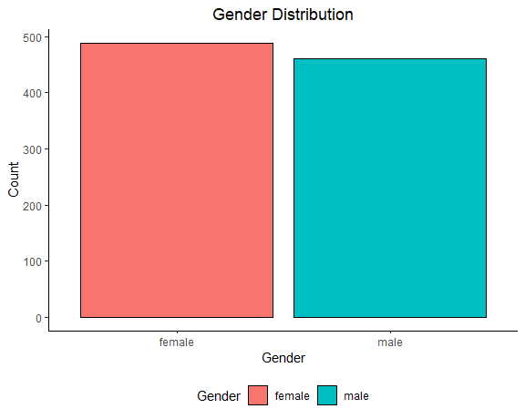

Gender and Test Scores.

``` r
scores_compare_df |> 
  ggplot(aes(x = score, color = score_type, fill = str_to_title(gender))) +
  geom_density(alpha = 0.5, color = "black") +
  labs(
    title = ("Gender and Test Scores"),
    x = "Score (0-100)",
    y = "Density",
    fill = "Gender"
  ) +
  facet_grid(. ~ score_type)
```

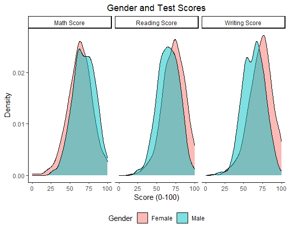

### Ethnic Group

General distribution.

``` r
scores_df |> 
  ggplot(aes(x = ethnic_group, fill = ethnic_group)) +
  geom_bar(color = "black", alpha = 0.5) +
  labs(
    title = ("Ethnic Group Distribution"),
    x = "Ethnic Group",
    y = "Count",
    fill = "Ethnic Group"
  )
```

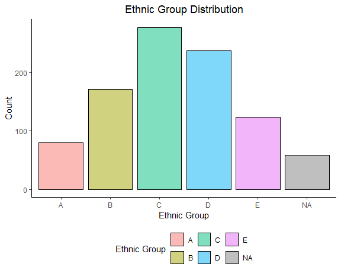

Math Score.

``` r
scores_df |>
  ggplot(aes(x = math_score, fill = ethnic_group)) +
  geom_histogram(alpha = 0.5, color = "black", bins = 10) +
  labs(
    title = ("Ethnic Group and Math Scores"),
    x = "Math Score (0-100)",
    y = "Count",
    fill = "Ethnic Group"
  ) +
  facet_grid(. ~ ethnic_group)
```

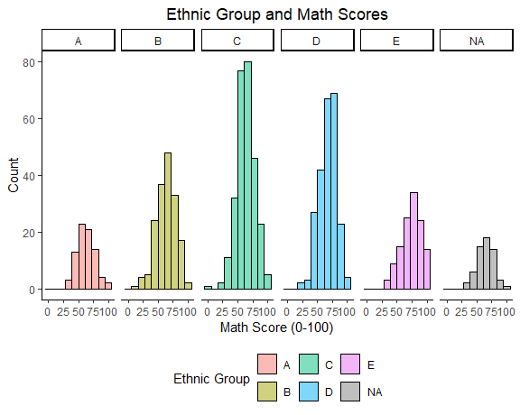

Reading Score.

``` r
scores_df |>
  ggplot(aes(x = reading_score, fill = ethnic_group)) +
  geom_histogram(alpha = 0.5, color = "black", bins = 10) +
  labs(
    title = ("Ethnic Group and Reading Scores"),
    x = "Reading Score (0-100)",
    y = "Count",
    fill = "Ethnic Group"
  ) +
  facet_grid(. ~ ethnic_group)
```

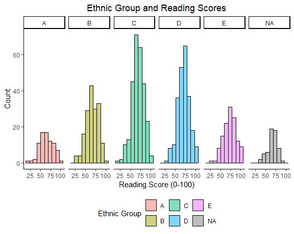

Writing Score.

``` r
scores_df |>
  ggplot(aes(x = writing_score, fill = ethnic_group)) +
  geom_histogram(alpha = 0.5, color = "black", bins = 10) +
  labs(
    title = ("Ethnic Group and Writing Scores"),
    x = "Writing Score (0-100)",
    y = "Count",
    fill = "Ethnic Group"
  ) +
  facet_grid(. ~ ethnic_group)
```

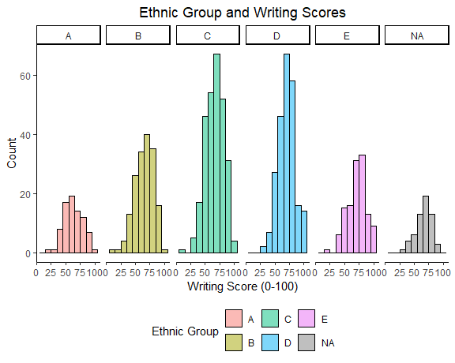

``` r
scores_df |> colnames()
```

    ##  [1] "id"                    "gender"                "ethnic_group"         
    ##  [4] "parent_educ"           "lunch_type"            "test_prep"            
    ##  [7] "parent_marital_status" "practice_sport"        "is_first_child"       
    ## [10] "nr_siblings"           "transport_means"       "wkly_study_hours"     
    ## [13] "math_score"            "reading_score"         "writing_score"

``` r
library(here)
```

``` r
# Load necessary libraries
library(dplyr)
library(ggplot2)
library(tidyverse)

library(readr)
Project_1_data <- read_csv("data/Project_1_data.csv")
```

    ## Rows: 948 Columns: 14
    ## ── Column specification ────────────────────────────────────────────────────────
    ## Delimiter: ","
    ## chr (10): Gender, EthnicGroup, ParentEduc, LunchType, TestPrep, ParentMarita...
    ## dbl  (4): NrSiblings, MathScore, ReadingScore, WritingScore
    ## 
    ## ℹ Use `spec()` to retrieve the full column specification for this data.
    ## ℹ Specify the column types or set `show_col_types = FALSE` to quiet this message.

``` r
View(Project_1_data)

# Summary statistics for all variables
summary_stats <- summary(Project_1_data )
print(summary_stats)
```

    ##     Gender          EthnicGroup         ParentEduc         LunchType        
    ##  Length:948         Length:948         Length:948         Length:948        
    ##  Class :character   Class :character   Class :character   Class :character  
    ##  Mode  :character   Mode  :character   Mode  :character   Mode  :character  
    ##                                                                             
    ##                                                                             
    ##                                                                             
    ##                                                                             
    ##    TestPrep         ParentMaritalStatus PracticeSport      IsFirstChild      
    ##  Length:948         Length:948          Length:948         Length:948        
    ##  Class :character   Class :character    Class :character   Class :character  
    ##  Mode  :character   Mode  :character    Mode  :character   Mode  :character  
    ##                                                                              
    ##                                                                              
    ##                                                                              
    ##                                                                              
    ##    NrSiblings    TransportMeans     WklyStudyHours       MathScore     
    ##  Min.   :0.000   Length:948         Length:948         Min.   :  0.00  
    ##  1st Qu.:1.000   Class :character   Class :character   1st Qu.: 56.00  
    ##  Median :2.000   Mode  :character   Mode  :character   Median : 66.00  
    ##  Mean   :2.155                                         Mean   : 65.98  
    ##  3rd Qu.:3.000                                         3rd Qu.: 76.00  
    ##  Max.   :7.000                                         Max.   :100.00  
    ##  NA's   :46                                                            
    ##   ReadingScore     WritingScore   
    ##  Min.   : 17.00   Min.   : 10.00  
    ##  1st Qu.: 59.00   1st Qu.: 57.00  
    ##  Median : 69.50   Median : 68.00  
    ##  Mean   : 68.84   Mean   : 67.93  
    ##  3rd Qu.: 80.00   3rd Qu.: 78.25  
    ##  Max.   :100.00   Max.   :100.00  
    ## 

``` r
# Visualize the distribution of MathScore, ReadingScore, and WritingScore
ggplot(Project_1_data, aes(x = MathScore)) + 
  geom_histogram(binwidth = 5, fill = "blue", alpha = 0.7) + 
  labs(title = "Distribution of Math Scores", x = "Math Score", y = "Frequency")
```

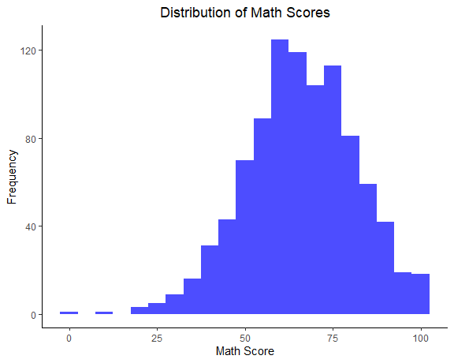

``` r
ggplot(Project_1_data, aes(x = ReadingScore)) + 
  geom_histogram(binwidth = 5, fill = "green", alpha = 0.7) + 
  labs(title = "Distribution of Reading Scores", x = "Reading Score", y = "Frequency")
```

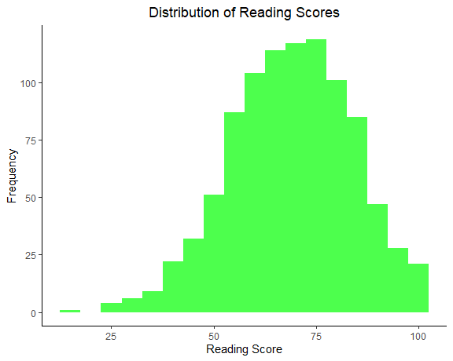

``` r
ggplot(Project_1_data, aes(x = WritingScore)) + 
  geom_histogram(binwidth = 5, fill = "red", alpha = 0.7) + 
  labs(title = "Distribution of Writing Scores", x = "Writing Score", y = "Frequency")
```

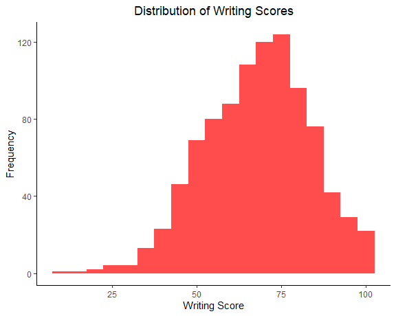

``` r
# Check for outliers using boxplots
ggplot(Project_1_data, aes(y = MathScore)) + 
  geom_boxplot(fill = "blue") + 
  labs(title = "Boxplot of Math Scores", y = "Math Score")
```

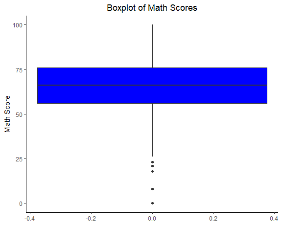

``` r
ggplot(Project_1_data, aes(y = ReadingScore)) + 
  geom_boxplot(fill = "green") + 
  labs(title = "Boxplot of Reading Scores", y = "Reading Score")
```

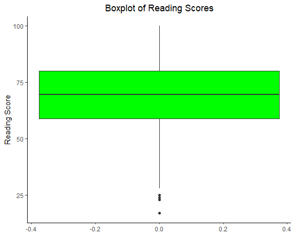

``` r
ggplot(Project_1_data, aes(y = WritingScore)) + 
  geom_boxplot(fill = "red") + 
  labs(title = "Boxplot of Writing Scores", y = "Writing Score")
```

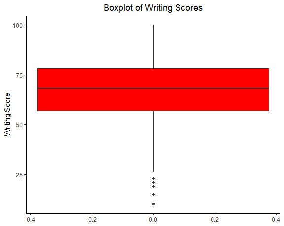

``` r
# Check for missing values
missing_values <- colSums(is.na(Project_1_data))
print(missing_values)
```

    ##              Gender         EthnicGroup          ParentEduc           LunchType 
    ##                   0                  59                  53                   0 
    ##            TestPrep ParentMaritalStatus       PracticeSport        IsFirstChild 
    ##                  55                  49                  16                  30 
    ##          NrSiblings      TransportMeans      WklyStudyHours           MathScore 
    ##                  46                 102                  37                   0 
    ##        ReadingScore        WritingScore 
    ##                   0                   0

``` r
# Explore distribution of numeric scores
numeric_vars <- Project_1_data %>% select(MathScore, ReadingScore, WritingScore)
summary(numeric_vars)
```

    ##    MathScore       ReadingScore     WritingScore   
    ##  Min.   :  0.00   Min.   : 17.00   Min.   : 10.00  
    ##  1st Qu.: 56.00   1st Qu.: 59.00   1st Qu.: 57.00  
    ##  Median : 66.00   Median : 69.50   Median : 68.00  
    ##  Mean   : 65.98   Mean   : 68.84   Mean   : 67.93  
    ##  3rd Qu.: 76.00   3rd Qu.: 80.00   3rd Qu.: 78.25  
    ##  Max.   :100.00   Max.   :100.00   Max.   :100.00

``` r
# Check for potential outliers in numeric scores
outliers <- numeric_vars %>% 
  gather(key = "variable", value = "value") %>%
  group_by(variable) %>%
  summarize(lower_bound = quantile(value, 0.25) - 1.5 * IQR(value),
            upper_bound = quantile(value, 0.75) + 1.5 * IQR(value)) %>%
  left_join(numeric_vars %>% gather(key = "variable", value = "value"), by = "variable") %>%
  filter(value < lower_bound | value > upper_bound)

print(outliers)
```

    ## # A tibble: 17 × 4
    ##    variable     lower_bound upper_bound value
    ##    <chr>              <dbl>       <dbl> <dbl>
    ##  1 MathScore           26          106     18
    ##  2 MathScore           26          106      0
    ##  3 MathScore           26          106     21
    ##  4 MathScore           26          106     23
    ##  5 MathScore           26          106     18
    ##  6 MathScore           26          106     23
    ##  7 MathScore           26          106      8
    ##  8 ReadingScore        27.5        112.    17
    ##  9 ReadingScore        27.5        112.    25
    ## 10 ReadingScore        27.5        112.    23
    ## 11 ReadingScore        27.5        112.    24
    ## 12 ReadingScore        27.5        112.    24
    ## 13 WritingScore        25.1        110.    10
    ## 14 WritingScore        25.1        110.    21
    ## 15 WritingScore        25.1        110.    19
    ## 16 WritingScore        25.1        110.    15
    ## 17 WritingScore        25.1        110.    23

``` r
# Visualize distributions
Project_1_data %>%
  gather(key = "variable", value = "value", MathScore, ReadingScore, WritingScore) %>%
  ggplot(aes(x = value, fill = variable)) +
  geom_histogram(bins = 30, alpha = 0.7, position = "identity") +
  facet_wrap(~ variable, scales = "free") +
  theme_minimal()
```

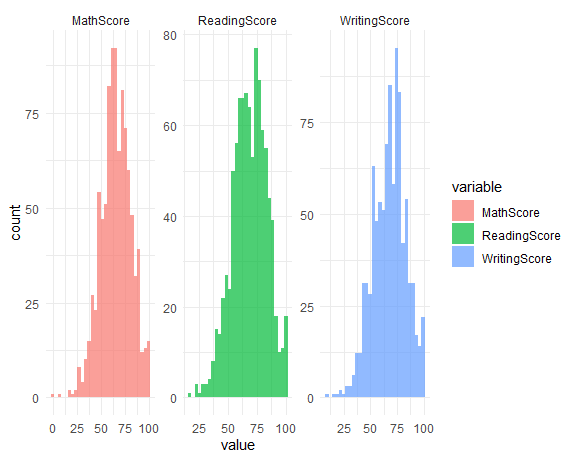

``` r
# Visualize categorical variables
categorical_vars <- Project_1_data %>% select(Gender, EthnicGroup, ParentEduc, LunchType, TestPrep, 
                                        ParentMaritalStatus, PracticeSport, IsFirstChild, 
                                        TransportMeans, WklyStudyHours)

categorical_plots <- categorical_vars %>%
  gather(key = "variable", value = "value") %>%
  ggplot(aes(x = value, fill = variable)) +
  geom_bar(alpha = 0.7) +
  facet_wrap(~ variable, scales = "free", ncol = 3) +
  theme_minimal()

print(categorical_plots)
```

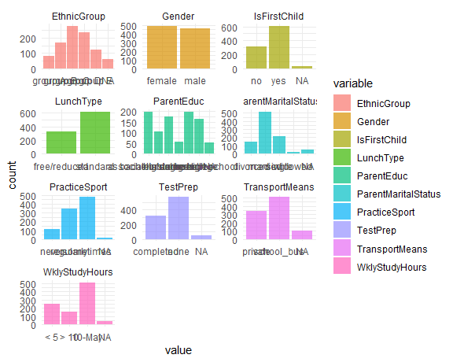

``` r
library(ggplot2)

# Function to create correlation plots
create_correlation_plot <- function(x, y, Project_1_data, title) {
  ggplot(data, aes_string(x = x, y = y)) +
    geom_point() +
    geom_smooth(method = "lm", se = FALSE, color = "blue") +
    labs(title = title, x = x, y = y) +
    theme_minimal()
}

# List of variables to plot against WritingScore
writing_score_vars <- c("gendermale", "ethnic_groupE", "lunch_typestandard", 
                        "test_prepcompleted", "parent_marital_statusmarried")

# List of variables to plot against ReadingScore
reading_score_vars <- c("gendermale", "ethnic_groupE", "lunch_typestandard", 
                        "test_prepcompleted", "parent_marital_statusmarried", 
                        "is_first_childyes")

# List of variables to plot against MathScore
math_score_vars <- c("gendermale", "ethnic_groupE", "ethnic_groupD", 
                     "lunch_typestandard", "test_prepcompleted", 
                     "parent_marital_statusmarried", "parent_marital_statuswidowed", 
                     "is_first_childyes")

# Create plots for WritingScore
for (var in writing_score_vars) {
  print(create_correlation_plot("gendermale", "WritingScore"))
}

# Create plots for ReadingScore
for (var in reading_score_vars) {
  print(create_correlation_plot(var, "ReadingScore", Project_1_data, (var, "vs ReadingScore")))
}

# Create plots for MathScore
for (var in math_score_vars) {
  print(create_correlation_plot(var, "MathScore", Project_1_data, (var, "vs MathScore")))
}
```
