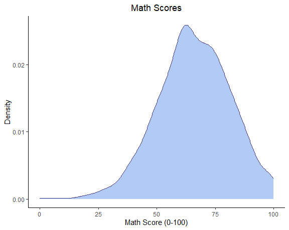

Regression (Math Scores)
================

# Data Exploration

## Explore Predictors

Import data.

``` r
source("scores_data.R")
```

Preview data.

``` r
scores_df |> 
  gtsummary::tbl_summary() |> 
  gtsummary::bold_labels() |> 
  gtsummary::italicize_levels()
```

<div id="iaepjsnsoo" style="padding-left:0px;padding-right:0px;padding-top:10px;padding-bottom:10px;overflow-x:auto;overflow-y:auto;width:auto;height:auto;">
<style>#iaepjsnsoo table {
  font-family: system-ui, 'Segoe UI', Roboto, Helvetica, Arial, sans-serif, 'Apple Color Emoji', 'Segoe UI Emoji', 'Segoe UI Symbol', 'Noto Color Emoji';
  -webkit-font-smoothing: antialiased;
  -moz-osx-font-smoothing: grayscale;
}
&#10;#iaepjsnsoo thead, #iaepjsnsoo tbody, #iaepjsnsoo tfoot, #iaepjsnsoo tr, #iaepjsnsoo td, #iaepjsnsoo th {
  border-style: none;
}
&#10;#iaepjsnsoo p {
  margin: 0;
  padding: 0;
}
&#10;#iaepjsnsoo .gt_table {
  display: table;
  border-collapse: collapse;
  line-height: normal;
  margin-left: auto;
  margin-right: auto;
  color: #333333;
  font-size: 16px;
  font-weight: normal;
  font-style: normal;
  background-color: #FFFFFF;
  width: auto;
  border-top-style: solid;
  border-top-width: 2px;
  border-top-color: #A8A8A8;
  border-right-style: none;
  border-right-width: 2px;
  border-right-color: #D3D3D3;
  border-bottom-style: solid;
  border-bottom-width: 2px;
  border-bottom-color: #A8A8A8;
  border-left-style: none;
  border-left-width: 2px;
  border-left-color: #D3D3D3;
}
&#10;#iaepjsnsoo .gt_caption {
  padding-top: 4px;
  padding-bottom: 4px;
}
&#10;#iaepjsnsoo .gt_title {
  color: #333333;
  font-size: 125%;
  font-weight: initial;
  padding-top: 4px;
  padding-bottom: 4px;
  padding-left: 5px;
  padding-right: 5px;
  border-bottom-color: #FFFFFF;
  border-bottom-width: 0;
}
&#10;#iaepjsnsoo .gt_subtitle {
  color: #333333;
  font-size: 85%;
  font-weight: initial;
  padding-top: 3px;
  padding-bottom: 5px;
  padding-left: 5px;
  padding-right: 5px;
  border-top-color: #FFFFFF;
  border-top-width: 0;
}
&#10;#iaepjsnsoo .gt_heading {
  background-color: #FFFFFF;
  text-align: center;
  border-bottom-color: #FFFFFF;
  border-left-style: none;
  border-left-width: 1px;
  border-left-color: #D3D3D3;
  border-right-style: none;
  border-right-width: 1px;
  border-right-color: #D3D3D3;
}
&#10;#iaepjsnsoo .gt_bottom_border {
  border-bottom-style: solid;
  border-bottom-width: 2px;
  border-bottom-color: #D3D3D3;
}
&#10;#iaepjsnsoo .gt_col_headings {
  border-top-style: solid;
  border-top-width: 2px;
  border-top-color: #D3D3D3;
  border-bottom-style: solid;
  border-bottom-width: 2px;
  border-bottom-color: #D3D3D3;
  border-left-style: none;
  border-left-width: 1px;
  border-left-color: #D3D3D3;
  border-right-style: none;
  border-right-width: 1px;
  border-right-color: #D3D3D3;
}
&#10;#iaepjsnsoo .gt_col_heading {
  color: #333333;
  background-color: #FFFFFF;
  font-size: 100%;
  font-weight: normal;
  text-transform: inherit;
  border-left-style: none;
  border-left-width: 1px;
  border-left-color: #D3D3D3;
  border-right-style: none;
  border-right-width: 1px;
  border-right-color: #D3D3D3;
  vertical-align: bottom;
  padding-top: 5px;
  padding-bottom: 6px;
  padding-left: 5px;
  padding-right: 5px;
  overflow-x: hidden;
}
&#10;#iaepjsnsoo .gt_column_spanner_outer {
  color: #333333;
  background-color: #FFFFFF;
  font-size: 100%;
  font-weight: normal;
  text-transform: inherit;
  padding-top: 0;
  padding-bottom: 0;
  padding-left: 4px;
  padding-right: 4px;
}
&#10;#iaepjsnsoo .gt_column_spanner_outer:first-child {
  padding-left: 0;
}
&#10;#iaepjsnsoo .gt_column_spanner_outer:last-child {
  padding-right: 0;
}
&#10;#iaepjsnsoo .gt_column_spanner {
  border-bottom-style: solid;
  border-bottom-width: 2px;
  border-bottom-color: #D3D3D3;
  vertical-align: bottom;
  padding-top: 5px;
  padding-bottom: 5px;
  overflow-x: hidden;
  display: inline-block;
  width: 100%;
}
&#10;#iaepjsnsoo .gt_spanner_row {
  border-bottom-style: hidden;
}
&#10;#iaepjsnsoo .gt_group_heading {
  padding-top: 8px;
  padding-bottom: 8px;
  padding-left: 5px;
  padding-right: 5px;
  color: #333333;
  background-color: #FFFFFF;
  font-size: 100%;
  font-weight: initial;
  text-transform: inherit;
  border-top-style: solid;
  border-top-width: 2px;
  border-top-color: #D3D3D3;
  border-bottom-style: solid;
  border-bottom-width: 2px;
  border-bottom-color: #D3D3D3;
  border-left-style: none;
  border-left-width: 1px;
  border-left-color: #D3D3D3;
  border-right-style: none;
  border-right-width: 1px;
  border-right-color: #D3D3D3;
  vertical-align: middle;
  text-align: left;
}
&#10;#iaepjsnsoo .gt_empty_group_heading {
  padding: 0.5px;
  color: #333333;
  background-color: #FFFFFF;
  font-size: 100%;
  font-weight: initial;
  border-top-style: solid;
  border-top-width: 2px;
  border-top-color: #D3D3D3;
  border-bottom-style: solid;
  border-bottom-width: 2px;
  border-bottom-color: #D3D3D3;
  vertical-align: middle;
}
&#10;#iaepjsnsoo .gt_from_md > :first-child {
  margin-top: 0;
}
&#10;#iaepjsnsoo .gt_from_md > :last-child {
  margin-bottom: 0;
}
&#10;#iaepjsnsoo .gt_row {
  padding-top: 8px;
  padding-bottom: 8px;
  padding-left: 5px;
  padding-right: 5px;
  margin: 10px;
  border-top-style: solid;
  border-top-width: 1px;
  border-top-color: #D3D3D3;
  border-left-style: none;
  border-left-width: 1px;
  border-left-color: #D3D3D3;
  border-right-style: none;
  border-right-width: 1px;
  border-right-color: #D3D3D3;
  vertical-align: middle;
  overflow-x: hidden;
}
&#10;#iaepjsnsoo .gt_stub {
  color: #333333;
  background-color: #FFFFFF;
  font-size: 100%;
  font-weight: initial;
  text-transform: inherit;
  border-right-style: solid;
  border-right-width: 2px;
  border-right-color: #D3D3D3;
  padding-left: 5px;
  padding-right: 5px;
}
&#10;#iaepjsnsoo .gt_stub_row_group {
  color: #333333;
  background-color: #FFFFFF;
  font-size: 100%;
  font-weight: initial;
  text-transform: inherit;
  border-right-style: solid;
  border-right-width: 2px;
  border-right-color: #D3D3D3;
  padding-left: 5px;
  padding-right: 5px;
  vertical-align: top;
}
&#10;#iaepjsnsoo .gt_row_group_first td {
  border-top-width: 2px;
}
&#10;#iaepjsnsoo .gt_row_group_first th {
  border-top-width: 2px;
}
&#10;#iaepjsnsoo .gt_summary_row {
  color: #333333;
  background-color: #FFFFFF;
  text-transform: inherit;
  padding-top: 8px;
  padding-bottom: 8px;
  padding-left: 5px;
  padding-right: 5px;
}
&#10;#iaepjsnsoo .gt_first_summary_row {
  border-top-style: solid;
  border-top-color: #D3D3D3;
}
&#10;#iaepjsnsoo .gt_first_summary_row.thick {
  border-top-width: 2px;
}
&#10;#iaepjsnsoo .gt_last_summary_row {
  padding-top: 8px;
  padding-bottom: 8px;
  padding-left: 5px;
  padding-right: 5px;
  border-bottom-style: solid;
  border-bottom-width: 2px;
  border-bottom-color: #D3D3D3;
}
&#10;#iaepjsnsoo .gt_grand_summary_row {
  color: #333333;
  background-color: #FFFFFF;
  text-transform: inherit;
  padding-top: 8px;
  padding-bottom: 8px;
  padding-left: 5px;
  padding-right: 5px;
}
&#10;#iaepjsnsoo .gt_first_grand_summary_row {
  padding-top: 8px;
  padding-bottom: 8px;
  padding-left: 5px;
  padding-right: 5px;
  border-top-style: double;
  border-top-width: 6px;
  border-top-color: #D3D3D3;
}
&#10;#iaepjsnsoo .gt_last_grand_summary_row_top {
  padding-top: 8px;
  padding-bottom: 8px;
  padding-left: 5px;
  padding-right: 5px;
  border-bottom-style: double;
  border-bottom-width: 6px;
  border-bottom-color: #D3D3D3;
}
&#10;#iaepjsnsoo .gt_striped {
  background-color: rgba(128, 128, 128, 0.05);
}
&#10;#iaepjsnsoo .gt_table_body {
  border-top-style: solid;
  border-top-width: 2px;
  border-top-color: #D3D3D3;
  border-bottom-style: solid;
  border-bottom-width: 2px;
  border-bottom-color: #D3D3D3;
}
&#10;#iaepjsnsoo .gt_footnotes {
  color: #333333;
  background-color: #FFFFFF;
  border-bottom-style: none;
  border-bottom-width: 2px;
  border-bottom-color: #D3D3D3;
  border-left-style: none;
  border-left-width: 2px;
  border-left-color: #D3D3D3;
  border-right-style: none;
  border-right-width: 2px;
  border-right-color: #D3D3D3;
}
&#10;#iaepjsnsoo .gt_footnote {
  margin: 0px;
  font-size: 90%;
  padding-top: 4px;
  padding-bottom: 4px;
  padding-left: 5px;
  padding-right: 5px;
}
&#10;#iaepjsnsoo .gt_sourcenotes {
  color: #333333;
  background-color: #FFFFFF;
  border-bottom-style: none;
  border-bottom-width: 2px;
  border-bottom-color: #D3D3D3;
  border-left-style: none;
  border-left-width: 2px;
  border-left-color: #D3D3D3;
  border-right-style: none;
  border-right-width: 2px;
  border-right-color: #D3D3D3;
}
&#10;#iaepjsnsoo .gt_sourcenote {
  font-size: 90%;
  padding-top: 4px;
  padding-bottom: 4px;
  padding-left: 5px;
  padding-right: 5px;
}
&#10;#iaepjsnsoo .gt_left {
  text-align: left;
}
&#10;#iaepjsnsoo .gt_center {
  text-align: center;
}
&#10;#iaepjsnsoo .gt_right {
  text-align: right;
  font-variant-numeric: tabular-nums;
}
&#10;#iaepjsnsoo .gt_font_normal {
  font-weight: normal;
}
&#10;#iaepjsnsoo .gt_font_bold {
  font-weight: bold;
}
&#10;#iaepjsnsoo .gt_font_italic {
  font-style: italic;
}
&#10;#iaepjsnsoo .gt_super {
  font-size: 65%;
}
&#10;#iaepjsnsoo .gt_footnote_marks {
  font-size: 75%;
  vertical-align: 0.4em;
  position: initial;
}
&#10;#iaepjsnsoo .gt_asterisk {
  font-size: 100%;
  vertical-align: 0;
}
&#10;#iaepjsnsoo .gt_indent_1 {
  text-indent: 5px;
}
&#10;#iaepjsnsoo .gt_indent_2 {
  text-indent: 10px;
}
&#10;#iaepjsnsoo .gt_indent_3 {
  text-indent: 15px;
}
&#10;#iaepjsnsoo .gt_indent_4 {
  text-indent: 20px;
}
&#10;#iaepjsnsoo .gt_indent_5 {
  text-indent: 25px;
}
&#10;#iaepjsnsoo .katex-display {
  display: inline-flex !important;
  margin-bottom: 0.75em !important;
}
&#10;#iaepjsnsoo div.Reactable > div.rt-table > div.rt-thead > div.rt-tr.rt-tr-group-header > div.rt-th-group:after {
  height: 0px !important;
}
</style>
<table class="gt_table" data-quarto-disable-processing="false" data-quarto-bootstrap="false">
  <thead>
    <tr class="gt_col_headings">
      <th class="gt_col_heading gt_columns_bottom_border gt_left" rowspan="1" colspan="1" scope="col" id="label"><span class='gt_from_md'><strong>Characteristic</strong></span></th>
      <th class="gt_col_heading gt_columns_bottom_border gt_center" rowspan="1" colspan="1" scope="col" id="stat_0"><span class='gt_from_md'><strong>N = 948</strong></span><span class="gt_footnote_marks" style="white-space:nowrap;font-style:italic;font-weight:normal;line-height:0;"><sup>1</sup></span></th>
    </tr>
  </thead>
  <tbody class="gt_table_body">
    <tr><td headers="label" class="gt_row gt_left" style="font-weight: bold;">id</td>
<td headers="stat_0" class="gt_row gt_center">475 (238, 712)</td></tr>
    <tr><td headers="label" class="gt_row gt_left" style="font-weight: bold;">gender</td>
<td headers="stat_0" class="gt_row gt_center"><br /></td></tr>
    <tr><td headers="label" class="gt_row gt_left" style="font-style: italic;">    female</td>
<td headers="stat_0" class="gt_row gt_center">488 (51%)</td></tr>
    <tr><td headers="label" class="gt_row gt_left" style="font-style: italic;">    male</td>
<td headers="stat_0" class="gt_row gt_center">460 (49%)</td></tr>
    <tr><td headers="label" class="gt_row gt_left" style="font-weight: bold;">ethnic_group</td>
<td headers="stat_0" class="gt_row gt_center"><br /></td></tr>
    <tr><td headers="label" class="gt_row gt_left" style="font-style: italic;">    A</td>
<td headers="stat_0" class="gt_row gt_center">80 (9.0%)</td></tr>
    <tr><td headers="label" class="gt_row gt_left" style="font-style: italic;">    B</td>
<td headers="stat_0" class="gt_row gt_center">171 (19%)</td></tr>
    <tr><td headers="label" class="gt_row gt_left" style="font-style: italic;">    C</td>
<td headers="stat_0" class="gt_row gt_center">277 (31%)</td></tr>
    <tr><td headers="label" class="gt_row gt_left" style="font-style: italic;">    D</td>
<td headers="stat_0" class="gt_row gt_center">237 (27%)</td></tr>
    <tr><td headers="label" class="gt_row gt_left" style="font-style: italic;">    E</td>
<td headers="stat_0" class="gt_row gt_center">124 (14%)</td></tr>
    <tr><td headers="label" class="gt_row gt_left" style="font-style: italic;">    Unknown</td>
<td headers="stat_0" class="gt_row gt_center">59</td></tr>
    <tr><td headers="label" class="gt_row gt_left" style="font-weight: bold;">parent_educ</td>
<td headers="stat_0" class="gt_row gt_center"><br /></td></tr>
    <tr><td headers="label" class="gt_row gt_left" style="font-style: italic;">    some high school</td>
<td headers="stat_0" class="gt_row gt_center">163 (18%)</td></tr>
    <tr><td headers="label" class="gt_row gt_left" style="font-style: italic;">    high school</td>
<td headers="stat_0" class="gt_row gt_center">176 (20%)</td></tr>
    <tr><td headers="label" class="gt_row gt_left" style="font-style: italic;">    some college</td>
<td headers="stat_0" class="gt_row gt_center">199 (22%)</td></tr>
    <tr><td headers="label" class="gt_row gt_left" style="font-style: italic;">    associates degree</td>
<td headers="stat_0" class="gt_row gt_center">198 (22%)</td></tr>
    <tr><td headers="label" class="gt_row gt_left" style="font-style: italic;">    bachelors degree</td>
<td headers="stat_0" class="gt_row gt_center">104 (12%)</td></tr>
    <tr><td headers="label" class="gt_row gt_left" style="font-style: italic;">    masters degree</td>
<td headers="stat_0" class="gt_row gt_center">55 (6.1%)</td></tr>
    <tr><td headers="label" class="gt_row gt_left" style="font-style: italic;">    Unknown</td>
<td headers="stat_0" class="gt_row gt_center">53</td></tr>
    <tr><td headers="label" class="gt_row gt_left" style="font-weight: bold;">lunch_type</td>
<td headers="stat_0" class="gt_row gt_center"><br /></td></tr>
    <tr><td headers="label" class="gt_row gt_left" style="font-style: italic;">    free_reduced</td>
<td headers="stat_0" class="gt_row gt_center">331 (35%)</td></tr>
    <tr><td headers="label" class="gt_row gt_left" style="font-style: italic;">    standard</td>
<td headers="stat_0" class="gt_row gt_center">617 (65%)</td></tr>
    <tr><td headers="label" class="gt_row gt_left" style="font-weight: bold;">test_prep</td>
<td headers="stat_0" class="gt_row gt_center"><br /></td></tr>
    <tr><td headers="label" class="gt_row gt_left" style="font-style: italic;">    none</td>
<td headers="stat_0" class="gt_row gt_center">571 (64%)</td></tr>
    <tr><td headers="label" class="gt_row gt_left" style="font-style: italic;">    completed</td>
<td headers="stat_0" class="gt_row gt_center">322 (36%)</td></tr>
    <tr><td headers="label" class="gt_row gt_left" style="font-style: italic;">    Unknown</td>
<td headers="stat_0" class="gt_row gt_center">55</td></tr>
    <tr><td headers="label" class="gt_row gt_left" style="font-weight: bold;">parent_marital_status</td>
<td headers="stat_0" class="gt_row gt_center"><br /></td></tr>
    <tr><td headers="label" class="gt_row gt_left" style="font-style: italic;">    divorced</td>
<td headers="stat_0" class="gt_row gt_center">146 (16%)</td></tr>
    <tr><td headers="label" class="gt_row gt_left" style="font-style: italic;">    married</td>
<td headers="stat_0" class="gt_row gt_center">516 (57%)</td></tr>
    <tr><td headers="label" class="gt_row gt_left" style="font-style: italic;">    single</td>
<td headers="stat_0" class="gt_row gt_center">213 (24%)</td></tr>
    <tr><td headers="label" class="gt_row gt_left" style="font-style: italic;">    widowed</td>
<td headers="stat_0" class="gt_row gt_center">24 (2.7%)</td></tr>
    <tr><td headers="label" class="gt_row gt_left" style="font-style: italic;">    Unknown</td>
<td headers="stat_0" class="gt_row gt_center">49</td></tr>
    <tr><td headers="label" class="gt_row gt_left" style="font-weight: bold;">practice_sport</td>
<td headers="stat_0" class="gt_row gt_center"><br /></td></tr>
    <tr><td headers="label" class="gt_row gt_left" style="font-style: italic;">    never</td>
<td headers="stat_0" class="gt_row gt_center">112 (12%)</td></tr>
    <tr><td headers="label" class="gt_row gt_left" style="font-style: italic;">    sometimes</td>
<td headers="stat_0" class="gt_row gt_center">477 (51%)</td></tr>
    <tr><td headers="label" class="gt_row gt_left" style="font-style: italic;">    regularly</td>
<td headers="stat_0" class="gt_row gt_center">343 (37%)</td></tr>
    <tr><td headers="label" class="gt_row gt_left" style="font-style: italic;">    Unknown</td>
<td headers="stat_0" class="gt_row gt_center">16</td></tr>
    <tr><td headers="label" class="gt_row gt_left" style="font-weight: bold;">is_first_child</td>
<td headers="stat_0" class="gt_row gt_center">604 (66%)</td></tr>
    <tr><td headers="label" class="gt_row gt_left" style="font-style: italic;">    Unknown</td>
<td headers="stat_0" class="gt_row gt_center">30</td></tr>
    <tr><td headers="label" class="gt_row gt_left" style="font-weight: bold;">nr_siblings</td>
<td headers="stat_0" class="gt_row gt_center"><br /></td></tr>
    <tr><td headers="label" class="gt_row gt_left" style="font-style: italic;">    0</td>
<td headers="stat_0" class="gt_row gt_center">101 (11%)</td></tr>
    <tr><td headers="label" class="gt_row gt_left" style="font-style: italic;">    1</td>
<td headers="stat_0" class="gt_row gt_center">245 (27%)</td></tr>
    <tr><td headers="label" class="gt_row gt_left" style="font-style: italic;">    2</td>
<td headers="stat_0" class="gt_row gt_center">213 (24%)</td></tr>
    <tr><td headers="label" class="gt_row gt_left" style="font-style: italic;">    3</td>
<td headers="stat_0" class="gt_row gt_center">198 (22%)</td></tr>
    <tr><td headers="label" class="gt_row gt_left" style="font-style: italic;">    4</td>
<td headers="stat_0" class="gt_row gt_center">76 (8.4%)</td></tr>
    <tr><td headers="label" class="gt_row gt_left" style="font-style: italic;">    5</td>
<td headers="stat_0" class="gt_row gt_center">50 (5.5%)</td></tr>
    <tr><td headers="label" class="gt_row gt_left" style="font-style: italic;">    6</td>
<td headers="stat_0" class="gt_row gt_center">8 (0.9%)</td></tr>
    <tr><td headers="label" class="gt_row gt_left" style="font-style: italic;">    7</td>
<td headers="stat_0" class="gt_row gt_center">11 (1.2%)</td></tr>
    <tr><td headers="label" class="gt_row gt_left" style="font-style: italic;">    Unknown</td>
<td headers="stat_0" class="gt_row gt_center">46</td></tr>
    <tr><td headers="label" class="gt_row gt_left" style="font-weight: bold;">transport_means</td>
<td headers="stat_0" class="gt_row gt_center"><br /></td></tr>
    <tr><td headers="label" class="gt_row gt_left" style="font-style: italic;">    private</td>
<td headers="stat_0" class="gt_row gt_center">337 (40%)</td></tr>
    <tr><td headers="label" class="gt_row gt_left" style="font-style: italic;">    school_bus</td>
<td headers="stat_0" class="gt_row gt_center">509 (60%)</td></tr>
    <tr><td headers="label" class="gt_row gt_left" style="font-style: italic;">    Unknown</td>
<td headers="stat_0" class="gt_row gt_center">102</td></tr>
    <tr><td headers="label" class="gt_row gt_left" style="font-weight: bold;">wkly_study_hours</td>
<td headers="stat_0" class="gt_row gt_center"><br /></td></tr>
    <tr><td headers="label" class="gt_row gt_left" style="font-style: italic;">    &lt; 5</td>
<td headers="stat_0" class="gt_row gt_center">253 (28%)</td></tr>
    <tr><td headers="label" class="gt_row gt_left" style="font-style: italic;">    5-10</td>
<td headers="stat_0" class="gt_row gt_center">508 (56%)</td></tr>
    <tr><td headers="label" class="gt_row gt_left" style="font-style: italic;">    &gt; 10</td>
<td headers="stat_0" class="gt_row gt_center">150 (16%)</td></tr>
    <tr><td headers="label" class="gt_row gt_left" style="font-style: italic;">    Unknown</td>
<td headers="stat_0" class="gt_row gt_center">37</td></tr>
    <tr><td headers="label" class="gt_row gt_left" style="font-weight: bold;">math_score</td>
<td headers="stat_0" class="gt_row gt_center">66 (56, 76)</td></tr>
    <tr><td headers="label" class="gt_row gt_left" style="font-weight: bold;">reading_score</td>
<td headers="stat_0" class="gt_row gt_center">70 (59, 80)</td></tr>
    <tr><td headers="label" class="gt_row gt_left" style="font-weight: bold;">writing_score</td>
<td headers="stat_0" class="gt_row gt_center">68 (57, 79)</td></tr>
  </tbody>
  &#10;  <tfoot class="gt_footnotes">
    <tr>
      <td class="gt_footnote" colspan="2"><span class="gt_footnote_marks" style="white-space:nowrap;font-style:italic;font-weight:normal;line-height:0;"><sup>1</sup></span> <span class='gt_from_md'>Median (Q1, Q3); n (%)</span></td>
    </tr>
  </tfoot>
</table>
</div>

## Deciding whether `math_score` needs to be transformed.

Visualize data.

``` r
scores_df |> 
  ggplot(aes(x = (math_score))) +
  geom_boxplot() +
  labs(
    title = "Math Scores",
    x = "Math Score (0-100)"
  )
```


``` r
scores_df |> 
  ggplot(aes(x = (math_score))) +
  geom_density(fill = "cornflowerblue", color = "darkslateblue", alpha = 0.5) +
  labs(
    title = "Math Scores",
    x = "Math Score (0-100)",
    y = "Density"
  )
```



``` r
scores_df |> 
  ggplot(aes(sample = (math_score))) +
  geom_qq() + geom_qq_line() +
  labs(
    title = "Math Scores",
    y = "Math Score (0-100)",
    x = "Standard Normal Quantiles"
  )
```


Excluding outliers that are below Q1 - 1.5IQR.

``` r
math_fivenum = fivenum(pull(scores_df, math_score))
math_iqr = math_fivenum[[4]] - math_fivenum[[2]]
# lower limit for outliers, no upper limit (Q1 + 1.5IQR = 106 > max=100)
outlier_ll = math_fivenum[[2]] - math_iqr*1.5

scores_df |> 
  filter(math_score > outlier_ll) |> 
  ggplot(aes(x = (math_score))) +
  geom_boxplot() +
  labs(
    title = "Math Scores",
    x = "Math Score (0-100)"
  )
```


``` r
scores_df |> 
  filter(math_score > outlier_ll) |> 
  ggplot(aes(sample = (math_score))) +
  geom_qq() + geom_qq_line() +
  labs(
    title = "Math Scores",
    y = "Math Score (0-100)",
    x = "Standard Normal Quantiles"
  )
```


### QQ Plots

Test potential transformations for better normality assumption. It seems
none of the transformations significantly improve the normality of the
data.

``` r
scores_df |> 
  filter(math_score > outlier_ll) |> 
  mutate(
    tf_original = math_score,
    tf_squared = math_score^2,
    tf_power_1.2 = math_score^1.2,
    tf_power_1.5 = math_score^1.5,
    tf_power_1.3 = math_score^1.3,
    tf_log = log(math_score)
    ) |> 
  pivot_longer(
    cols = starts_with("tf_"),
    names_to = "transformation",
    values_to = "score",
    names_prefix = "tf_"
  ) |> 
  ggplot(aes(sample = score)) +
  geom_qq() +
  geom_qq_line() +
  facet_wrap(~transformation, scales = "free") +
  labs(
    title = "QQ Plots for Math Scores",
    x = "Standard Normal Quantiles",
    y = "Sample Quantiles"
  )
```


### Box Cox Transformation

When using a Box Cox Transformation to potentially improve the normality
of the data, we can see that it is not able to estimate a lambda and
thus does not apply a transformation. As such, I will continue with the
original `math_score` data for the model.

``` r
# Create a Box-Cox transformation object
BoxCoxTrans(scores_df$math_score)
```

    ## Box-Cox Transformation
    ## 
    ## 948 data points used to estimate Lambda
    ## 
    ## Input data summary:
    ##    Min. 1st Qu.  Median    Mean 3rd Qu.    Max. 
    ##    0.00   56.00   66.00   65.98   76.00  100.00 
    ## 
    ## Lambda could not be estimated; no transformation is applied

# Building Regression Models

## Main Effects Model

``` r
math_model = scores_df |> 
  select(-c(id, reading_score, writing_score)) |> 
  lm(math_score ~ ., data = _)

math_model |> 
  broom::tidy() |> 
  filter(p.value < 0.05) |> 
  knitr::kable(digits = 10, caption = "Full Model (no other scores) Coefficients")
```

| term                         |  estimate | std.error | statistic |      p.value |
|:-----------------------------|----------:|----------:|----------:|-------------:|
| (Intercept)                  | 39.328886 |  3.569661 | 11.017540 | 0.0000000000 |
| gendermale                   |  5.085524 |  1.138579 |  4.466552 | 0.0000096069 |
| ethnic_groupE                | 11.175202 |  2.443396 |  4.573636 | 0.0000058968 |
| parent_educassociates degree |  4.905810 |  1.772845 |  2.767197 | 0.0058396496 |
| parent_educbachelors degree  |  6.665192 |  2.076282 |  3.210157 | 0.0014020777 |
| parent_educmasters degree    |  6.809626 |  2.541684 |  2.679179 | 0.0075957394 |
| lunch_typestandard           | 12.353942 |  1.177087 | 10.495351 | 0.0000000000 |
| test_prepcompleted           |  4.771667 |  1.200738 |  3.973945 | 0.0000798679 |
| parent_marital_statusmarried |  5.480546 |  1.616994 |  3.389343 | 0.0007495575 |
| parent_marital_statuswidowed |  7.794425 |  3.811923 |  2.044749 | 0.0413432781 |
| wkly_study_hours5-10         |  3.539397 |  1.342938 |  2.635563 | 0.0086308941 |

Full Model (no other scores) Coefficients

**Significant Predictors**

- gendermale
- ethnic_groupE
- parent_educassociates degree
- parent_educbachelors degree
- parent_educmasters degree
- lunch_typestandard
- test_prepcompleted
- parent_marital_statusmarried
- parent_marital_statuswidowed
- wkly_study_hours5-10

## Check residuals

``` r
math_model |> summary()
```

    ## 
    ## Call:
    ## lm(formula = math_score ~ ., data = select(scores_df, -c(id, 
    ##     reading_score, writing_score)))
    ## 
    ## Residuals:
    ##     Min      1Q  Median      3Q     Max 
    ## -48.916  -9.265   0.725  10.104  33.013 
    ## 
    ## Coefficients:
    ##                              Estimate Std. Error t value Pr(>|t|)    
    ## (Intercept)                   39.3289     3.5697  11.018  < 2e-16 ***
    ## gendermale                     5.0855     1.1386   4.467 9.61e-06 ***
    ## ethnic_groupB                 -0.1788     2.3136  -0.077  0.93841    
    ## ethnic_groupC                 -0.2089     2.2149  -0.094  0.92489    
    ## ethnic_groupD                  3.6247     2.2286   1.626  0.10441    
    ## ethnic_groupE                 11.1752     2.4434   4.574 5.90e-06 ***
    ## parent_educhigh school        -0.3235     1.8015  -0.180  0.85757    
    ## parent_educsome college        3.1933     1.8163   1.758  0.07927 .  
    ## parent_educassociates degree   4.9058     1.7728   2.767  0.00584 ** 
    ## parent_educbachelors degree    6.6652     2.0763   3.210  0.00140 ** 
    ## parent_educmasters degree      6.8096     2.5417   2.679  0.00760 ** 
    ## lunch_typestandard            12.3539     1.1771  10.495  < 2e-16 ***
    ## test_prepcompleted             4.7717     1.2007   3.974 7.99e-05 ***
    ## parent_marital_statusmarried   5.4805     1.6170   3.389  0.00075 ***
    ## parent_marital_statussingle    2.1682     1.8454   1.175  0.24053    
    ## parent_marital_statuswidowed   7.7944     3.8119   2.045  0.04134 *  
    ## practice_sportsometimes        1.5255     1.8439   0.827  0.40838    
    ## practice_sportregularly        1.6701     1.9046   0.877  0.38092    
    ## is_first_childyes              1.1303     1.2125   0.932  0.35162    
    ## nr_siblings                    0.7403     0.3844   1.926  0.05461 .  
    ## transport_meansschool_bus     -0.4319     1.1629  -0.371  0.71050    
    ## wkly_study_hours5-10           3.5394     1.3429   2.636  0.00863 ** 
    ## wkly_study_hours> 10           3.0384     1.7540   1.732  0.08378 .  
    ## ---
    ## Signif. codes:  0 '***' 0.001 '**' 0.01 '*' 0.05 '.' 0.1 ' ' 1
    ## 
    ## Residual standard error: 13.52 on 564 degrees of freedom
    ##   (361 observations deleted due to missingness)
    ## Multiple R-squared:  0.3221, Adjusted R-squared:  0.2956 
    ## F-statistic: 12.18 on 22 and 564 DF,  p-value: < 2.2e-16

**RSE = 13.52**: Indicates the average difference betweeen observeed and
fitted values.

**R^2 = 0.3221** About 32.21% of the variability in reading score is
explained by the covariates.

**Adj-R^2 = 0.2956** After penalizing for the predictors in the model
that don’t add anything useful, 29.56% of the variability in reading
score is explained by the covariates.

``` r
par(mfrow = c(2,2))
plot(math_model)
```


## Stepwise Predictor Selection

### Backwards Selection

Update math model to only include significant predictors.

``` r
math_model_bk = scores_df |> 
  select(-c(id, reading_score, writing_score)) |> 
  drop_na() |> 
  lm(math_score ~ ., data = _) |> 
  step(direction = "backward")
```

    ## Start:  AIC=3080.15
    ## math_score ~ gender + ethnic_group + parent_educ + lunch_type + 
    ##     test_prep + parent_marital_status + practice_sport + is_first_child + 
    ##     nr_siblings + transport_means + wkly_study_hours
    ## 
    ##                         Df Sum of Sq    RSS    AIC
    ## - practice_sport         2     149.5 103299 3077.0
    ## - transport_means        1      25.2 103175 3078.3
    ## - is_first_child         1     158.9 103308 3079.1
    ## <none>                               103149 3080.1
    ## - nr_siblings            1     678.4 103828 3082.0
    ## - wkly_study_hours       2    1299.9 104449 3083.5
    ## - parent_marital_status  3    2798.6 105948 3089.9
    ## - parent_educ            5    4174.0 107323 3093.4
    ## - test_prep              1    2888.2 106038 3094.4
    ## - gender                 1    3648.7 106798 3098.6
    ## - ethnic_group           4    8780.7 111930 3120.1
    ## - lunch_type             1   20145.7 123295 3182.9
    ## 
    ## Step:  AIC=3077
    ## math_score ~ gender + ethnic_group + parent_educ + lunch_type + 
    ##     test_prep + parent_marital_status + is_first_child + nr_siblings + 
    ##     transport_means + wkly_study_hours
    ## 
    ##                         Df Sum of Sq    RSS    AIC
    ## - transport_means        1      20.2 103319 3075.1
    ## - is_first_child         1     144.3 103443 3075.8
    ## <none>                               103299 3077.0
    ## - nr_siblings            1     676.7 103976 3078.8
    ## - wkly_study_hours       2    1325.3 104624 3080.5
    ## - parent_marital_status  3    2815.0 106114 3086.8
    ## - parent_educ            5    4108.3 107407 3089.9
    ## - test_prep              1    2955.2 106254 3091.6
    ## - gender                 1    3643.0 106942 3095.3
    ## - ethnic_group           4    8744.5 112043 3116.7
    ## - lunch_type             1   20057.7 123357 3179.2
    ## 
    ## Step:  AIC=3075.11
    ## math_score ~ gender + ethnic_group + parent_educ + lunch_type + 
    ##     test_prep + parent_marital_status + is_first_child + nr_siblings + 
    ##     wkly_study_hours
    ## 
    ##                         Df Sum of Sq    RSS    AIC
    ## - is_first_child         1     142.1 103461 3073.9
    ## <none>                               103319 3075.1
    ## - nr_siblings            1     675.5 103995 3076.9
    ## - wkly_study_hours       2    1319.0 104638 3078.6
    ## - parent_marital_status  3    2802.2 106121 3084.8
    ## - parent_educ            5    4088.2 107407 3087.9
    ## - test_prep              1    3021.0 106340 3090.0
    ## - gender                 1    3635.8 106955 3093.4
    ## - ethnic_group           4    8741.3 112060 3114.8
    ## - lunch_type             1   20047.0 123366 3177.2
    ## 
    ## Step:  AIC=3073.92
    ## math_score ~ gender + ethnic_group + parent_educ + lunch_type + 
    ##     test_prep + parent_marital_status + nr_siblings + wkly_study_hours
    ## 
    ##                         Df Sum of Sq    RSS    AIC
    ## <none>                               103461 3073.9
    ## - nr_siblings            1     629.8 104091 3075.5
    ## - wkly_study_hours       2    1344.8 104806 3077.5
    ## - parent_marital_status  3    2726.0 106187 3083.2
    ## - parent_educ            5    4053.0 107514 3086.5
    ## - test_prep              1    3115.5 106577 3089.3
    ## - gender                 1    3650.4 107112 3092.3
    ## - ethnic_group           4    8726.4 112188 3113.5
    ## - lunch_type             1   20082.2 123543 3176.1

``` r
math_model_bk |> summary()
```

    ## 
    ## Call:
    ## lm(formula = math_score ~ gender + ethnic_group + parent_educ + 
    ##     lunch_type + test_prep + parent_marital_status + nr_siblings + 
    ##     wkly_study_hours, data = drop_na(select(scores_df, -c(id, 
    ##     reading_score, writing_score))))
    ## 
    ## Residuals:
    ##     Min      1Q  Median      3Q     Max 
    ## -48.412  -8.860   0.405  10.319  33.266 
    ## 
    ## Coefficients:
    ##                              Estimate Std. Error t value Pr(>|t|)    
    ## (Intercept)                  41.16843    3.06033  13.452  < 2e-16 ***
    ## gendermale                    5.08556    1.13600   4.477 9.16e-06 ***
    ## ethnic_groupB                -0.12625    2.30718  -0.055 0.956379    
    ## ethnic_groupC                -0.06815    2.20498  -0.031 0.975356    
    ## ethnic_groupD                 3.71549    2.22091   1.673 0.094886 .  
    ## ethnic_groupE                11.18161    2.43421   4.594 5.37e-06 ***
    ## parent_educhigh school       -0.18280    1.79415  -0.102 0.918882    
    ## parent_educsome college       3.28679    1.81048   1.815 0.069985 .  
    ## parent_educassociates degree  4.87887    1.76705   2.761 0.005948 ** 
    ## parent_educbachelors degree   6.59755    2.07021   3.187 0.001517 ** 
    ## parent_educmasters degree     6.75770    2.52501   2.676 0.007659 ** 
    ## lunch_typestandard           12.32626    1.17393  10.500  < 2e-16 ***
    ## test_prepcompleted            4.92090    1.18986   4.136 4.07e-05 ***
    ## parent_marital_statusmarried  5.41133    1.60455   3.372 0.000796 ***
    ## parent_marital_statussingle   2.13481    1.83057   1.166 0.244023    
    ## parent_marital_statuswidowed  7.48771    3.79448   1.973 0.048944 *  
    ## nr_siblings                   0.71090    0.38232   1.859 0.063482 .  
    ## wkly_study_hours5-10          3.60274    1.33885   2.691 0.007335 ** 
    ## wkly_study_hours> 10          3.04378    1.74927   1.740 0.082395 .  
    ## ---
    ## Signif. codes:  0 '***' 0.001 '**' 0.01 '*' 0.05 '.' 0.1 ' ' 1
    ## 
    ## Residual standard error: 13.5 on 568 degrees of freedom
    ## Multiple R-squared:   0.32,  Adjusted R-squared:  0.2985 
    ## F-statistic: 14.85 on 18 and 568 DF,  p-value: < 2.2e-16

**Resulting Model**

math_score ~ gender + ethnic_group + parent_educ + lunch_type +
test_prep + parent_marital_status + nr_siblings + wkly_study_hours

**Significant Predictors**

- gendermale
- ethnic_groupE
- parent_educassociates degree
- parent_educbachelors degree
- parent_educmasters degree
- lunch_typestandard
- test_prepcompleted
- parent_marital_statusmarried
- parent_marital_statuswidowed
- wkly_study_hours5-10

**RSE = 13.5**: Indicates the average difference betweeen observeed and
fitted values.

**R^2 = 0.32** About 32% of the variability in reading score is
explained by the covariates.

**Adj-R^2 = 0.2985** After penalizing for the predictors in the model
that don’t add anything useful, 29.85% of the variability in reading
score is explained by the covariates.

``` r
par(mfrow = c(2,2))
plot(math_model_bk)
```


### Forward Selection

Update math model to only include significant predictors.

``` r
null_math_model = scores_df |> 
  select(-c(id, reading_score, writing_score)) |> 
  drop_na() |> 
  lm(math_score ~ 1, data = _)

math_model_fw = null_math_model |> 
  step(direction = "forward", scope = formula(math_model))
```

    ## Start:  AIC=3264.33
    ## math_score ~ 1
    ## 
    ##                         Df Sum of Sq    RSS    AIC
    ## + lunch_type             1   22340.6 129816 3173.1
    ## + ethnic_group           4   11630.1 140526 3225.7
    ## + gender                 1    5114.8 147042 3246.3
    ## + test_prep              1    4114.3 148042 3250.2
    ## + parent_educ            5    4397.1 147759 3257.1
    ## + wkly_study_hours       2    2365.3 149791 3259.1
    ## + parent_marital_status  3    2625.8 149531 3260.1
    ## + nr_siblings            1     615.0 151541 3264.0
    ## <none>                               152157 3264.3
    ## + is_first_child         1     132.5 152024 3265.8
    ## + transport_means        1       0.3 152156 3266.3
    ## + practice_sport         2      17.8 152139 3268.3
    ## 
    ## Step:  AIC=3173.12
    ## math_score ~ lunch_type
    ## 
    ##                         Df Sum of Sq    RSS    AIC
    ## + ethnic_group           4   10097.8 119718 3133.6
    ## + test_prep              1    4711.5 125104 3153.4
    ## + gender                 1    4049.1 125767 3156.5
    ## + parent_educ            5    4657.6 125158 3161.7
    ## + parent_marital_status  3    2481.0 127335 3167.8
    ## + wkly_study_hours       2    2008.6 127807 3168.0
    ## + nr_siblings            1     601.2 129215 3172.4
    ## <none>                               129816 3173.1
    ## + is_first_child         1      93.5 129722 3174.7
    ## + transport_means        1       1.5 129814 3175.1
    ## + practice_sport         2      76.4 129739 3176.8
    ## 
    ## Step:  AIC=3133.59
    ## math_score ~ lunch_type + ethnic_group
    ## 
    ##                         Df Sum of Sq    RSS    AIC
    ## + test_prep              1    4077.4 115641 3115.2
    ## + gender                 1    3574.9 116143 3117.8
    ## + parent_marital_status  3    3208.1 116510 3123.7
    ## + parent_educ            5    3901.2 115817 3124.1
    ## + wkly_study_hours       2    1623.3 118095 3129.6
    ## + nr_siblings            1     669.1 119049 3132.3
    ## <none>                               119718 3133.6
    ## + is_first_child         1      82.1 119636 3135.2
    ## + transport_means        1       1.2 119717 3135.6
    ## + practice_sport         2     178.0 119540 3136.7
    ## 
    ## Step:  AIC=3115.25
    ## math_score ~ lunch_type + ethnic_group + test_prep
    ## 
    ##                         Df Sum of Sq    RSS    AIC
    ## + gender                 1    3258.7 112382 3100.5
    ## + parent_marital_status  3    3343.5 112297 3104.0
    ## + parent_educ            5    3694.7 111946 3106.2
    ## + wkly_study_hours       2    1226.5 114414 3113.0
    ## + nr_siblings            1     527.9 115113 3114.6
    ## <none>                               115641 3115.2
    ## + is_first_child         1      34.0 115607 3117.1
    ## + transport_means        1      12.8 115628 3117.2
    ## + practice_sport         2     113.8 115527 3118.7
    ## 
    ## Step:  AIC=3100.47
    ## math_score ~ lunch_type + ethnic_group + test_prep + gender
    ## 
    ##                         Df Sum of Sq    RSS    AIC
    ## + parent_educ            5    4081.3 108301 3088.8
    ## + parent_marital_status  3    3157.1 109225 3089.7
    ## + wkly_study_hours       2    1243.9 111138 3097.9
    ## + nr_siblings            1     631.9 111750 3099.2
    ## <none>                               112382 3100.5
    ## + is_first_child         1      24.9 112357 3102.3
    ## + transport_means        1       7.4 112375 3102.4
    ## + practice_sport         2     118.4 112264 3103.8
    ## 
    ## Step:  AIC=3088.76
    ## math_score ~ lunch_type + ethnic_group + test_prep + gender + 
    ##     parent_educ
    ## 
    ##                         Df Sum of Sq    RSS    AIC
    ## + parent_marital_status  3   2912.61 105388 3078.8
    ## + wkly_study_hours       2   1385.30 106915 3085.2
    ## + nr_siblings            1    681.65 107619 3087.1
    ## <none>                               108301 3088.8
    ## + is_first_child         1     46.96 108254 3090.5
    ## + transport_means        1      2.22 108298 3090.7
    ## + practice_sport         2    172.15 108129 3091.8
    ## 
    ## Step:  AIC=3078.75
    ## math_score ~ lunch_type + ethnic_group + test_prep + gender + 
    ##     parent_educ + parent_marital_status
    ## 
    ##                    Df Sum of Sq    RSS    AIC
    ## + wkly_study_hours  2   1297.10 104091 3075.5
    ## + nr_siblings       1    582.04 104806 3077.5
    ## <none>                          105388 3078.8
    ## + is_first_child    1    118.24 105270 3080.1
    ## + transport_means   1     11.07 105377 3080.7
    ## + practice_sport    2    153.50 105235 3081.9
    ## 
    ## Step:  AIC=3075.48
    ## math_score ~ lunch_type + ethnic_group + test_prep + gender + 
    ##     parent_educ + parent_marital_status + wkly_study_hours
    ## 
    ##                   Df Sum of Sq    RSS    AIC
    ## + nr_siblings      1    629.79 103461 3073.9
    ## <none>                         104091 3075.5
    ## + is_first_child   1     96.35 103995 3076.9
    ## + transport_means  1     17.33 104074 3077.4
    ## + practice_sport   2    131.10 103960 3078.7
    ## 
    ## Step:  AIC=3073.92
    ## math_score ~ lunch_type + ethnic_group + test_prep + gender + 
    ##     parent_educ + parent_marital_status + wkly_study_hours + 
    ##     nr_siblings
    ## 
    ##                   Df Sum of Sq    RSS    AIC
    ## <none>                         103461 3073.9
    ## + is_first_child   1   142.106 103319 3075.1
    ## + transport_means  1    18.041 103443 3075.8
    ## + practice_sport   2   130.088 103331 3077.2

``` r
math_model_fw |> summary()
```

    ## 
    ## Call:
    ## lm(formula = math_score ~ lunch_type + ethnic_group + test_prep + 
    ##     gender + parent_educ + parent_marital_status + wkly_study_hours + 
    ##     nr_siblings, data = drop_na(select(scores_df, -c(id, reading_score, 
    ##     writing_score))))
    ## 
    ## Residuals:
    ##     Min      1Q  Median      3Q     Max 
    ## -48.412  -8.860   0.405  10.319  33.266 
    ## 
    ## Coefficients:
    ##                              Estimate Std. Error t value Pr(>|t|)    
    ## (Intercept)                  41.16843    3.06033  13.452  < 2e-16 ***
    ## lunch_typestandard           12.32626    1.17393  10.500  < 2e-16 ***
    ## ethnic_groupB                -0.12625    2.30718  -0.055 0.956379    
    ## ethnic_groupC                -0.06815    2.20498  -0.031 0.975356    
    ## ethnic_groupD                 3.71549    2.22091   1.673 0.094886 .  
    ## ethnic_groupE                11.18161    2.43421   4.594 5.37e-06 ***
    ## test_prepcompleted            4.92090    1.18986   4.136 4.07e-05 ***
    ## gendermale                    5.08556    1.13600   4.477 9.16e-06 ***
    ## parent_educhigh school       -0.18280    1.79415  -0.102 0.918882    
    ## parent_educsome college       3.28679    1.81048   1.815 0.069985 .  
    ## parent_educassociates degree  4.87887    1.76705   2.761 0.005948 ** 
    ## parent_educbachelors degree   6.59755    2.07021   3.187 0.001517 ** 
    ## parent_educmasters degree     6.75770    2.52501   2.676 0.007659 ** 
    ## parent_marital_statusmarried  5.41133    1.60455   3.372 0.000796 ***
    ## parent_marital_statussingle   2.13481    1.83057   1.166 0.244023    
    ## parent_marital_statuswidowed  7.48771    3.79448   1.973 0.048944 *  
    ## wkly_study_hours5-10          3.60274    1.33885   2.691 0.007335 ** 
    ## wkly_study_hours> 10          3.04378    1.74927   1.740 0.082395 .  
    ## nr_siblings                   0.71090    0.38232   1.859 0.063482 .  
    ## ---
    ## Signif. codes:  0 '***' 0.001 '**' 0.01 '*' 0.05 '.' 0.1 ' ' 1
    ## 
    ## Residual standard error: 13.5 on 568 degrees of freedom
    ## Multiple R-squared:   0.32,  Adjusted R-squared:  0.2985 
    ## F-statistic: 14.85 on 18 and 568 DF,  p-value: < 2.2e-16

``` r
math_model_fw |> 
  broom::tidy() |> 
  filter(p.value < 0.05) |> 
  pull(term) |> 
  paste(collapse = "* ")
```

    ## [1] "(Intercept)* lunch_typestandard* ethnic_groupE* test_prepcompleted* gendermale* parent_educassociates degree* parent_educbachelors degree* parent_educmasters degree* parent_marital_statusmarried* parent_marital_statuswidowed* wkly_study_hours5-10"

**Resulting Model**

math_score ~ gender + ethnic_group + parent_educ + lunch_type +
test_prep + parent_marital_status + practice_sport + is_first_child +
nr_siblings + transport_means + wkly_study_hours

**Significant Predictors**

- lunch_typestandard
- ethnic_groupE
- test_prepcompleted
- gendermale
- parent_educassociates degree
- parent_educbachelors degree
- parent_educmasters degree
- parent_marital_statusmarried
- parent_marital_statuswidowed
- wkly_study_hours5-10

**RSE = 13.52**: Indicates the average difference betweeen observeed and
fitted values.

**R^2 = 0.3221** About 32.21% of the variability in reading score is
explained by the covariates.

**Adj-R^2 = 0.2956** After penalizing for the predictors in the model
that don’t add anything useful, 29.56% of the variability in reading
score is explained by the covariates.

``` r
par(mfrow = c(2,2))
plot(math_model_bk)
```


# Interaction

## Run Interaction Plots

One example here, the rest are in code.

``` r
math_df = scores_df |> 
  select(-c(id, reading_score, writing_score)) |> 
  drop_na()

# Ethnic Group
interaction.plot(
  x.factor = math_df$lunch_type,
  trace.factor = math_df$ethnic_group,
  response = math_df$math_score,
  col = rainbow(length(unique(math_df$ethnic_group))),
  xlab = "Lunch Type",
  trace.label = "Ethnic Group",
  ylab = "Math Score",
  main = "Interaction: Lunch Type x Ethnic Group"
)
```


**Interactions found**

- gender, nr_siblings
- ethnic_group, parent_educ
- ethnic_group, lunch_type
- ethnic_group, test_prep
- ethnic_group, parent_marital_status
- ethnic_group, practice_sport
- ethnic_group, is_first_child
- ethnic_group, nr_siblings
- ethnic_group, transport_means
- ethnic_group, wkly_study_hours
- parent_educ, lunch_type
- parent_educ, test_prep
- parent_educ, parent_marital_status
- parent_educ, practice_sport
- parent_educ, is_first_child
- parent_educ, nr_siblings
- parent_educ, transport_means
- parent_educ, wkly_study_hours
- parent_marital_status, practice_sport
- parent_marital_status, is_first_child
- parent_marital_status, nr_siblings
- parent_marital_status, transport_means
- parent_marital_status, wkly_study_hours
- practice_sport, is_first_child
- practice_sport, nr_siblings
- practice_sport, transport_means
- practice_sport, wkly_study_hours
- is_first_child, nr_siblings
- is_first_child, wkly_study_hours
- nr_siblings, transport_means
- nr_siblings, wkly_study_hours
- transport_means, wkly_study_hours

## Identify significant interactions

``` r
interaction_pairs = c("gender, nr_siblings", "ethnic_group, parent_educ", "ethnic_group, lunch_type", "ethnic_group, test_prep", "ethnic_group, parent_marital_status", "ethnic_group, practice_sport", "ethnic_group, is_first_child", "ethnic_group, nr_siblings", "ethnic_group, transport_means", "ethnic_group, wkly_study_hours", "parent_educ, lunch_type", "parent_educ, test_prep", "parent_educ, parent_marital_status", "parent_educ, practice_sport", "parent_educ, is_first_child", "parent_educ, nr_siblings", "parent_educ, transport_means", "parent_educ, wkly_study_hours", "parent_marital_status, practice_sport", "parent_marital_status, is_first_child", "parent_marital_status, nr_siblings", "parent_marital_status, transport_means", "parent_marital_status, wkly_study_hours", "practice_sport, is_first_child", "practice_sport, nr_siblings", "practice_sport, transport_means", "practice_sport, wkly_study_hours", "is_first_child, nr_siblings", "is_first_child, wkly_study_hours", "nr_siblings, transport_means", "nr_siblings, wkly_study_hours", "transport_means, wkly_study_hours")


get_model_formula = function(model){
  model_formula_char = as.character(formula(math_model))
  model_formula_str = paste(
    model_formula_char[[2]],
    model_formula_char[[1]],
    model_formula_char[[3]])
  
  return(model_formula_str)
}

math_model_formula_str = get_model_formula(math_model)

# Significant Interactions List
sig_int = list()

for(i in 1:length(interaction_pairs)){
  interaction_term = interaction_pairs[[i]] |> 
    str_replace(", ", " * ")
  new_formula = paste(math_model_formula_str, "+", interaction_term) |> 
    formula()
  new_model = lm(new_formula, data = math_df)
  
  significant_interactions = new_model |> 
    broom::tidy() |> 
    filter(str_detect(term, ":")) |> 
    filter(p.value < 0.05)
  
  if (nrow(significant_interactions) > 0){
    print(interaction_pairs[[i]])
    sig_int = append(sig_int, interaction_term)
  }
}
```

    ## [1] "parent_educ, parent_marital_status"
    ## [1] "parent_educ, wkly_study_hours"
    ## [1] "parent_marital_status, wkly_study_hours"

# Modeling with Interactions

## Full Model with Interactions

``` r
full_model_formula = 
  paste(math_model_formula_str, "+", paste(sig_int, collapse = " + ")) |> 
  formula()
full_model = lm(full_model_formula, data = math_df)

full_model |> summary()
```

    ## 
    ## Call:
    ## lm(formula = full_model_formula, data = math_df)
    ## 
    ## Residuals:
    ##     Min      1Q  Median      3Q     Max 
    ## -50.809  -8.476   0.159   9.754  30.852 
    ## 
    ## Coefficients:
    ##                                                           Estimate Std. Error
    ## (Intercept)                                                47.6749     5.7570
    ## gendermale                                                  5.1945     1.1562
    ## ethnic_groupB                                              -0.7204     2.3326
    ## ethnic_groupC                                              -0.4685     2.2208
    ## ethnic_groupD                                               3.1701     2.2378
    ## ethnic_groupE                                              10.4132     2.4891
    ## parent_educhigh school                                     -9.5544     5.3697
    ## parent_educsome college                                    -2.8771     5.5717
    ## parent_educassociates degree                               -7.6750     5.4289
    ## parent_educbachelors degree                                10.1860     7.1085
    ## parent_educmasters degree                                  -2.3812     6.8706
    ## lunch_typestandard                                         12.8235     1.2005
    ## test_prepcompleted                                          5.2992     1.2156
    ## parent_marital_statusmarried                                0.2504     4.6772
    ## parent_marital_statussingle                                -9.6288     5.1863
    ## parent_marital_statuswidowed                                5.6939    12.9836
    ## practice_sportsometimes                                     2.0909     1.8788
    ## practice_sportregularly                                     2.6931     1.9428
    ## is_first_childyes                                           1.6344     1.2339
    ## nr_siblings                                                 0.7880     0.3869
    ## transport_meansschool_bus                                  -0.6542     1.1685
    ## wkly_study_hours5-10                                       -3.7498     4.4955
    ## wkly_study_hours> 10                                       -7.7437     5.8228
    ## parent_educhigh school:parent_marital_statusmarried         8.1970     4.8765
    ## parent_educsome college:parent_marital_statusmarried        0.6925     4.9830
    ## parent_educassociates degree:parent_marital_statusmarried   8.8407     4.9951
    ## parent_educbachelors degree:parent_marital_statusmarried   -9.3935     6.5731
    ## parent_educmasters degree:parent_marital_statusmarried      7.9440     6.6997
    ## parent_educhigh school:parent_marital_statussingle         14.2103     5.6935
    ## parent_educsome college:parent_marital_statussingle         0.2126     5.7474
    ## parent_educassociates degree:parent_marital_statussingle   12.3079     5.5856
    ## parent_educbachelors degree:parent_marital_statussingle    -9.6198     7.4531
    ## parent_educmasters degree:parent_marital_statussingle      10.6189     7.4165
    ## parent_educhigh school:parent_marital_statuswidowed       -18.8828    17.8125
    ## parent_educsome college:parent_marital_statuswidowed        0.8595    15.9336
    ## parent_educassociates degree:parent_marital_statuswidowed   5.5931    16.0096
    ## parent_educbachelors degree:parent_marital_statuswidowed  -15.3805    18.6192
    ## parent_educmasters degree:parent_marital_statuswidowed    -12.0432    21.7647
    ## parent_educhigh school:wkly_study_hours5-10                 2.7237     4.2655
    ## parent_educsome college:wkly_study_hours5-10                8.8171     4.3573
    ## parent_educassociates degree:wkly_study_hours5-10           6.0949     4.2269
    ## parent_educbachelors degree:wkly_study_hours5-10            9.5050     4.7838
    ## parent_educmasters degree:wkly_study_hours5-10              3.1713     5.6763
    ## parent_educhigh school:wkly_study_hours> 10                -1.0700     5.7993
    ## parent_educsome college:wkly_study_hours> 10                2.7841     5.6199
    ## parent_educassociates degree:wkly_study_hours> 10           4.2307     5.3562
    ## parent_educbachelors degree:wkly_study_hours> 10           -2.0137     6.6148
    ## parent_educmasters degree:wkly_study_hours> 10              5.5033     8.7934
    ## parent_marital_statusmarried:wkly_study_hours5-10           0.2962     3.9078
    ## parent_marital_statussingle:wkly_study_hours5-10            6.4668     4.3898
    ## parent_marital_statuswidowed:wkly_study_hours5-10          10.3429    14.6148
    ## parent_marital_statusmarried:wkly_study_hours> 10           8.2435     5.1709
    ## parent_marital_statussingle:wkly_study_hours> 10           14.9377     5.8017
    ## parent_marital_statuswidowed:wkly_study_hours> 10           3.9207    16.0606
    ##                                                           t value Pr(>|t|)    
    ## (Intercept)                                                 8.281 9.90e-16 ***
    ## gendermale                                                  4.493 8.63e-06 ***
    ## ethnic_groupB                                              -0.309   0.7576    
    ## ethnic_groupC                                              -0.211   0.8330    
    ## ethnic_groupD                                               1.417   0.1572    
    ## ethnic_groupE                                               4.184 3.36e-05 ***
    ## parent_educhigh school                                     -1.779   0.0758 .  
    ## parent_educsome college                                    -0.516   0.6058    
    ## parent_educassociates degree                               -1.414   0.1580    
    ## parent_educbachelors degree                                 1.433   0.1525    
    ## parent_educmasters degree                                  -0.347   0.7290    
    ## lunch_typestandard                                         10.682  < 2e-16 ***
    ## test_prepcompleted                                          4.359 1.57e-05 ***
    ## parent_marital_statusmarried                                0.054   0.9573    
    ## parent_marital_statussingle                                -1.857   0.0639 .  
    ## parent_marital_statuswidowed                                0.439   0.6612    
    ## practice_sportsometimes                                     1.113   0.2663    
    ## practice_sportregularly                                     1.386   0.1663    
    ## is_first_childyes                                           1.325   0.1859    
    ## nr_siblings                                                 2.037   0.0422 *  
    ## transport_meansschool_bus                                  -0.560   0.5758    
    ## wkly_study_hours5-10                                       -0.834   0.4046    
    ## wkly_study_hours> 10                                       -1.330   0.1841    
    ## parent_educhigh school:parent_marital_statusmarried         1.681   0.0934 .  
    ## parent_educsome college:parent_marital_statusmarried        0.139   0.8895    
    ## parent_educassociates degree:parent_marital_statusmarried   1.770   0.0773 .  
    ## parent_educbachelors degree:parent_marital_statusmarried   -1.429   0.1536    
    ## parent_educmasters degree:parent_marital_statusmarried      1.186   0.2363    
    ## parent_educhigh school:parent_marital_statussingle          2.496   0.0129 *  
    ## parent_educsome college:parent_marital_statussingle         0.037   0.9705    
    ## parent_educassociates degree:parent_marital_statussingle    2.204   0.0280 *  
    ## parent_educbachelors degree:parent_marital_statussingle    -1.291   0.1974    
    ## parent_educmasters degree:parent_marital_statussingle       1.432   0.1528    
    ## parent_educhigh school:parent_marital_statuswidowed        -1.060   0.2896    
    ## parent_educsome college:parent_marital_statuswidowed        0.054   0.9570    
    ## parent_educassociates degree:parent_marital_statuswidowed   0.349   0.7270    
    ## parent_educbachelors degree:parent_marital_statuswidowed   -0.826   0.4091    
    ## parent_educmasters degree:parent_marital_statuswidowed     -0.553   0.5803    
    ## parent_educhigh school:wkly_study_hours5-10                 0.639   0.5234    
    ## parent_educsome college:wkly_study_hours5-10                2.024   0.0435 *  
    ## parent_educassociates degree:wkly_study_hours5-10           1.442   0.1499    
    ## parent_educbachelors degree:wkly_study_hours5-10            1.987   0.0474 *  
    ## parent_educmasters degree:wkly_study_hours5-10              0.559   0.5766    
    ## parent_educhigh school:wkly_study_hours> 10                -0.185   0.8537    
    ## parent_educsome college:wkly_study_hours> 10                0.495   0.6205    
    ## parent_educassociates degree:wkly_study_hours> 10           0.790   0.4300    
    ## parent_educbachelors degree:wkly_study_hours> 10           -0.304   0.7609    
    ## parent_educmasters degree:wkly_study_hours> 10              0.626   0.5317    
    ## parent_marital_statusmarried:wkly_study_hours5-10           0.076   0.9396    
    ## parent_marital_statussingle:wkly_study_hours5-10            1.473   0.1413    
    ## parent_marital_statuswidowed:wkly_study_hours5-10           0.708   0.4794    
    ## parent_marital_statusmarried:wkly_study_hours> 10           1.594   0.1115    
    ## parent_marital_statussingle:wkly_study_hours> 10            2.575   0.0103 *  
    ## parent_marital_statuswidowed:wkly_study_hours> 10           0.244   0.8072    
    ## ---
    ## Signif. codes:  0 '***' 0.001 '**' 0.01 '*' 0.05 '.' 0.1 ' ' 1
    ## 
    ## Residual standard error: 13.34 on 533 degrees of freedom
    ## Multiple R-squared:  0.3769, Adjusted R-squared:  0.3149 
    ## F-statistic: 6.083 on 53 and 533 DF,  p-value: < 2.2e-16

## Backwards Model with Interactions

``` r
backward_model = 
  math_df |> 
  lm(full_model_formula, data = _) |> 
  step(direction = "backward")
```

    ## Start:  AIC=3092.67
    ## math_score ~ gender + ethnic_group + parent_educ + lunch_type + 
    ##     test_prep + parent_marital_status + practice_sport + is_first_child + 
    ##     nr_siblings + transport_means + wkly_study_hours + parent_educ * 
    ##     parent_marital_status + parent_educ * wkly_study_hours + 
    ##     parent_marital_status * wkly_study_hours
    ## 
    ##                                          Df Sum of Sq    RSS    AIC
    ## - parent_educ:wkly_study_hours           10    1733.4  96544 3083.3
    ## - parent_educ:parent_marital_status      15    4530.5  99341 3090.1
    ## - practice_sport                          2     341.9  95153 3090.8
    ## - transport_means                         1      55.8  94867 3091.0
    ## - parent_marital_status:wkly_study_hours  6    1711.2  96522 3091.2
    ## - is_first_child                          1     312.1  95123 3092.6
    ## <none>                                                 94811 3092.7
    ## - nr_siblings                             1     737.8  95549 3095.2
    ## - test_prep                               1    3380.5  98191 3111.2
    ## - gender                                  1    3590.3  98401 3112.5
    ## - ethnic_group                            4    7511.9 102323 3129.4
    ## - lunch_type                              1   20296.1 115107 3204.5
    ## 
    ## Step:  AIC=3083.3
    ## math_score ~ gender + ethnic_group + parent_educ + lunch_type + 
    ##     test_prep + parent_marital_status + practice_sport + is_first_child + 
    ##     nr_siblings + transport_means + wkly_study_hours + parent_educ:parent_marital_status + 
    ##     parent_marital_status:wkly_study_hours
    ## 
    ##                                          Df Sum of Sq    RSS    AIC
    ## - practice_sport                          2     272.3  96817 3081.0
    ## - transport_means                         1      76.3  96621 3081.8
    ## - parent_marital_status:wkly_study_hours  6    1746.6  98291 3081.8
    ## - parent_educ:parent_marital_status      15    4909.2 101454 3082.4
    ## - is_first_child                          1     242.3  96787 3082.8
    ## <none>                                                 96544 3083.3
    ## - nr_siblings                             1     796.4  97341 3086.1
    ## - test_prep                               1    3136.2  99680 3100.1
    ## - gender                                  1    3782.3 100327 3103.9
    ## - ethnic_group                            4    8220.0 104764 3123.3
    ## - lunch_type                              1   20673.0 117217 3195.2
    ## 
    ## Step:  AIC=3080.96
    ## math_score ~ gender + ethnic_group + parent_educ + lunch_type + 
    ##     test_prep + parent_marital_status + is_first_child + nr_siblings + 
    ##     transport_means + wkly_study_hours + parent_educ:parent_marital_status + 
    ##     parent_marital_status:wkly_study_hours
    ## 
    ##                                          Df Sum of Sq    RSS    AIC
    ## - parent_marital_status:wkly_study_hours  6    1729.8  98546 3079.4
    ## - transport_means                         1      71.6  96888 3079.4
    ## - parent_educ:parent_marital_status      15    4823.9 101641 3079.5
    ## - is_first_child                          1     201.6  97018 3080.2
    ## <none>                                                 96817 3081.0
    ## - nr_siblings                             1     792.2  97609 3083.7
    ## - test_prep                               1    3243.5 100060 3098.3
    ## - gender                                  1    3756.3 100573 3101.3
    ## - ethnic_group                            4    8216.7 105033 3120.8
    ## - lunch_type                              1   20508.7 117325 3191.7
    ## 
    ## Step:  AIC=3079.35
    ## math_score ~ gender + ethnic_group + parent_educ + lunch_type + 
    ##     test_prep + parent_marital_status + is_first_child + nr_siblings + 
    ##     transport_means + wkly_study_hours + parent_educ:parent_marital_status
    ## 
    ##                                     Df Sum of Sq    RSS    AIC
    ## - parent_educ:parent_marital_status 15    4752.4 103299 3077.0
    ## - transport_means                    1      48.2  98595 3077.6
    ## - is_first_child                     1     189.0  98735 3078.5
    ## <none>                                            98546 3079.4
    ## - wkly_study_hours                   2    1042.6  99589 3081.5
    ## - nr_siblings                        1     738.3  99285 3081.7
    ## - test_prep                          1    3302.7 101849 3096.7
    ## - gender                             1    3487.6 102034 3097.8
    ## - ethnic_group                       4    8411.5 106958 3119.4
    ## - lunch_type                         1   20704.6 119251 3189.3
    ## 
    ## Step:  AIC=3077
    ## math_score ~ gender + ethnic_group + parent_educ + lunch_type + 
    ##     test_prep + parent_marital_status + is_first_child + nr_siblings + 
    ##     transport_means + wkly_study_hours
    ## 
    ##                         Df Sum of Sq    RSS    AIC
    ## - transport_means        1      20.2 103319 3075.1
    ## - is_first_child         1     144.3 103443 3075.8
    ## <none>                               103299 3077.0
    ## - nr_siblings            1     676.7 103976 3078.8
    ## - wkly_study_hours       2    1325.3 104624 3080.5
    ## - parent_marital_status  3    2815.0 106114 3086.8
    ## - parent_educ            5    4108.3 107407 3089.9
    ## - test_prep              1    2955.2 106254 3091.6
    ## - gender                 1    3643.0 106942 3095.3
    ## - ethnic_group           4    8744.5 112043 3116.7
    ## - lunch_type             1   20057.7 123357 3179.2
    ## 
    ## Step:  AIC=3075.11
    ## math_score ~ gender + ethnic_group + parent_educ + lunch_type + 
    ##     test_prep + parent_marital_status + is_first_child + nr_siblings + 
    ##     wkly_study_hours
    ## 
    ##                         Df Sum of Sq    RSS    AIC
    ## - is_first_child         1     142.1 103461 3073.9
    ## <none>                               103319 3075.1
    ## - nr_siblings            1     675.5 103995 3076.9
    ## - wkly_study_hours       2    1319.0 104638 3078.6
    ## - parent_marital_status  3    2802.2 106121 3084.8
    ## - parent_educ            5    4088.2 107407 3087.9
    ## - test_prep              1    3021.0 106340 3090.0
    ## - gender                 1    3635.8 106955 3093.4
    ## - ethnic_group           4    8741.3 112060 3114.8
    ## - lunch_type             1   20047.0 123366 3177.2
    ## 
    ## Step:  AIC=3073.92
    ## math_score ~ gender + ethnic_group + parent_educ + lunch_type + 
    ##     test_prep + parent_marital_status + nr_siblings + wkly_study_hours
    ## 
    ##                         Df Sum of Sq    RSS    AIC
    ## <none>                               103461 3073.9
    ## - nr_siblings            1     629.8 104091 3075.5
    ## - wkly_study_hours       2    1344.8 104806 3077.5
    ## - parent_marital_status  3    2726.0 106187 3083.2
    ## - parent_educ            5    4053.0 107514 3086.5
    ## - test_prep              1    3115.5 106577 3089.3
    ## - gender                 1    3650.4 107112 3092.3
    ## - ethnic_group           4    8726.4 112188 3113.5
    ## - lunch_type             1   20082.2 123543 3176.1

``` r
backward_model |> summary()
```

    ## 
    ## Call:
    ## lm(formula = math_score ~ gender + ethnic_group + parent_educ + 
    ##     lunch_type + test_prep + parent_marital_status + nr_siblings + 
    ##     wkly_study_hours, data = math_df)
    ## 
    ## Residuals:
    ##     Min      1Q  Median      3Q     Max 
    ## -48.412  -8.860   0.405  10.319  33.266 
    ## 
    ## Coefficients:
    ##                              Estimate Std. Error t value Pr(>|t|)    
    ## (Intercept)                  41.16843    3.06033  13.452  < 2e-16 ***
    ## gendermale                    5.08556    1.13600   4.477 9.16e-06 ***
    ## ethnic_groupB                -0.12625    2.30718  -0.055 0.956379    
    ## ethnic_groupC                -0.06815    2.20498  -0.031 0.975356    
    ## ethnic_groupD                 3.71549    2.22091   1.673 0.094886 .  
    ## ethnic_groupE                11.18161    2.43421   4.594 5.37e-06 ***
    ## parent_educhigh school       -0.18280    1.79415  -0.102 0.918882    
    ## parent_educsome college       3.28679    1.81048   1.815 0.069985 .  
    ## parent_educassociates degree  4.87887    1.76705   2.761 0.005948 ** 
    ## parent_educbachelors degree   6.59755    2.07021   3.187 0.001517 ** 
    ## parent_educmasters degree     6.75770    2.52501   2.676 0.007659 ** 
    ## lunch_typestandard           12.32626    1.17393  10.500  < 2e-16 ***
    ## test_prepcompleted            4.92090    1.18986   4.136 4.07e-05 ***
    ## parent_marital_statusmarried  5.41133    1.60455   3.372 0.000796 ***
    ## parent_marital_statussingle   2.13481    1.83057   1.166 0.244023    
    ## parent_marital_statuswidowed  7.48771    3.79448   1.973 0.048944 *  
    ## nr_siblings                   0.71090    0.38232   1.859 0.063482 .  
    ## wkly_study_hours5-10          3.60274    1.33885   2.691 0.007335 ** 
    ## wkly_study_hours> 10          3.04378    1.74927   1.740 0.082395 .  
    ## ---
    ## Signif. codes:  0 '***' 0.001 '**' 0.01 '*' 0.05 '.' 0.1 ' ' 1
    ## 
    ## Residual standard error: 13.5 on 568 degrees of freedom
    ## Multiple R-squared:   0.32,  Adjusted R-squared:  0.2985 
    ## F-statistic: 14.85 on 18 and 568 DF,  p-value: < 2.2e-16

## Forward Model with Interactions

``` r
null_model = math_df |> 
  lm(math_score ~ 1, data = _)

forward_model = null_model |> 
  step(direction = "forward", scope = full_model_formula)
```

    ## Start:  AIC=3264.33
    ## math_score ~ 1
    ## 
    ##                         Df Sum of Sq    RSS    AIC
    ## + lunch_type             1   22340.6 129816 3173.1
    ## + ethnic_group           4   11630.1 140526 3225.7
    ## + gender                 1    5114.8 147042 3246.3
    ## + test_prep              1    4114.3 148042 3250.2
    ## + parent_educ            5    4397.1 147759 3257.1
    ## + wkly_study_hours       2    2365.3 149791 3259.1
    ## + parent_marital_status  3    2625.8 149531 3260.1
    ## + nr_siblings            1     615.0 151541 3264.0
    ## <none>                               152157 3264.3
    ## + is_first_child         1     132.5 152024 3265.8
    ## + transport_means        1       0.3 152156 3266.3
    ## + practice_sport         2      17.8 152139 3268.3
    ## 
    ## Step:  AIC=3173.12
    ## math_score ~ lunch_type
    ## 
    ##                         Df Sum of Sq    RSS    AIC
    ## + ethnic_group           4   10097.8 119718 3133.6
    ## + test_prep              1    4711.5 125104 3153.4
    ## + gender                 1    4049.1 125767 3156.5
    ## + parent_educ            5    4657.6 125158 3161.7
    ## + parent_marital_status  3    2481.0 127335 3167.8
    ## + wkly_study_hours       2    2008.6 127807 3168.0
    ## + nr_siblings            1     601.2 129215 3172.4
    ## <none>                               129816 3173.1
    ## + is_first_child         1      93.5 129722 3174.7
    ## + transport_means        1       1.5 129814 3175.1
    ## + practice_sport         2      76.4 129739 3176.8
    ## 
    ## Step:  AIC=3133.59
    ## math_score ~ lunch_type + ethnic_group
    ## 
    ##                         Df Sum of Sq    RSS    AIC
    ## + test_prep              1    4077.4 115641 3115.2
    ## + gender                 1    3574.9 116143 3117.8
    ## + parent_marital_status  3    3208.1 116510 3123.7
    ## + parent_educ            5    3901.2 115817 3124.1
    ## + wkly_study_hours       2    1623.3 118095 3129.6
    ## + nr_siblings            1     669.1 119049 3132.3
    ## <none>                               119718 3133.6
    ## + is_first_child         1      82.1 119636 3135.2
    ## + transport_means        1       1.2 119717 3135.6
    ## + practice_sport         2     178.0 119540 3136.7
    ## 
    ## Step:  AIC=3115.25
    ## math_score ~ lunch_type + ethnic_group + test_prep
    ## 
    ##                         Df Sum of Sq    RSS    AIC
    ## + gender                 1    3258.7 112382 3100.5
    ## + parent_marital_status  3    3343.5 112297 3104.0
    ## + parent_educ            5    3694.7 111946 3106.2
    ## + wkly_study_hours       2    1226.5 114414 3113.0
    ## + nr_siblings            1     527.9 115113 3114.6
    ## <none>                               115641 3115.2
    ## + is_first_child         1      34.0 115607 3117.1
    ## + transport_means        1      12.8 115628 3117.2
    ## + practice_sport         2     113.8 115527 3118.7
    ## 
    ## Step:  AIC=3100.47
    ## math_score ~ lunch_type + ethnic_group + test_prep + gender
    ## 
    ##                         Df Sum of Sq    RSS    AIC
    ## + parent_educ            5    4081.3 108301 3088.8
    ## + parent_marital_status  3    3157.1 109225 3089.7
    ## + wkly_study_hours       2    1243.9 111138 3097.9
    ## + nr_siblings            1     631.9 111750 3099.2
    ## <none>                               112382 3100.5
    ## + is_first_child         1      24.9 112357 3102.3
    ## + transport_means        1       7.4 112375 3102.4
    ## + practice_sport         2     118.4 112264 3103.8
    ## 
    ## Step:  AIC=3088.76
    ## math_score ~ lunch_type + ethnic_group + test_prep + gender + 
    ##     parent_educ
    ## 
    ##                         Df Sum of Sq    RSS    AIC
    ## + parent_marital_status  3   2912.61 105388 3078.8
    ## + wkly_study_hours       2   1385.30 106915 3085.2
    ## + nr_siblings            1    681.65 107619 3087.1
    ## <none>                               108301 3088.8
    ## + is_first_child         1     46.96 108254 3090.5
    ## + transport_means        1      2.22 108298 3090.7
    ## + practice_sport         2    172.15 108129 3091.8
    ## 
    ## Step:  AIC=3078.75
    ## math_score ~ lunch_type + ethnic_group + test_prep + gender + 
    ##     parent_educ + parent_marital_status
    ## 
    ##                                     Df Sum of Sq    RSS    AIC
    ## + wkly_study_hours                   2    1297.1 104091 3075.5
    ## + nr_siblings                        1     582.0 104806 3077.5
    ## <none>                                           105388 3078.8
    ## + is_first_child                     1     118.2 105270 3080.1
    ## + transport_means                    1      11.1 105377 3080.7
    ## + parent_educ:parent_marital_status 15    4918.9 100469 3080.7
    ## + practice_sport                     2     153.5 105235 3081.9
    ## 
    ## Step:  AIC=3075.48
    ## math_score ~ lunch_type + ethnic_group + test_prep + gender + 
    ##     parent_educ + parent_marital_status + wkly_study_hours
    ## 
    ##                                          Df Sum of Sq    RSS    AIC
    ## + nr_siblings                             1     629.8 103461 3073.9
    ## <none>                                                104091 3075.5
    ## + is_first_child                          1      96.4 103995 3076.9
    ## + transport_means                         1      17.3 104074 3077.4
    ## + parent_marital_status:wkly_study_hours  6    1625.2 102466 3078.2
    ## + practice_sport                          2     131.1 103960 3078.7
    ## + parent_educ:parent_marital_status      15    4630.6  99460 3078.8
    ## + parent_educ:wkly_study_hours           10    2122.2 101969 3083.4
    ## 
    ## Step:  AIC=3073.92
    ## math_score ~ lunch_type + ethnic_group + test_prep + gender + 
    ##     parent_educ + parent_marital_status + wkly_study_hours + 
    ##     nr_siblings
    ## 
    ##                                          Df Sum of Sq    RSS    AIC
    ## <none>                                                103461 3073.9
    ## + is_first_child                          1     142.1 103319 3075.1
    ## + transport_means                         1      18.0 103443 3075.8
    ## + parent_marital_status:wkly_study_hours  6    1650.6 101811 3076.5
    ## + parent_educ:parent_marital_status      15    4681.2  98780 3076.7
    ## + practice_sport                          2     130.1 103331 3077.2
    ## + parent_educ:wkly_study_hours           10    2050.6 101411 3082.2

# Model Summaries

``` r
models_list = list(math_model, math_model_bk, math_model_fw, full_model, backward_model, forward_model)
model_names = c("Full Model", "Backward Model", "Forward Model", "Full Model with Interactions", "Backward Model with Interactions", "Forward Model with Interactions")

model_summaries_df = tibble(
  name = character(),
  formula = character(),
  r.squared = numeric(),
  adj.r.squared = numeric(),
  rmse = numeric()
)

for(i in 1:length(models_list)){
  model_summary = summary(models_list[[i]])
  
  new_row = tibble(
    name = model_names[[i]],
    formula = get_model_formula(models_list[[i]]),
    r.squared = model_summary$r.squared,
    adj.r.squared = model_summary$adj.r.squared,
    rmse = sqrt(mean(model_summary$residuals^2))
  )
  
  model_summaries_df = bind_rows(model_summaries_df, new_row)
}

# Output summary of models
model_summaries_df |> 
  arrange(-adj.r.squared, rmse) |> 
  knitr::kable()
```

| name | formula | r.squared | adj.r.squared | rmse |
|:---|:---|---:|---:|---:|
| Full Model with Interactions | math_score ~ gender + ethnic_group + parent_educ + lunch_type + test_prep + parent_marital_status + practice_sport + is_first_child + nr_siblings + transport_means + wkly_study_hours | 0.3768857 | 0.3149250 | 12.70896 |
| Backward Model | math_score ~ gender + ethnic_group + parent_educ + lunch_type + test_prep + parent_marital_status + practice_sport + is_first_child + nr_siblings + transport_means + wkly_study_hours | 0.3200342 | 0.2984860 | 13.27608 |
| Backward Model with Interactions | math_score ~ gender + ethnic_group + parent_educ + lunch_type + test_prep + parent_marital_status + practice_sport + is_first_child + nr_siblings + transport_means + wkly_study_hours | 0.3200342 | 0.2984860 | 13.27608 |
| Forward Model | math_score ~ gender + ethnic_group + parent_educ + lunch_type + test_prep + parent_marital_status + practice_sport + is_first_child + nr_siblings + transport_means + wkly_study_hours | 0.3200342 | 0.2984860 | 13.27608 |
| Forward Model with Interactions | math_score ~ gender + ethnic_group + parent_educ + lunch_type + test_prep + parent_marital_status + practice_sport + is_first_child + nr_siblings + transport_means + wkly_study_hours | 0.3200342 | 0.2984860 | 13.27608 |
| Full Model | math_score ~ gender + ethnic_group + parent_educ + lunch_type + test_prep + parent_marital_status + practice_sport + is_first_child + nr_siblings + transport_means + wkly_study_hours | 0.3220832 | 0.2956397 | 13.25606 |

Based on these results, we can see that the Full Model with interactions
performs the best. It has the highest adjusted R-squared value and the
lowest RMSE.

## Check Residuals

``` r
par(mfrow = c(2,2))
plot(full_model)
```

    ## Warning: not plotting observations with leverage one:
    ##   190


# Cross Validation

We can also perform cross validation to assess the performance of our
model.

``` r
# Use 10-fold validation and create the training sets
train = trainControl(method = "cv", number = 5)

# Fit the filtered_best model
math_model_cv = train(
  formula(get_model_formula(full_model)),
  data = math_df,
  trControl = train,
  method = 'lm')

math_model_cv$results |> knitr::kable()
```

| intercept |     RMSE |  Rsquared |      MAE |    RMSESD | RsquaredSD |     MAESD |
|:----------|---------:|----------:|---------:|----------:|-----------:|----------:|
| TRUE      | 13.85106 | 0.2733995 | 11.30274 | 0.9245126 |  0.0663602 | 0.7825629 |

On average, the reading model explains 28.1% of the score’s variance.
The RMSE is 13.75, and the model has an average absolute difference of
11.30 between the true and predicted values.

# With Other Scores

We can now also assess how adding other scores (math and writing) to the
model will affect its performance.

``` r
math_and_scores = scores_df |> 
  select(-id) |> 
  na.omit()

formula_with_scores = 
  paste(get_model_formula(full_model), "+ reading_score + writing_score") |>
  formula()

model_with_scores = lm(formula_with_scores, data = math_and_scores)


mse_math_scores = mean((math_and_scores$math_score - predict(model_with_scores, newdata = math_and_scores))^2)

mse_math = mean((math_and_scores$math_score - predict(full_model, newdata = math_and_scores))^2)

tibble(
  model = c("Math with scores", "Math without scores"),
  MSE = c(mse_math_scores, mse_math)
) |> knitr::kable()
```

| model               |      MSE |
|:--------------------|---------:|
| Math with scores    |  28.0864 |
| Math without scores | 161.5177 |

The MSE decreased by 5.8x after adding other scores to the model.
Therefore, we can conclude the writing and reading scores can have a
significant effect on the math score, and can leverage that in building
another model.
