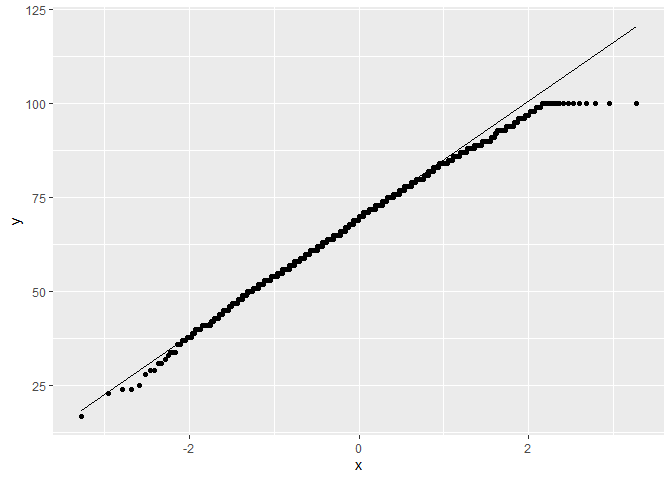
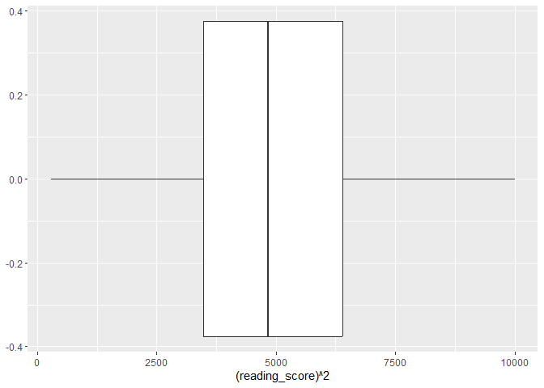

Reading Regression
================
mk4995
2024-12-15

## Explore variables.

Import data.

``` r
source("scores_data.R")
```

    ## ── Attaching core tidyverse packages ──────────────────────── tidyverse 2.0.0 ──
    ## ✔ dplyr     1.1.4     ✔ readr     2.1.5
    ## ✔ forcats   1.0.0     ✔ stringr   1.5.1
    ## ✔ ggplot2   3.5.1     ✔ tibble    3.2.1
    ## ✔ lubridate 1.9.3     ✔ tidyr     1.3.1
    ## ✔ purrr     1.0.2     
    ## ── Conflicts ────────────────────────────────────────── tidyverse_conflicts() ──
    ## ✖ dplyr::filter() masks stats::filter()
    ## ✖ dplyr::lag()    masks stats::lag()
    ## ℹ Use the conflicted package (<http://conflicted.r-lib.org/>) to force all conflicts to become errors

    ## Warning: package 'fastDummies' was built under R version 4.4.2

    ## Rows: 948 Columns: 14
    ## ── Column specification ────────────────────────────────────────────────────────
    ## Delimiter: ","
    ## chr (10): Gender, EthnicGroup, ParentEduc, LunchType, TestPrep, ParentMarita...
    ## dbl  (4): NrSiblings, MathScore, ReadingScore, WritingScore
    ## 
    ## ℹ Use `spec()` to retrieve the full column specification for this data.
    ## ℹ Specify the column types or set `show_col_types = FALSE` to quiet this message.

``` r
# scores_df = 
  # scores_df |> na.omit()

scores_df |> 
  gtsummary::tbl_summary() |> 
  gtsummary::bold_labels() |> 
  gtsummary::italicize_levels()
```

<div id="pvmwosfvud" style="padding-left:0px;padding-right:0px;padding-top:10px;padding-bottom:10px;overflow-x:auto;overflow-y:auto;width:auto;height:auto;">
<style>#pvmwosfvud table {
  font-family: system-ui, 'Segoe UI', Roboto, Helvetica, Arial, sans-serif, 'Apple Color Emoji', 'Segoe UI Emoji', 'Segoe UI Symbol', 'Noto Color Emoji';
  -webkit-font-smoothing: antialiased;
  -moz-osx-font-smoothing: grayscale;
}
&#10;#pvmwosfvud thead, #pvmwosfvud tbody, #pvmwosfvud tfoot, #pvmwosfvud tr, #pvmwosfvud td, #pvmwosfvud th {
  border-style: none;
}
&#10;#pvmwosfvud p {
  margin: 0;
  padding: 0;
}
&#10;#pvmwosfvud .gt_table {
  display: table;
  border-collapse: collapse;
  line-height: normal;
  margin-left: auto;
  margin-right: auto;
  color: #333333;
  font-size: 16px;
  font-weight: normal;
  font-style: normal;
  background-color: #FFFFFF;
  width: auto;
  border-top-style: solid;
  border-top-width: 2px;
  border-top-color: #A8A8A8;
  border-right-style: none;
  border-right-width: 2px;
  border-right-color: #D3D3D3;
  border-bottom-style: solid;
  border-bottom-width: 2px;
  border-bottom-color: #A8A8A8;
  border-left-style: none;
  border-left-width: 2px;
  border-left-color: #D3D3D3;
}
&#10;#pvmwosfvud .gt_caption {
  padding-top: 4px;
  padding-bottom: 4px;
}
&#10;#pvmwosfvud .gt_title {
  color: #333333;
  font-size: 125%;
  font-weight: initial;
  padding-top: 4px;
  padding-bottom: 4px;
  padding-left: 5px;
  padding-right: 5px;
  border-bottom-color: #FFFFFF;
  border-bottom-width: 0;
}
&#10;#pvmwosfvud .gt_subtitle {
  color: #333333;
  font-size: 85%;
  font-weight: initial;
  padding-top: 3px;
  padding-bottom: 5px;
  padding-left: 5px;
  padding-right: 5px;
  border-top-color: #FFFFFF;
  border-top-width: 0;
}
&#10;#pvmwosfvud .gt_heading {
  background-color: #FFFFFF;
  text-align: center;
  border-bottom-color: #FFFFFF;
  border-left-style: none;
  border-left-width: 1px;
  border-left-color: #D3D3D3;
  border-right-style: none;
  border-right-width: 1px;
  border-right-color: #D3D3D3;
}
&#10;#pvmwosfvud .gt_bottom_border {
  border-bottom-style: solid;
  border-bottom-width: 2px;
  border-bottom-color: #D3D3D3;
}
&#10;#pvmwosfvud .gt_col_headings {
  border-top-style: solid;
  border-top-width: 2px;
  border-top-color: #D3D3D3;
  border-bottom-style: solid;
  border-bottom-width: 2px;
  border-bottom-color: #D3D3D3;
  border-left-style: none;
  border-left-width: 1px;
  border-left-color: #D3D3D3;
  border-right-style: none;
  border-right-width: 1px;
  border-right-color: #D3D3D3;
}
&#10;#pvmwosfvud .gt_col_heading {
  color: #333333;
  background-color: #FFFFFF;
  font-size: 100%;
  font-weight: normal;
  text-transform: inherit;
  border-left-style: none;
  border-left-width: 1px;
  border-left-color: #D3D3D3;
  border-right-style: none;
  border-right-width: 1px;
  border-right-color: #D3D3D3;
  vertical-align: bottom;
  padding-top: 5px;
  padding-bottom: 6px;
  padding-left: 5px;
  padding-right: 5px;
  overflow-x: hidden;
}
&#10;#pvmwosfvud .gt_column_spanner_outer {
  color: #333333;
  background-color: #FFFFFF;
  font-size: 100%;
  font-weight: normal;
  text-transform: inherit;
  padding-top: 0;
  padding-bottom: 0;
  padding-left: 4px;
  padding-right: 4px;
}
&#10;#pvmwosfvud .gt_column_spanner_outer:first-child {
  padding-left: 0;
}
&#10;#pvmwosfvud .gt_column_spanner_outer:last-child {
  padding-right: 0;
}
&#10;#pvmwosfvud .gt_column_spanner {
  border-bottom-style: solid;
  border-bottom-width: 2px;
  border-bottom-color: #D3D3D3;
  vertical-align: bottom;
  padding-top: 5px;
  padding-bottom: 5px;
  overflow-x: hidden;
  display: inline-block;
  width: 100%;
}
&#10;#pvmwosfvud .gt_spanner_row {
  border-bottom-style: hidden;
}
&#10;#pvmwosfvud .gt_group_heading {
  padding-top: 8px;
  padding-bottom: 8px;
  padding-left: 5px;
  padding-right: 5px;
  color: #333333;
  background-color: #FFFFFF;
  font-size: 100%;
  font-weight: initial;
  text-transform: inherit;
  border-top-style: solid;
  border-top-width: 2px;
  border-top-color: #D3D3D3;
  border-bottom-style: solid;
  border-bottom-width: 2px;
  border-bottom-color: #D3D3D3;
  border-left-style: none;
  border-left-width: 1px;
  border-left-color: #D3D3D3;
  border-right-style: none;
  border-right-width: 1px;
  border-right-color: #D3D3D3;
  vertical-align: middle;
  text-align: left;
}
&#10;#pvmwosfvud .gt_empty_group_heading {
  padding: 0.5px;
  color: #333333;
  background-color: #FFFFFF;
  font-size: 100%;
  font-weight: initial;
  border-top-style: solid;
  border-top-width: 2px;
  border-top-color: #D3D3D3;
  border-bottom-style: solid;
  border-bottom-width: 2px;
  border-bottom-color: #D3D3D3;
  vertical-align: middle;
}
&#10;#pvmwosfvud .gt_from_md > :first-child {
  margin-top: 0;
}
&#10;#pvmwosfvud .gt_from_md > :last-child {
  margin-bottom: 0;
}
&#10;#pvmwosfvud .gt_row {
  padding-top: 8px;
  padding-bottom: 8px;
  padding-left: 5px;
  padding-right: 5px;
  margin: 10px;
  border-top-style: solid;
  border-top-width: 1px;
  border-top-color: #D3D3D3;
  border-left-style: none;
  border-left-width: 1px;
  border-left-color: #D3D3D3;
  border-right-style: none;
  border-right-width: 1px;
  border-right-color: #D3D3D3;
  vertical-align: middle;
  overflow-x: hidden;
}
&#10;#pvmwosfvud .gt_stub {
  color: #333333;
  background-color: #FFFFFF;
  font-size: 100%;
  font-weight: initial;
  text-transform: inherit;
  border-right-style: solid;
  border-right-width: 2px;
  border-right-color: #D3D3D3;
  padding-left: 5px;
  padding-right: 5px;
}
&#10;#pvmwosfvud .gt_stub_row_group {
  color: #333333;
  background-color: #FFFFFF;
  font-size: 100%;
  font-weight: initial;
  text-transform: inherit;
  border-right-style: solid;
  border-right-width: 2px;
  border-right-color: #D3D3D3;
  padding-left: 5px;
  padding-right: 5px;
  vertical-align: top;
}
&#10;#pvmwosfvud .gt_row_group_first td {
  border-top-width: 2px;
}
&#10;#pvmwosfvud .gt_row_group_first th {
  border-top-width: 2px;
}
&#10;#pvmwosfvud .gt_summary_row {
  color: #333333;
  background-color: #FFFFFF;
  text-transform: inherit;
  padding-top: 8px;
  padding-bottom: 8px;
  padding-left: 5px;
  padding-right: 5px;
}
&#10;#pvmwosfvud .gt_first_summary_row {
  border-top-style: solid;
  border-top-color: #D3D3D3;
}
&#10;#pvmwosfvud .gt_first_summary_row.thick {
  border-top-width: 2px;
}
&#10;#pvmwosfvud .gt_last_summary_row {
  padding-top: 8px;
  padding-bottom: 8px;
  padding-left: 5px;
  padding-right: 5px;
  border-bottom-style: solid;
  border-bottom-width: 2px;
  border-bottom-color: #D3D3D3;
}
&#10;#pvmwosfvud .gt_grand_summary_row {
  color: #333333;
  background-color: #FFFFFF;
  text-transform: inherit;
  padding-top: 8px;
  padding-bottom: 8px;
  padding-left: 5px;
  padding-right: 5px;
}
&#10;#pvmwosfvud .gt_first_grand_summary_row {
  padding-top: 8px;
  padding-bottom: 8px;
  padding-left: 5px;
  padding-right: 5px;
  border-top-style: double;
  border-top-width: 6px;
  border-top-color: #D3D3D3;
}
&#10;#pvmwosfvud .gt_last_grand_summary_row_top {
  padding-top: 8px;
  padding-bottom: 8px;
  padding-left: 5px;
  padding-right: 5px;
  border-bottom-style: double;
  border-bottom-width: 6px;
  border-bottom-color: #D3D3D3;
}
&#10;#pvmwosfvud .gt_striped {
  background-color: rgba(128, 128, 128, 0.05);
}
&#10;#pvmwosfvud .gt_table_body {
  border-top-style: solid;
  border-top-width: 2px;
  border-top-color: #D3D3D3;
  border-bottom-style: solid;
  border-bottom-width: 2px;
  border-bottom-color: #D3D3D3;
}
&#10;#pvmwosfvud .gt_footnotes {
  color: #333333;
  background-color: #FFFFFF;
  border-bottom-style: none;
  border-bottom-width: 2px;
  border-bottom-color: #D3D3D3;
  border-left-style: none;
  border-left-width: 2px;
  border-left-color: #D3D3D3;
  border-right-style: none;
  border-right-width: 2px;
  border-right-color: #D3D3D3;
}
&#10;#pvmwosfvud .gt_footnote {
  margin: 0px;
  font-size: 90%;
  padding-top: 4px;
  padding-bottom: 4px;
  padding-left: 5px;
  padding-right: 5px;
}
&#10;#pvmwosfvud .gt_sourcenotes {
  color: #333333;
  background-color: #FFFFFF;
  border-bottom-style: none;
  border-bottom-width: 2px;
  border-bottom-color: #D3D3D3;
  border-left-style: none;
  border-left-width: 2px;
  border-left-color: #D3D3D3;
  border-right-style: none;
  border-right-width: 2px;
  border-right-color: #D3D3D3;
}
&#10;#pvmwosfvud .gt_sourcenote {
  font-size: 90%;
  padding-top: 4px;
  padding-bottom: 4px;
  padding-left: 5px;
  padding-right: 5px;
}
&#10;#pvmwosfvud .gt_left {
  text-align: left;
}
&#10;#pvmwosfvud .gt_center {
  text-align: center;
}
&#10;#pvmwosfvud .gt_right {
  text-align: right;
  font-variant-numeric: tabular-nums;
}
&#10;#pvmwosfvud .gt_font_normal {
  font-weight: normal;
}
&#10;#pvmwosfvud .gt_font_bold {
  font-weight: bold;
}
&#10;#pvmwosfvud .gt_font_italic {
  font-style: italic;
}
&#10;#pvmwosfvud .gt_super {
  font-size: 65%;
}
&#10;#pvmwosfvud .gt_footnote_marks {
  font-size: 75%;
  vertical-align: 0.4em;
  position: initial;
}
&#10;#pvmwosfvud .gt_asterisk {
  font-size: 100%;
  vertical-align: 0;
}
&#10;#pvmwosfvud .gt_indent_1 {
  text-indent: 5px;
}
&#10;#pvmwosfvud .gt_indent_2 {
  text-indent: 10px;
}
&#10;#pvmwosfvud .gt_indent_3 {
  text-indent: 15px;
}
&#10;#pvmwosfvud .gt_indent_4 {
  text-indent: 20px;
}
&#10;#pvmwosfvud .gt_indent_5 {
  text-indent: 25px;
}
&#10;#pvmwosfvud .katex-display {
  display: inline-flex !important;
  margin-bottom: 0.75em !important;
}
&#10;#pvmwosfvud div.Reactable > div.rt-table > div.rt-thead > div.rt-tr.rt-tr-group-header > div.rt-th-group:after {
  height: 0px !important;
}
</style>
<table class="gt_table" data-quarto-disable-processing="false" data-quarto-bootstrap="false">
  <thead>
    <tr class="gt_col_headings">
      <th class="gt_col_heading gt_columns_bottom_border gt_left" rowspan="1" colspan="1" scope="col" id="label"><span class='gt_from_md'><strong>Characteristic</strong></span></th>
      <th class="gt_col_heading gt_columns_bottom_border gt_center" rowspan="1" colspan="1" scope="col" id="stat_0"><span class='gt_from_md'><strong>N = 948</strong></span><span class="gt_footnote_marks" style="white-space:nowrap;font-style:italic;font-weight:normal;line-height:0;"><sup>1</sup></span></th>
    </tr>
  </thead>
  <tbody class="gt_table_body">
    <tr><td headers="label" class="gt_row gt_left" style="font-weight: bold;">id</td>
<td headers="stat_0" class="gt_row gt_center">475 (238, 712)</td></tr>
    <tr><td headers="label" class="gt_row gt_left" style="font-weight: bold;">gender</td>
<td headers="stat_0" class="gt_row gt_center"><br /></td></tr>
    <tr><td headers="label" class="gt_row gt_left" style="font-style: italic;">    female</td>
<td headers="stat_0" class="gt_row gt_center">488 (51%)</td></tr>
    <tr><td headers="label" class="gt_row gt_left" style="font-style: italic;">    male</td>
<td headers="stat_0" class="gt_row gt_center">460 (49%)</td></tr>
    <tr><td headers="label" class="gt_row gt_left" style="font-weight: bold;">ethnic_group</td>
<td headers="stat_0" class="gt_row gt_center"><br /></td></tr>
    <tr><td headers="label" class="gt_row gt_left" style="font-style: italic;">    A</td>
<td headers="stat_0" class="gt_row gt_center">80 (9.0%)</td></tr>
    <tr><td headers="label" class="gt_row gt_left" style="font-style: italic;">    B</td>
<td headers="stat_0" class="gt_row gt_center">171 (19%)</td></tr>
    <tr><td headers="label" class="gt_row gt_left" style="font-style: italic;">    C</td>
<td headers="stat_0" class="gt_row gt_center">277 (31%)</td></tr>
    <tr><td headers="label" class="gt_row gt_left" style="font-style: italic;">    D</td>
<td headers="stat_0" class="gt_row gt_center">237 (27%)</td></tr>
    <tr><td headers="label" class="gt_row gt_left" style="font-style: italic;">    E</td>
<td headers="stat_0" class="gt_row gt_center">124 (14%)</td></tr>
    <tr><td headers="label" class="gt_row gt_left" style="font-style: italic;">    Unknown</td>
<td headers="stat_0" class="gt_row gt_center">59</td></tr>
    <tr><td headers="label" class="gt_row gt_left" style="font-weight: bold;">parent_educ</td>
<td headers="stat_0" class="gt_row gt_center"><br /></td></tr>
    <tr><td headers="label" class="gt_row gt_left" style="font-style: italic;">    some high school</td>
<td headers="stat_0" class="gt_row gt_center">163 (30%)</td></tr>
    <tr><td headers="label" class="gt_row gt_left" style="font-style: italic;">    high school</td>
<td headers="stat_0" class="gt_row gt_center">176 (33%)</td></tr>
    <tr><td headers="label" class="gt_row gt_left" style="font-style: italic;">    some college</td>
<td headers="stat_0" class="gt_row gt_center">199 (37%)</td></tr>
    <tr><td headers="label" class="gt_row gt_left" style="font-style: italic;">    associate's degree</td>
<td headers="stat_0" class="gt_row gt_center">0 (0%)</td></tr>
    <tr><td headers="label" class="gt_row gt_left" style="font-style: italic;">    backelor's degree</td>
<td headers="stat_0" class="gt_row gt_center">0 (0%)</td></tr>
    <tr><td headers="label" class="gt_row gt_left" style="font-style: italic;">    master's degree</td>
<td headers="stat_0" class="gt_row gt_center">0 (0%)</td></tr>
    <tr><td headers="label" class="gt_row gt_left" style="font-style: italic;">    Unknown</td>
<td headers="stat_0" class="gt_row gt_center">410</td></tr>
    <tr><td headers="label" class="gt_row gt_left" style="font-weight: bold;">lunch_type</td>
<td headers="stat_0" class="gt_row gt_center"><br /></td></tr>
    <tr><td headers="label" class="gt_row gt_left" style="font-style: italic;">    free_reduced</td>
<td headers="stat_0" class="gt_row gt_center">331 (35%)</td></tr>
    <tr><td headers="label" class="gt_row gt_left" style="font-style: italic;">    standard</td>
<td headers="stat_0" class="gt_row gt_center">617 (65%)</td></tr>
    <tr><td headers="label" class="gt_row gt_left" style="font-weight: bold;">test_prep</td>
<td headers="stat_0" class="gt_row gt_center"><br /></td></tr>
    <tr><td headers="label" class="gt_row gt_left" style="font-style: italic;">    none</td>
<td headers="stat_0" class="gt_row gt_center">571 (64%)</td></tr>
    <tr><td headers="label" class="gt_row gt_left" style="font-style: italic;">    completed</td>
<td headers="stat_0" class="gt_row gt_center">322 (36%)</td></tr>
    <tr><td headers="label" class="gt_row gt_left" style="font-style: italic;">    Unknown</td>
<td headers="stat_0" class="gt_row gt_center">55</td></tr>
    <tr><td headers="label" class="gt_row gt_left" style="font-weight: bold;">parent_marital_status</td>
<td headers="stat_0" class="gt_row gt_center"><br /></td></tr>
    <tr><td headers="label" class="gt_row gt_left" style="font-style: italic;">    divorced</td>
<td headers="stat_0" class="gt_row gt_center">146 (16%)</td></tr>
    <tr><td headers="label" class="gt_row gt_left" style="font-style: italic;">    married</td>
<td headers="stat_0" class="gt_row gt_center">516 (57%)</td></tr>
    <tr><td headers="label" class="gt_row gt_left" style="font-style: italic;">    single</td>
<td headers="stat_0" class="gt_row gt_center">213 (24%)</td></tr>
    <tr><td headers="label" class="gt_row gt_left" style="font-style: italic;">    widowed</td>
<td headers="stat_0" class="gt_row gt_center">24 (2.7%)</td></tr>
    <tr><td headers="label" class="gt_row gt_left" style="font-style: italic;">    Unknown</td>
<td headers="stat_0" class="gt_row gt_center">49</td></tr>
    <tr><td headers="label" class="gt_row gt_left" style="font-weight: bold;">practice_sport</td>
<td headers="stat_0" class="gt_row gt_center"><br /></td></tr>
    <tr><td headers="label" class="gt_row gt_left" style="font-style: italic;">    never</td>
<td headers="stat_0" class="gt_row gt_center">112 (12%)</td></tr>
    <tr><td headers="label" class="gt_row gt_left" style="font-style: italic;">    sometimes</td>
<td headers="stat_0" class="gt_row gt_center">477 (51%)</td></tr>
    <tr><td headers="label" class="gt_row gt_left" style="font-style: italic;">    regularly</td>
<td headers="stat_0" class="gt_row gt_center">343 (37%)</td></tr>
    <tr><td headers="label" class="gt_row gt_left" style="font-style: italic;">    Unknown</td>
<td headers="stat_0" class="gt_row gt_center">16</td></tr>
    <tr><td headers="label" class="gt_row gt_left" style="font-weight: bold;">is_first_child</td>
<td headers="stat_0" class="gt_row gt_center">604 (66%)</td></tr>
    <tr><td headers="label" class="gt_row gt_left" style="font-style: italic;">    Unknown</td>
<td headers="stat_0" class="gt_row gt_center">30</td></tr>
    <tr><td headers="label" class="gt_row gt_left" style="font-weight: bold;">nr_siblings</td>
<td headers="stat_0" class="gt_row gt_center"><br /></td></tr>
    <tr><td headers="label" class="gt_row gt_left" style="font-style: italic;">    0</td>
<td headers="stat_0" class="gt_row gt_center">101 (11%)</td></tr>
    <tr><td headers="label" class="gt_row gt_left" style="font-style: italic;">    1</td>
<td headers="stat_0" class="gt_row gt_center">245 (27%)</td></tr>
    <tr><td headers="label" class="gt_row gt_left" style="font-style: italic;">    2</td>
<td headers="stat_0" class="gt_row gt_center">213 (24%)</td></tr>
    <tr><td headers="label" class="gt_row gt_left" style="font-style: italic;">    3</td>
<td headers="stat_0" class="gt_row gt_center">198 (22%)</td></tr>
    <tr><td headers="label" class="gt_row gt_left" style="font-style: italic;">    4</td>
<td headers="stat_0" class="gt_row gt_center">76 (8.4%)</td></tr>
    <tr><td headers="label" class="gt_row gt_left" style="font-style: italic;">    5</td>
<td headers="stat_0" class="gt_row gt_center">50 (5.5%)</td></tr>
    <tr><td headers="label" class="gt_row gt_left" style="font-style: italic;">    6</td>
<td headers="stat_0" class="gt_row gt_center">8 (0.9%)</td></tr>
    <tr><td headers="label" class="gt_row gt_left" style="font-style: italic;">    7</td>
<td headers="stat_0" class="gt_row gt_center">11 (1.2%)</td></tr>
    <tr><td headers="label" class="gt_row gt_left" style="font-style: italic;">    Unknown</td>
<td headers="stat_0" class="gt_row gt_center">46</td></tr>
    <tr><td headers="label" class="gt_row gt_left" style="font-weight: bold;">transport_means</td>
<td headers="stat_0" class="gt_row gt_center"><br /></td></tr>
    <tr><td headers="label" class="gt_row gt_left" style="font-style: italic;">    private</td>
<td headers="stat_0" class="gt_row gt_center">337 (40%)</td></tr>
    <tr><td headers="label" class="gt_row gt_left" style="font-style: italic;">    school_bus</td>
<td headers="stat_0" class="gt_row gt_center">509 (60%)</td></tr>
    <tr><td headers="label" class="gt_row gt_left" style="font-style: italic;">    Unknown</td>
<td headers="stat_0" class="gt_row gt_center">102</td></tr>
    <tr><td headers="label" class="gt_row gt_left" style="font-weight: bold;">wkly_study_hours</td>
<td headers="stat_0" class="gt_row gt_center"><br /></td></tr>
    <tr><td headers="label" class="gt_row gt_left" style="font-style: italic;">    &lt; 5</td>
<td headers="stat_0" class="gt_row gt_center">253 (28%)</td></tr>
    <tr><td headers="label" class="gt_row gt_left" style="font-style: italic;">    5-10</td>
<td headers="stat_0" class="gt_row gt_center">508 (56%)</td></tr>
    <tr><td headers="label" class="gt_row gt_left" style="font-style: italic;">    &gt; 10</td>
<td headers="stat_0" class="gt_row gt_center">150 (16%)</td></tr>
    <tr><td headers="label" class="gt_row gt_left" style="font-style: italic;">    Unknown</td>
<td headers="stat_0" class="gt_row gt_center">37</td></tr>
    <tr><td headers="label" class="gt_row gt_left" style="font-weight: bold;">math_score</td>
<td headers="stat_0" class="gt_row gt_center">66 (56, 76)</td></tr>
    <tr><td headers="label" class="gt_row gt_left" style="font-weight: bold;">reading_score</td>
<td headers="stat_0" class="gt_row gt_center">70 (59, 80)</td></tr>
    <tr><td headers="label" class="gt_row gt_left" style="font-weight: bold;">writing_score</td>
<td headers="stat_0" class="gt_row gt_center">68 (57, 79)</td></tr>
  </tbody>
  &#10;  <tfoot class="gt_footnotes">
    <tr>
      <td class="gt_footnote" colspan="2"><span class="gt_footnote_marks" style="white-space:nowrap;font-style:italic;font-weight:normal;line-height:0;"><sup>1</sup></span> <span class='gt_from_md'>Median (Q1, Q3); n (%)</span></td>
    </tr>
  </tfoot>
</table>
</div>

``` r
pairs(scores_df)
```

<!-- -->

## Decide if `reading_score` needs to be transformed.

``` r
library(ggplot2)
library(dplyr)
library(patchwork)
```

    ## Warning: package 'patchwork' was built under R version 4.4.2

``` r
scores_df |> 
  ggplot(aes(x = (reading_score))) +
  geom_boxplot()
```

<!-- -->

``` r
scores_df |> 
  ggplot(aes(sample = (reading_score))) +
  geom_qq() + geom_qq_line()
```

<!-- -->

``` r
scores_df |> 
  filter(!(id == 33)) |> 
  ggplot(aes(sample = reading_score)) +
  geom_qq() + geom_qq_line()
```

<!-- -->

``` r
library(caret)
```

    ## Warning: package 'caret' was built under R version 4.4.2

    ## Loading required package: lattice

    ## 
    ## Attaching package: 'caret'

    ## The following object is masked from 'package:purrr':
    ## 
    ##     lift

``` r
# Create a Box-Cox transformation object
bc_transform <- BoxCoxTrans(scores_df$reading_score)  # Replace Area with your variable

# View the optimal lambda
bc_transform$lambda
```

    ## [1] 1.3

``` r
scores_df |> 
  ggplot(aes(x = (reading_score)^2)) +
  geom_boxplot()
```

<!-- -->

``` r
scores_df = 
  scores_df |> 
  mutate(reading_score_squared = (reading_score)^2) 
```

## Basic regression models

Without other scores and no transformation:

``` r
reading_df = scores_df |> select(-c(id, math_score, writing_score))

reading_model = lm(reading_score ~ ., data = reading_df)
summary(reading_model)
```

    ## 
    ## Call:
    ## lm(formula = reading_score ~ ., data = reading_df)
    ## 
    ## Residuals:
    ##      Min       1Q   Median       3Q      Max 
    ## -15.4753  -0.6726   0.7486   1.4448   2.9225 
    ## 
    ## Coefficients:
    ##                                Estimate Std. Error t value Pr(>|t|)    
    ## (Intercept)                   3.092e+01  8.706e-01  35.516   <2e-16 ***
    ## gendermale                    4.520e-01  2.827e-01   1.599    0.111    
    ## ethnic_groupB                 1.554e-01  5.096e-01   0.305    0.761    
    ## ethnic_groupC                 4.663e-01  4.878e-01   0.956    0.340    
    ## ethnic_groupD                 5.600e-01  4.843e-01   1.156    0.248    
    ## ethnic_groupE                 5.890e-01  5.651e-01   1.042    0.298    
    ## parent_educhigh school        4.155e-01  3.287e-01   1.264    0.207    
    ## parent_educsome college       1.823e-01  3.312e-01   0.550    0.582    
    ## lunch_typestandard            3.031e-01  2.915e-01   1.040    0.299    
    ## test_prepcompleted            1.467e-01  2.943e-01   0.498    0.618    
    ## parent_marital_statusmarried  1.863e-01  3.735e-01   0.499    0.618    
    ## parent_marital_statussingle  -9.043e-02  4.310e-01  -0.210    0.834    
    ## parent_marital_statuswidowed -5.650e-03  8.893e-01  -0.006    0.995    
    ## practice_sportsometimes      -4.303e-01  4.528e-01  -0.950    0.343    
    ## practice_sportregularly      -4.774e-01  4.603e-01  -1.037    0.300    
    ## is_first_childyes             7.710e-02  2.909e-01   0.265    0.791    
    ## nr_siblings                  -5.840e-02  9.045e-02  -0.646    0.519    
    ## transport_meansschool_bus    -3.319e-02  2.672e-01  -0.124    0.901    
    ## wkly_study_hours5-10         -1.102e-01  3.212e-01  -0.343    0.732    
    ## wkly_study_hours> 10         -3.926e-01  4.182e-01  -0.939    0.348    
    ## reading_score_squared         7.543e-03  7.787e-05  96.866   <2e-16 ***
    ## ---
    ## Signif. codes:  0 '***' 0.001 '**' 0.01 '*' 0.05 '.' 0.1 ' ' 1
    ## 
    ## Residual standard error: 2.442 on 328 degrees of freedom
    ##   (599 observations deleted due to missingness)
    ## Multiple R-squared:  0.975,  Adjusted R-squared:  0.9735 
    ## F-statistic: 640.6 on 20 and 328 DF,  p-value: < 2.2e-16

Significant coefficients:

- (Intercept)
- gendermale
- ethnic_groupE
- lunch_typestandard
- test_prepcompleted
- parent_marital_statusmarried

# Check spread of residuals.

**RSE = 13.27**: Indicates the average difference betweeen observed and
fitted values.

**R^2 = 0.2609** About 26.09% of the variability in reading score is
explained by the covariates.

**Adj-R^2 = 0.2182** After penalizing for the predictors in the model
that don’t add anything useful, 21.82% of the variability in reading
score is explained by the covariates.

``` r
reading_transformed_df = 
  reading_df |> 
  mutate(reading_score_squared = reading_score^2) |> 
  select(-reading_score)

reading_transformed_model = lm(reading_score_squared ~ ., data = reading_transformed_df)
summary(reading_transformed_model)
```

    ## 
    ## Call:
    ## lm(formula = reading_score_squared ~ ., data = reading_transformed_df)
    ## 
    ## Residuals:
    ##     Min      1Q  Median      3Q     Max 
    ## -3759.4 -1170.7  -117.6  1134.3  4166.0 
    ## 
    ## Coefficients:
    ##                              Estimate Std. Error t value Pr(>|t|)    
    ## (Intercept)                   3226.67     590.20   5.467 9.06e-08 ***
    ## gendermale                   -1164.12     189.58  -6.140 2.37e-09 ***
    ## ethnic_groupB                 -540.03     359.61  -1.502  0.13413    
    ## ethnic_groupC                 -203.83     345.16  -0.591  0.55524    
    ## ethnic_groupD                  248.92     342.65   0.726  0.46809    
    ## ethnic_groupE                  894.51     397.09   2.253  0.02494 *  
    ## parent_educhigh school        -103.37     232.64  -0.444  0.65708    
    ## parent_educsome college        280.03     233.99   1.197  0.23227    
    ## lunch_typestandard            1128.97     196.77   5.738 2.18e-08 ***
    ## test_prepcompleted             853.35     202.99   4.204 3.38e-05 ***
    ## parent_marital_statusmarried   688.26     261.74   2.630  0.00895 ** 
    ## parent_marital_statussingle    312.68     304.65   1.026  0.30548    
    ## parent_marital_statuswidowed   760.09     628.22   1.210  0.22719    
    ## practice_sportsometimes         37.38     320.60   0.117  0.90726    
    ## practice_sportregularly       -285.99     325.54  -0.879  0.38031    
    ## is_first_childyes              397.56     204.77   1.941  0.05306 .  
    ## nr_siblings                     73.83      63.91   1.155  0.24882    
    ## transport_meansschool_bus      132.88     189.05   0.703  0.48265    
    ## wkly_study_hours5-10           131.60     227.31   0.579  0.56303    
    ## wkly_study_hours> 10            86.22     296.05   0.291  0.77107    
    ## ---
    ## Signif. codes:  0 '***' 0.001 '**' 0.01 '*' 0.05 '.' 0.1 ' ' 1
    ## 
    ## Residual standard error: 1729 on 329 degrees of freedom
    ##   (599 observations deleted due to missingness)
    ## Multiple R-squared:  0.2648, Adjusted R-squared:  0.2224 
    ## F-statistic: 6.237 on 19 and 329 DF,  p-value: 1.115e-13

## Creating optimal models

Start regression procedures without the other score variables against
`reading_score`.

``` r
# Does not contain id, math score, wrting score, or NAs
reading_df = scores_df |> na.omit() |> select(-c(id, math_score, writing_score))
```

Use forward and backward model selection and test-based procedures.

``` r
# Backward model
mult.fit = lm(reading_score ~ ., data = reading_df)
summary(mult.fit)
```

    ## 
    ## Call:
    ## lm(formula = reading_score ~ ., data = reading_df)
    ## 
    ## Residuals:
    ##      Min       1Q   Median       3Q      Max 
    ## -15.4753  -0.6726   0.7486   1.4448   2.9225 
    ## 
    ## Coefficients:
    ##                                Estimate Std. Error t value Pr(>|t|)    
    ## (Intercept)                   3.092e+01  8.706e-01  35.516   <2e-16 ***
    ## gendermale                    4.520e-01  2.827e-01   1.599    0.111    
    ## ethnic_groupB                 1.554e-01  5.096e-01   0.305    0.761    
    ## ethnic_groupC                 4.663e-01  4.878e-01   0.956    0.340    
    ## ethnic_groupD                 5.600e-01  4.843e-01   1.156    0.248    
    ## ethnic_groupE                 5.890e-01  5.651e-01   1.042    0.298    
    ## parent_educhigh school        4.155e-01  3.287e-01   1.264    0.207    
    ## parent_educsome college       1.823e-01  3.312e-01   0.550    0.582    
    ## lunch_typestandard            3.031e-01  2.915e-01   1.040    0.299    
    ## test_prepcompleted            1.467e-01  2.943e-01   0.498    0.618    
    ## parent_marital_statusmarried  1.863e-01  3.735e-01   0.499    0.618    
    ## parent_marital_statussingle  -9.043e-02  4.310e-01  -0.210    0.834    
    ## parent_marital_statuswidowed -5.650e-03  8.893e-01  -0.006    0.995    
    ## practice_sportsometimes      -4.303e-01  4.528e-01  -0.950    0.343    
    ## practice_sportregularly      -4.774e-01  4.603e-01  -1.037    0.300    
    ## is_first_childyes             7.710e-02  2.909e-01   0.265    0.791    
    ## nr_siblings                  -5.840e-02  9.045e-02  -0.646    0.519    
    ## transport_meansschool_bus    -3.319e-02  2.672e-01  -0.124    0.901    
    ## wkly_study_hours5-10         -1.102e-01  3.212e-01  -0.343    0.732    
    ## wkly_study_hours> 10         -3.926e-01  4.182e-01  -0.939    0.348    
    ## reading_score_squared         7.543e-03  7.787e-05  96.866   <2e-16 ***
    ## ---
    ## Signif. codes:  0 '***' 0.001 '**' 0.01 '*' 0.05 '.' 0.1 ' ' 1
    ## 
    ## Residual standard error: 2.442 on 328 degrees of freedom
    ## Multiple R-squared:  0.975,  Adjusted R-squared:  0.9735 
    ## F-statistic: 640.6 on 20 and 328 DF,  p-value: < 2.2e-16

``` r
backward_model = step(mult.fit, direction = "backward")
```

    ## Start:  AIC=643.54
    ## reading_score ~ gender + ethnic_group + parent_educ + lunch_type + 
    ##     test_prep + parent_marital_status + practice_sport + is_first_child + 
    ##     nr_siblings + transport_means + wkly_study_hours + reading_score_squared
    ## 
    ##                         Df Sum of Sq   RSS     AIC
    ## - ethnic_group           4        14  1970  638.02
    ## - parent_marital_status  3         5  1961  638.40
    ## - wkly_study_hours       2         5  1962  640.52
    ## - practice_sport         2         7  1963  640.73
    ## - parent_educ            2        10  1966  641.26
    ## - transport_means        1         0  1956  641.56
    ## - is_first_child         1         0  1956  641.62
    ## - test_prep              1         1  1958  641.81
    ## - nr_siblings            1         2  1959  641.99
    ## - lunch_type             1         6  1963  642.69
    ## <none>                                1956  643.54
    ## - gender                 1        15  1971  644.25
    ## - reading_score_squared  1     55957 57914 1823.96
    ## 
    ## Step:  AIC=638.02
    ## reading_score ~ gender + parent_educ + lunch_type + test_prep + 
    ##     parent_marital_status + practice_sport + is_first_child + 
    ##     nr_siblings + transport_means + wkly_study_hours + reading_score_squared
    ## 
    ##                         Df Sum of Sq   RSS     AIC
    ## - parent_marital_status  3         4  1974  632.80
    ## - wkly_study_hours       2         6  1976  635.08
    ## - practice_sport         2         7  1977  635.27
    ## - parent_educ            2         9  1979  635.53
    ## - transport_means        1         0  1970  636.07
    ## - is_first_child         1         0  1970  636.07
    ## - test_prep              1         1  1971  636.17
    ## - nr_siblings            1         4  1974  636.66
    ## - lunch_type             1         6  1976  637.03
    ## <none>                                1970  638.02
    ## - gender                 1        18  1988  639.12
    ## - reading_score_squared  1     59836 61806 1838.66
    ## 
    ## Step:  AIC=632.8
    ## reading_score ~ gender + parent_educ + lunch_type + test_prep + 
    ##     practice_sport + is_first_child + nr_siblings + transport_means + 
    ##     wkly_study_hours + reading_score_squared
    ## 
    ##                         Df Sum of Sq   RSS     AIC
    ## - wkly_study_hours       2         7  1981  629.97
    ## - practice_sport         2         7  1982  630.12
    ## - parent_educ            2         9  1984  630.41
    ## - is_first_child         1         0  1975  630.83
    ## - transport_means        1         0  1975  630.86
    ## - test_prep              1         1  1975  630.92
    ## - nr_siblings            1         4  1978  631.44
    ## - lunch_type             1         5  1980  631.74
    ## <none>                                1974  632.80
    ## - gender                 1        19  1993  634.12
    ## - reading_score_squared  1     60975 62950 1839.06
    ## 
    ## Step:  AIC=629.97
    ## reading_score ~ gender + parent_educ + lunch_type + test_prep + 
    ##     practice_sport + is_first_child + nr_siblings + transport_means + 
    ##     reading_score_squared
    ## 
    ##                         Df Sum of Sq   RSS     AIC
    ## - practice_sport         2         8  1989  627.34
    ## - parent_educ            2         9  1990  627.58
    ## - is_first_child         1         0  1981  627.99
    ## - transport_means        1         0  1981  628.03
    ## - test_prep              1         0  1981  628.04
    ## - nr_siblings            1         4  1985  628.71
    ## - lunch_type             1         6  1987  628.94
    ## <none>                                1981  629.97
    ## - gender                 1        18  1999  631.08
    ## - reading_score_squared  1     61105 63086 1835.82
    ## 
    ## Step:  AIC=627.34
    ## reading_score ~ gender + parent_educ + lunch_type + test_prep + 
    ##     is_first_child + nr_siblings + transport_means + reading_score_squared
    ## 
    ##                         Df Sum of Sq   RSS     AIC
    ## - parent_educ            2         9  1997  624.84
    ## - test_prep              1         0  1989  625.36
    ## - is_first_child         1         0  1989  625.37
    ## - transport_means        1         1  1989  625.45
    ## - nr_siblings            1         4  1993  626.08
    ## - lunch_type             1         6  1995  626.40
    ## <none>                                1989  627.34
    ## - gender                 1        18  2006  628.42
    ## - reading_score_squared  1     61706 63694 1835.17
    ## 
    ## Step:  AIC=624.84
    ## reading_score ~ gender + lunch_type + test_prep + is_first_child + 
    ##     nr_siblings + transport_means + reading_score_squared
    ## 
    ##                         Df Sum of Sq   RSS     AIC
    ## - test_prep              1         0  1997  622.84
    ## - is_first_child         1         0  1998  622.91
    ## - transport_means        1         1  1998  622.97
    ## - nr_siblings            1         3  2000  623.36
    ## - lunch_type             1         7  2004  623.98
    ## <none>                                1997  624.84
    ## - gender                 1        19  2017  626.20
    ## - reading_score_squared  1     62496 64493 1835.51
    ## 
    ## Step:  AIC=622.84
    ## reading_score ~ gender + lunch_type + is_first_child + nr_siblings + 
    ##     transport_means + reading_score_squared
    ## 
    ##                         Df Sum of Sq   RSS     AIC
    ## - is_first_child         1         0  1998  620.91
    ## - transport_means        1         1  1998  620.97
    ## - nr_siblings            1         3  2000  621.36
    ## - lunch_type             1         7  2004  621.99
    ## <none>                                1997  622.84
    ## - gender                 1        20  2017  624.24
    ## - reading_score_squared  1     65846 67844 1851.19
    ## 
    ## Step:  AIC=620.91
    ## reading_score ~ gender + lunch_type + nr_siblings + transport_means + 
    ##     reading_score_squared
    ## 
    ##                         Df Sum of Sq   RSS     AIC
    ## - transport_means        1         1  1999  619.05
    ## - nr_siblings            1         3  2001  619.49
    ## - lunch_type             1         6  2004  620.04
    ## <none>                                1998  620.91
    ## - gender                 1        20  2018  622.37
    ## - reading_score_squared  1     66290 68287 1851.47
    ## 
    ## Step:  AIC=619.05
    ## reading_score ~ gender + lunch_type + nr_siblings + reading_score_squared
    ## 
    ##                         Df Sum of Sq   RSS     AIC
    ## - nr_siblings            1         3  2002  617.62
    ## - lunch_type             1         7  2005  618.21
    ## <none>                                1999  619.05
    ## - gender                 1        20  2018  620.49
    ## - reading_score_squared  1     66305 68304 1849.55
    ## 
    ## Step:  AIC=617.62
    ## reading_score ~ gender + lunch_type + reading_score_squared
    ## 
    ##                         Df Sum of Sq   RSS     AIC
    ## - lunch_type             1         7  2009  616.87
    ## <none>                                2002  617.62
    ## - gender                 1        20  2022  619.16
    ## - reading_score_squared  1     66335 68337 1847.72
    ## 
    ## Step:  AIC=616.87
    ## reading_score ~ gender + reading_score_squared
    ## 
    ##                         Df Sum of Sq   RSS     AIC
    ## <none>                                2009  616.87
    ## - gender                 1        24  2034  619.09
    ## - reading_score_squared  1     72106 74115 1874.05

``` r
summary(backward_model)
```

    ## 
    ## Call:
    ## lm(formula = reading_score ~ gender + reading_score_squared, 
    ##     data = reading_df)
    ## 
    ## Residuals:
    ##      Min       1Q   Median       3Q      Max 
    ## -16.1573  -0.5087   0.8328   1.4230   1.9803 
    ## 
    ## Coefficients:
    ##                        Estimate Std. Error t value Pr(>|t|)    
    ## (Intercept)           3.096e+01  3.980e-01  77.791   <2e-16 ***
    ## gendermale            5.479e-01  2.669e-01   2.053   0.0408 *  
    ## reading_score_squared 7.588e-03  6.810e-05 111.437   <2e-16 ***
    ## ---
    ## Signif. codes:  0 '***' 0.001 '**' 0.01 '*' 0.05 '.' 0.1 ' ' 1
    ## 
    ## Residual standard error: 2.41 on 346 degrees of freedom
    ## Multiple R-squared:  0.9744, Adjusted R-squared:  0.9742 
    ## F-statistic:  6575 on 2 and 346 DF,  p-value: < 2.2e-16

The resulting model is:

$$
\text{reading_score} = \beta_0 + \beta_1 \cdot \text{gender} + \beta_2 \cdot \text{ethnic_group} + \beta_3 \cdot \text{lunch_type} + \beta_4 \cdot \text{test_prep} + \beta_5 \cdot \text{parent_marital_status} + \beta_6 \cdot \text{is_first_child}
$$

``` r
# Forward model
null_model = lm(reading_score ~ 1, data = scores_df1)
forward_model = step(null_model, direction = "forward", scope = formula(mult.fit))
summary(forward_model)
```
