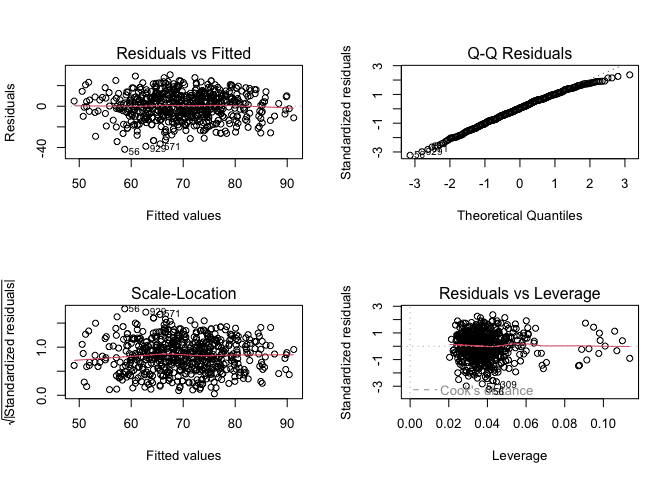
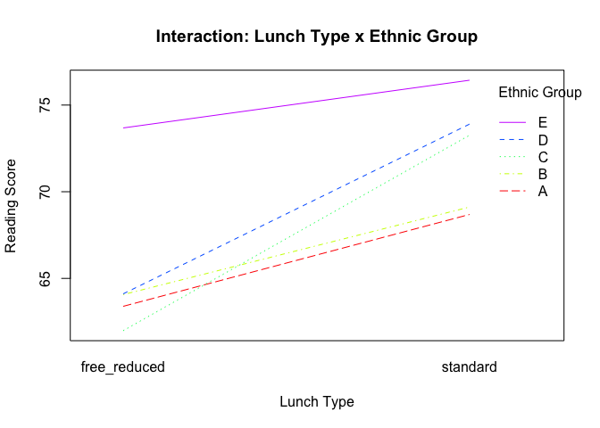

Reading Regression
================
mk4995
2024-12-15

# Data Exploration

## Explore predictors.

Import data.

``` r
source("scores_data.R")
```

    ## ── Attaching core tidyverse packages ──────────────────────── tidyverse 2.0.0 ──
    ## ✔ dplyr     1.1.4     ✔ readr     2.1.5
    ## ✔ forcats   1.0.0     ✔ stringr   1.5.1
    ## ✔ ggplot2   3.5.1     ✔ tibble    3.2.1
    ## ✔ lubridate 1.9.3     ✔ tidyr     1.3.1
    ## ✔ purrr     1.0.2     
    ## ── Conflicts ────────────────────────────────────────── tidyverse_conflicts() ──
    ## ✖ dplyr::filter() masks stats::filter()
    ## ✖ dplyr::lag()    masks stats::lag()
    ## ℹ Use the conflicted package (<http://conflicted.r-lib.org/>) to force all conflicts to become errors
    ## Rows: 948 Columns: 14
    ## ── Column specification ────────────────────────────────────────────────────────
    ## Delimiter: ","
    ## chr (10): Gender, EthnicGroup, ParentEduc, LunchType, TestPrep, ParentMarita...
    ## dbl  (4): NrSiblings, MathScore, ReadingScore, WritingScore
    ## 
    ## ℹ Use `spec()` to retrieve the full column specification for this data.
    ## ℹ Specify the column types or set `show_col_types = FALSE` to quiet this message.

Examine the overall data distributions and any correlations.

``` r
scores_df |> select(-id) |> 
  gtsummary::tbl_summary() |> 
  gtsummary::bold_labels() |> 
  gtsummary::italicize_levels()
```

<div id="bjtnreigup" style="padding-left:0px;padding-right:0px;padding-top:10px;padding-bottom:10px;overflow-x:auto;overflow-y:auto;width:auto;height:auto;">
<style>#bjtnreigup table {
  font-family: system-ui, 'Segoe UI', Roboto, Helvetica, Arial, sans-serif, 'Apple Color Emoji', 'Segoe UI Emoji', 'Segoe UI Symbol', 'Noto Color Emoji';
  -webkit-font-smoothing: antialiased;
  -moz-osx-font-smoothing: grayscale;
}
&#10;#bjtnreigup thead, #bjtnreigup tbody, #bjtnreigup tfoot, #bjtnreigup tr, #bjtnreigup td, #bjtnreigup th {
  border-style: none;
}
&#10;#bjtnreigup p {
  margin: 0;
  padding: 0;
}
&#10;#bjtnreigup .gt_table {
  display: table;
  border-collapse: collapse;
  line-height: normal;
  margin-left: auto;
  margin-right: auto;
  color: #333333;
  font-size: 16px;
  font-weight: normal;
  font-style: normal;
  background-color: #FFFFFF;
  width: auto;
  border-top-style: solid;
  border-top-width: 2px;
  border-top-color: #A8A8A8;
  border-right-style: none;
  border-right-width: 2px;
  border-right-color: #D3D3D3;
  border-bottom-style: solid;
  border-bottom-width: 2px;
  border-bottom-color: #A8A8A8;
  border-left-style: none;
  border-left-width: 2px;
  border-left-color: #D3D3D3;
}
&#10;#bjtnreigup .gt_caption {
  padding-top: 4px;
  padding-bottom: 4px;
}
&#10;#bjtnreigup .gt_title {
  color: #333333;
  font-size: 125%;
  font-weight: initial;
  padding-top: 4px;
  padding-bottom: 4px;
  padding-left: 5px;
  padding-right: 5px;
  border-bottom-color: #FFFFFF;
  border-bottom-width: 0;
}
&#10;#bjtnreigup .gt_subtitle {
  color: #333333;
  font-size: 85%;
  font-weight: initial;
  padding-top: 3px;
  padding-bottom: 5px;
  padding-left: 5px;
  padding-right: 5px;
  border-top-color: #FFFFFF;
  border-top-width: 0;
}
&#10;#bjtnreigup .gt_heading {
  background-color: #FFFFFF;
  text-align: center;
  border-bottom-color: #FFFFFF;
  border-left-style: none;
  border-left-width: 1px;
  border-left-color: #D3D3D3;
  border-right-style: none;
  border-right-width: 1px;
  border-right-color: #D3D3D3;
}
&#10;#bjtnreigup .gt_bottom_border {
  border-bottom-style: solid;
  border-bottom-width: 2px;
  border-bottom-color: #D3D3D3;
}
&#10;#bjtnreigup .gt_col_headings {
  border-top-style: solid;
  border-top-width: 2px;
  border-top-color: #D3D3D3;
  border-bottom-style: solid;
  border-bottom-width: 2px;
  border-bottom-color: #D3D3D3;
  border-left-style: none;
  border-left-width: 1px;
  border-left-color: #D3D3D3;
  border-right-style: none;
  border-right-width: 1px;
  border-right-color: #D3D3D3;
}
&#10;#bjtnreigup .gt_col_heading {
  color: #333333;
  background-color: #FFFFFF;
  font-size: 100%;
  font-weight: normal;
  text-transform: inherit;
  border-left-style: none;
  border-left-width: 1px;
  border-left-color: #D3D3D3;
  border-right-style: none;
  border-right-width: 1px;
  border-right-color: #D3D3D3;
  vertical-align: bottom;
  padding-top: 5px;
  padding-bottom: 6px;
  padding-left: 5px;
  padding-right: 5px;
  overflow-x: hidden;
}
&#10;#bjtnreigup .gt_column_spanner_outer {
  color: #333333;
  background-color: #FFFFFF;
  font-size: 100%;
  font-weight: normal;
  text-transform: inherit;
  padding-top: 0;
  padding-bottom: 0;
  padding-left: 4px;
  padding-right: 4px;
}
&#10;#bjtnreigup .gt_column_spanner_outer:first-child {
  padding-left: 0;
}
&#10;#bjtnreigup .gt_column_spanner_outer:last-child {
  padding-right: 0;
}
&#10;#bjtnreigup .gt_column_spanner {
  border-bottom-style: solid;
  border-bottom-width: 2px;
  border-bottom-color: #D3D3D3;
  vertical-align: bottom;
  padding-top: 5px;
  padding-bottom: 5px;
  overflow-x: hidden;
  display: inline-block;
  width: 100%;
}
&#10;#bjtnreigup .gt_spanner_row {
  border-bottom-style: hidden;
}
&#10;#bjtnreigup .gt_group_heading {
  padding-top: 8px;
  padding-bottom: 8px;
  padding-left: 5px;
  padding-right: 5px;
  color: #333333;
  background-color: #FFFFFF;
  font-size: 100%;
  font-weight: initial;
  text-transform: inherit;
  border-top-style: solid;
  border-top-width: 2px;
  border-top-color: #D3D3D3;
  border-bottom-style: solid;
  border-bottom-width: 2px;
  border-bottom-color: #D3D3D3;
  border-left-style: none;
  border-left-width: 1px;
  border-left-color: #D3D3D3;
  border-right-style: none;
  border-right-width: 1px;
  border-right-color: #D3D3D3;
  vertical-align: middle;
  text-align: left;
}
&#10;#bjtnreigup .gt_empty_group_heading {
  padding: 0.5px;
  color: #333333;
  background-color: #FFFFFF;
  font-size: 100%;
  font-weight: initial;
  border-top-style: solid;
  border-top-width: 2px;
  border-top-color: #D3D3D3;
  border-bottom-style: solid;
  border-bottom-width: 2px;
  border-bottom-color: #D3D3D3;
  vertical-align: middle;
}
&#10;#bjtnreigup .gt_from_md > :first-child {
  margin-top: 0;
}
&#10;#bjtnreigup .gt_from_md > :last-child {
  margin-bottom: 0;
}
&#10;#bjtnreigup .gt_row {
  padding-top: 8px;
  padding-bottom: 8px;
  padding-left: 5px;
  padding-right: 5px;
  margin: 10px;
  border-top-style: solid;
  border-top-width: 1px;
  border-top-color: #D3D3D3;
  border-left-style: none;
  border-left-width: 1px;
  border-left-color: #D3D3D3;
  border-right-style: none;
  border-right-width: 1px;
  border-right-color: #D3D3D3;
  vertical-align: middle;
  overflow-x: hidden;
}
&#10;#bjtnreigup .gt_stub {
  color: #333333;
  background-color: #FFFFFF;
  font-size: 100%;
  font-weight: initial;
  text-transform: inherit;
  border-right-style: solid;
  border-right-width: 2px;
  border-right-color: #D3D3D3;
  padding-left: 5px;
  padding-right: 5px;
}
&#10;#bjtnreigup .gt_stub_row_group {
  color: #333333;
  background-color: #FFFFFF;
  font-size: 100%;
  font-weight: initial;
  text-transform: inherit;
  border-right-style: solid;
  border-right-width: 2px;
  border-right-color: #D3D3D3;
  padding-left: 5px;
  padding-right: 5px;
  vertical-align: top;
}
&#10;#bjtnreigup .gt_row_group_first td {
  border-top-width: 2px;
}
&#10;#bjtnreigup .gt_row_group_first th {
  border-top-width: 2px;
}
&#10;#bjtnreigup .gt_summary_row {
  color: #333333;
  background-color: #FFFFFF;
  text-transform: inherit;
  padding-top: 8px;
  padding-bottom: 8px;
  padding-left: 5px;
  padding-right: 5px;
}
&#10;#bjtnreigup .gt_first_summary_row {
  border-top-style: solid;
  border-top-color: #D3D3D3;
}
&#10;#bjtnreigup .gt_first_summary_row.thick {
  border-top-width: 2px;
}
&#10;#bjtnreigup .gt_last_summary_row {
  padding-top: 8px;
  padding-bottom: 8px;
  padding-left: 5px;
  padding-right: 5px;
  border-bottom-style: solid;
  border-bottom-width: 2px;
  border-bottom-color: #D3D3D3;
}
&#10;#bjtnreigup .gt_grand_summary_row {
  color: #333333;
  background-color: #FFFFFF;
  text-transform: inherit;
  padding-top: 8px;
  padding-bottom: 8px;
  padding-left: 5px;
  padding-right: 5px;
}
&#10;#bjtnreigup .gt_first_grand_summary_row {
  padding-top: 8px;
  padding-bottom: 8px;
  padding-left: 5px;
  padding-right: 5px;
  border-top-style: double;
  border-top-width: 6px;
  border-top-color: #D3D3D3;
}
&#10;#bjtnreigup .gt_last_grand_summary_row_top {
  padding-top: 8px;
  padding-bottom: 8px;
  padding-left: 5px;
  padding-right: 5px;
  border-bottom-style: double;
  border-bottom-width: 6px;
  border-bottom-color: #D3D3D3;
}
&#10;#bjtnreigup .gt_striped {
  background-color: rgba(128, 128, 128, 0.05);
}
&#10;#bjtnreigup .gt_table_body {
  border-top-style: solid;
  border-top-width: 2px;
  border-top-color: #D3D3D3;
  border-bottom-style: solid;
  border-bottom-width: 2px;
  border-bottom-color: #D3D3D3;
}
&#10;#bjtnreigup .gt_footnotes {
  color: #333333;
  background-color: #FFFFFF;
  border-bottom-style: none;
  border-bottom-width: 2px;
  border-bottom-color: #D3D3D3;
  border-left-style: none;
  border-left-width: 2px;
  border-left-color: #D3D3D3;
  border-right-style: none;
  border-right-width: 2px;
  border-right-color: #D3D3D3;
}
&#10;#bjtnreigup .gt_footnote {
  margin: 0px;
  font-size: 90%;
  padding-top: 4px;
  padding-bottom: 4px;
  padding-left: 5px;
  padding-right: 5px;
}
&#10;#bjtnreigup .gt_sourcenotes {
  color: #333333;
  background-color: #FFFFFF;
  border-bottom-style: none;
  border-bottom-width: 2px;
  border-bottom-color: #D3D3D3;
  border-left-style: none;
  border-left-width: 2px;
  border-left-color: #D3D3D3;
  border-right-style: none;
  border-right-width: 2px;
  border-right-color: #D3D3D3;
}
&#10;#bjtnreigup .gt_sourcenote {
  font-size: 90%;
  padding-top: 4px;
  padding-bottom: 4px;
  padding-left: 5px;
  padding-right: 5px;
}
&#10;#bjtnreigup .gt_left {
  text-align: left;
}
&#10;#bjtnreigup .gt_center {
  text-align: center;
}
&#10;#bjtnreigup .gt_right {
  text-align: right;
  font-variant-numeric: tabular-nums;
}
&#10;#bjtnreigup .gt_font_normal {
  font-weight: normal;
}
&#10;#bjtnreigup .gt_font_bold {
  font-weight: bold;
}
&#10;#bjtnreigup .gt_font_italic {
  font-style: italic;
}
&#10;#bjtnreigup .gt_super {
  font-size: 65%;
}
&#10;#bjtnreigup .gt_footnote_marks {
  font-size: 75%;
  vertical-align: 0.4em;
  position: initial;
}
&#10;#bjtnreigup .gt_asterisk {
  font-size: 100%;
  vertical-align: 0;
}
&#10;#bjtnreigup .gt_indent_1 {
  text-indent: 5px;
}
&#10;#bjtnreigup .gt_indent_2 {
  text-indent: 10px;
}
&#10;#bjtnreigup .gt_indent_3 {
  text-indent: 15px;
}
&#10;#bjtnreigup .gt_indent_4 {
  text-indent: 20px;
}
&#10;#bjtnreigup .gt_indent_5 {
  text-indent: 25px;
}
&#10;#bjtnreigup .katex-display {
  display: inline-flex !important;
  margin-bottom: 0.75em !important;
}
&#10;#bjtnreigup div.Reactable > div.rt-table > div.rt-thead > div.rt-tr.rt-tr-group-header > div.rt-th-group:after {
  height: 0px !important;
}
</style>
<table class="gt_table" data-quarto-disable-processing="false" data-quarto-bootstrap="false">
  <thead>
    <tr class="gt_col_headings">
      <th class="gt_col_heading gt_columns_bottom_border gt_left" rowspan="1" colspan="1" scope="col" id="label"><span class='gt_from_md'><strong>Characteristic</strong></span></th>
      <th class="gt_col_heading gt_columns_bottom_border gt_center" rowspan="1" colspan="1" scope="col" id="stat_0"><span class='gt_from_md'><strong>N = 948</strong></span><span class="gt_footnote_marks" style="white-space:nowrap;font-style:italic;font-weight:normal;line-height:0;"><sup>1</sup></span></th>
    </tr>
  </thead>
  <tbody class="gt_table_body">
    <tr><td headers="label" class="gt_row gt_left" style="font-weight: bold;">gender</td>
<td headers="stat_0" class="gt_row gt_center"><br /></td></tr>
    <tr><td headers="label" class="gt_row gt_left" style="font-style: italic;">    female</td>
<td headers="stat_0" class="gt_row gt_center">488 (51%)</td></tr>
    <tr><td headers="label" class="gt_row gt_left" style="font-style: italic;">    male</td>
<td headers="stat_0" class="gt_row gt_center">460 (49%)</td></tr>
    <tr><td headers="label" class="gt_row gt_left" style="font-weight: bold;">ethnic_group</td>
<td headers="stat_0" class="gt_row gt_center"><br /></td></tr>
    <tr><td headers="label" class="gt_row gt_left" style="font-style: italic;">    A</td>
<td headers="stat_0" class="gt_row gt_center">80 (9.0%)</td></tr>
    <tr><td headers="label" class="gt_row gt_left" style="font-style: italic;">    B</td>
<td headers="stat_0" class="gt_row gt_center">171 (19%)</td></tr>
    <tr><td headers="label" class="gt_row gt_left" style="font-style: italic;">    C</td>
<td headers="stat_0" class="gt_row gt_center">277 (31%)</td></tr>
    <tr><td headers="label" class="gt_row gt_left" style="font-style: italic;">    D</td>
<td headers="stat_0" class="gt_row gt_center">237 (27%)</td></tr>
    <tr><td headers="label" class="gt_row gt_left" style="font-style: italic;">    E</td>
<td headers="stat_0" class="gt_row gt_center">124 (14%)</td></tr>
    <tr><td headers="label" class="gt_row gt_left" style="font-style: italic;">    Unknown</td>
<td headers="stat_0" class="gt_row gt_center">59</td></tr>
    <tr><td headers="label" class="gt_row gt_left" style="font-weight: bold;">parent_educ</td>
<td headers="stat_0" class="gt_row gt_center"><br /></td></tr>
    <tr><td headers="label" class="gt_row gt_left" style="font-style: italic;">    some high school</td>
<td headers="stat_0" class="gt_row gt_center">163 (18%)</td></tr>
    <tr><td headers="label" class="gt_row gt_left" style="font-style: italic;">    high school</td>
<td headers="stat_0" class="gt_row gt_center">176 (20%)</td></tr>
    <tr><td headers="label" class="gt_row gt_left" style="font-style: italic;">    some college</td>
<td headers="stat_0" class="gt_row gt_center">199 (22%)</td></tr>
    <tr><td headers="label" class="gt_row gt_left" style="font-style: italic;">    associates degree</td>
<td headers="stat_0" class="gt_row gt_center">198 (22%)</td></tr>
    <tr><td headers="label" class="gt_row gt_left" style="font-style: italic;">    bachelors degree</td>
<td headers="stat_0" class="gt_row gt_center">104 (12%)</td></tr>
    <tr><td headers="label" class="gt_row gt_left" style="font-style: italic;">    masters degree</td>
<td headers="stat_0" class="gt_row gt_center">55 (6.1%)</td></tr>
    <tr><td headers="label" class="gt_row gt_left" style="font-style: italic;">    Unknown</td>
<td headers="stat_0" class="gt_row gt_center">53</td></tr>
    <tr><td headers="label" class="gt_row gt_left" style="font-weight: bold;">lunch_type</td>
<td headers="stat_0" class="gt_row gt_center"><br /></td></tr>
    <tr><td headers="label" class="gt_row gt_left" style="font-style: italic;">    free_reduced</td>
<td headers="stat_0" class="gt_row gt_center">331 (35%)</td></tr>
    <tr><td headers="label" class="gt_row gt_left" style="font-style: italic;">    standard</td>
<td headers="stat_0" class="gt_row gt_center">617 (65%)</td></tr>
    <tr><td headers="label" class="gt_row gt_left" style="font-weight: bold;">test_prep</td>
<td headers="stat_0" class="gt_row gt_center"><br /></td></tr>
    <tr><td headers="label" class="gt_row gt_left" style="font-style: italic;">    none</td>
<td headers="stat_0" class="gt_row gt_center">571 (64%)</td></tr>
    <tr><td headers="label" class="gt_row gt_left" style="font-style: italic;">    completed</td>
<td headers="stat_0" class="gt_row gt_center">322 (36%)</td></tr>
    <tr><td headers="label" class="gt_row gt_left" style="font-style: italic;">    Unknown</td>
<td headers="stat_0" class="gt_row gt_center">55</td></tr>
    <tr><td headers="label" class="gt_row gt_left" style="font-weight: bold;">parent_marital_status</td>
<td headers="stat_0" class="gt_row gt_center"><br /></td></tr>
    <tr><td headers="label" class="gt_row gt_left" style="font-style: italic;">    divorced</td>
<td headers="stat_0" class="gt_row gt_center">146 (16%)</td></tr>
    <tr><td headers="label" class="gt_row gt_left" style="font-style: italic;">    married</td>
<td headers="stat_0" class="gt_row gt_center">516 (57%)</td></tr>
    <tr><td headers="label" class="gt_row gt_left" style="font-style: italic;">    single</td>
<td headers="stat_0" class="gt_row gt_center">213 (24%)</td></tr>
    <tr><td headers="label" class="gt_row gt_left" style="font-style: italic;">    widowed</td>
<td headers="stat_0" class="gt_row gt_center">24 (2.7%)</td></tr>
    <tr><td headers="label" class="gt_row gt_left" style="font-style: italic;">    Unknown</td>
<td headers="stat_0" class="gt_row gt_center">49</td></tr>
    <tr><td headers="label" class="gt_row gt_left" style="font-weight: bold;">practice_sport</td>
<td headers="stat_0" class="gt_row gt_center"><br /></td></tr>
    <tr><td headers="label" class="gt_row gt_left" style="font-style: italic;">    never</td>
<td headers="stat_0" class="gt_row gt_center">112 (12%)</td></tr>
    <tr><td headers="label" class="gt_row gt_left" style="font-style: italic;">    sometimes</td>
<td headers="stat_0" class="gt_row gt_center">477 (51%)</td></tr>
    <tr><td headers="label" class="gt_row gt_left" style="font-style: italic;">    regularly</td>
<td headers="stat_0" class="gt_row gt_center">343 (37%)</td></tr>
    <tr><td headers="label" class="gt_row gt_left" style="font-style: italic;">    Unknown</td>
<td headers="stat_0" class="gt_row gt_center">16</td></tr>
    <tr><td headers="label" class="gt_row gt_left" style="font-weight: bold;">is_first_child</td>
<td headers="stat_0" class="gt_row gt_center">604 (66%)</td></tr>
    <tr><td headers="label" class="gt_row gt_left" style="font-style: italic;">    Unknown</td>
<td headers="stat_0" class="gt_row gt_center">30</td></tr>
    <tr><td headers="label" class="gt_row gt_left" style="font-weight: bold;">nr_siblings</td>
<td headers="stat_0" class="gt_row gt_center"><br /></td></tr>
    <tr><td headers="label" class="gt_row gt_left" style="font-style: italic;">    0</td>
<td headers="stat_0" class="gt_row gt_center">101 (11%)</td></tr>
    <tr><td headers="label" class="gt_row gt_left" style="font-style: italic;">    1</td>
<td headers="stat_0" class="gt_row gt_center">245 (27%)</td></tr>
    <tr><td headers="label" class="gt_row gt_left" style="font-style: italic;">    2</td>
<td headers="stat_0" class="gt_row gt_center">213 (24%)</td></tr>
    <tr><td headers="label" class="gt_row gt_left" style="font-style: italic;">    3</td>
<td headers="stat_0" class="gt_row gt_center">198 (22%)</td></tr>
    <tr><td headers="label" class="gt_row gt_left" style="font-style: italic;">    4</td>
<td headers="stat_0" class="gt_row gt_center">76 (8.4%)</td></tr>
    <tr><td headers="label" class="gt_row gt_left" style="font-style: italic;">    5</td>
<td headers="stat_0" class="gt_row gt_center">50 (5.5%)</td></tr>
    <tr><td headers="label" class="gt_row gt_left" style="font-style: italic;">    6</td>
<td headers="stat_0" class="gt_row gt_center">8 (0.9%)</td></tr>
    <tr><td headers="label" class="gt_row gt_left" style="font-style: italic;">    7</td>
<td headers="stat_0" class="gt_row gt_center">11 (1.2%)</td></tr>
    <tr><td headers="label" class="gt_row gt_left" style="font-style: italic;">    Unknown</td>
<td headers="stat_0" class="gt_row gt_center">46</td></tr>
    <tr><td headers="label" class="gt_row gt_left" style="font-weight: bold;">transport_means</td>
<td headers="stat_0" class="gt_row gt_center"><br /></td></tr>
    <tr><td headers="label" class="gt_row gt_left" style="font-style: italic;">    private</td>
<td headers="stat_0" class="gt_row gt_center">337 (40%)</td></tr>
    <tr><td headers="label" class="gt_row gt_left" style="font-style: italic;">    school_bus</td>
<td headers="stat_0" class="gt_row gt_center">509 (60%)</td></tr>
    <tr><td headers="label" class="gt_row gt_left" style="font-style: italic;">    Unknown</td>
<td headers="stat_0" class="gt_row gt_center">102</td></tr>
    <tr><td headers="label" class="gt_row gt_left" style="font-weight: bold;">wkly_study_hours</td>
<td headers="stat_0" class="gt_row gt_center"><br /></td></tr>
    <tr><td headers="label" class="gt_row gt_left" style="font-style: italic;">    &lt; 5</td>
<td headers="stat_0" class="gt_row gt_center">253 (28%)</td></tr>
    <tr><td headers="label" class="gt_row gt_left" style="font-style: italic;">    5-10</td>
<td headers="stat_0" class="gt_row gt_center">508 (56%)</td></tr>
    <tr><td headers="label" class="gt_row gt_left" style="font-style: italic;">    &gt; 10</td>
<td headers="stat_0" class="gt_row gt_center">150 (16%)</td></tr>
    <tr><td headers="label" class="gt_row gt_left" style="font-style: italic;">    Unknown</td>
<td headers="stat_0" class="gt_row gt_center">37</td></tr>
    <tr><td headers="label" class="gt_row gt_left" style="font-weight: bold;">math_score</td>
<td headers="stat_0" class="gt_row gt_center">66 (56, 76)</td></tr>
    <tr><td headers="label" class="gt_row gt_left" style="font-weight: bold;">reading_score</td>
<td headers="stat_0" class="gt_row gt_center">70 (59, 80)</td></tr>
    <tr><td headers="label" class="gt_row gt_left" style="font-weight: bold;">writing_score</td>
<td headers="stat_0" class="gt_row gt_center">68 (57, 79)</td></tr>
  </tbody>
  &#10;  <tfoot class="gt_footnotes">
    <tr>
      <td class="gt_footnote" colspan="2"><span class="gt_footnote_marks" style="white-space:nowrap;font-style:italic;font-weight:normal;line-height:0;"><sup>1</sup></span> <span class='gt_from_md'>n (%); Median (Q1, Q3)</span></td>
    </tr>
  </tfoot>
</table>
</div>

``` r
pairs(scores_df)
```

<!-- -->

It appears that math score, reading score, and writing score are
correlated pairwise.

## Decide if `reading_score` needs to be transformed.

``` r
library(ggplot2)
library(dplyr)
library(patchwork)

scores_df |> 
  ggplot(aes(x = (reading_score))) +
  geom_boxplot()
```

<!-- -->

``` r
scores_df |> 
  ggplot(aes(sample = (reading_score))) +
  geom_qq() + geom_qq_line()
```

<!-- -->

According to the boxplot and QQ-plot above, `reading_score` does not
meet the normality assumptions because of values in the higher range. We
can try a Box Cox transformation to adjust this.

``` r
library(caret)
```

    ## Loading required package: lattice

    ## 
    ## Attaching package: 'caret'

    ## The following object is masked from 'package:purrr':
    ## 
    ##     lift

``` r
# Create a Box-Cox transformation object
bc_transform <- BoxCoxTrans(scores_df$reading_score)  # Replace Area with your variable

# View the optimal lambda
bc_transform$lambda
```

    ## [1] 1.3

According to the Box-Cox transformation, the ideal lambda is 1.3. Since
1.3 is difficult to contextualize in terms of score, let’s try to
compare this to 2. When we compare this to 2, we can see that the
normality plot doesn’t get much better - in fact, now the lower tails
are worse. Based on this, for the ease of explanation, we will move
forward with the original `reading_score` variable.

``` r
scores_df |> 
  ggplot(aes(x = (reading_score)^2)) +
  geom_boxplot()
```

<!-- -->

``` r
scores_df |> 
  ggplot(aes(sample = (reading_score)^2)) +
  geom_qq() + geom_qq_line()
```

<!-- -->

# Building regression models

## Full model

We can start by creating a full model.

``` r
reading_full_df = scores_df |> select(-c(id, math_score, writing_score))

reading_model = lm(reading_score ~ ., data = reading_full_df)
reading_model |> summary() |> broom::tidy() |> knitr::kable(digits = 10, caption = "Full Model (no other scores) Coefficients")
```

| term                         |   estimate | std.error |  statistic |      p.value |
|:-----------------------------|-----------:|----------:|-----------:|-------------:|
| (Intercept)                  | 54.5206488 | 3.4843012 | 15.6475133 | 0.0000000000 |
| gendermale                   | -7.6724870 | 1.1113529 | -6.9037357 | 0.0000000000 |
| ethnic_groupB                | -1.4286680 | 2.2582343 | -0.6326483 | 0.5272197693 |
| ethnic_groupC                | -0.8558146 | 2.1618913 | -0.3958638 | 0.6923551984 |
| ethnic_groupD                |  2.5663203 | 2.1753214 |  1.1797430 | 0.2385998003 |
| ethnic_groupE                |  5.9164689 | 2.3849678 |  2.4807332 | 0.0134017714 |
| parent_educhigh school       | -0.5784617 | 1.7584199 | -0.3289668 | 0.7423029116 |
| parent_educsome college      |  2.4081628 | 1.7728619 |  1.3583476 | 0.1748964756 |
| parent_educassociates degree |  4.7947537 | 1.7304513 |  2.7708112 | 0.0057760978 |
| parent_educbachelors degree  |  7.3496088 | 2.0266328 |  3.6265124 | 0.0003133096 |
| parent_educmasters degree    |  8.7149325 | 2.4809055 |  3.5128031 | 0.0004789378 |
| lunch_typestandard           |  8.4373866 | 1.1489398 |  7.3436279 | 0.0000000000 |
| test_prepcompleted           |  6.2821934 | 1.1720252 |  5.3601180 | 0.0000001214 |
| parent_marital_statusmarried |  5.2439308 | 1.5783274 |  3.3224608 | 0.0009500656 |
| parent_marital_statussingle  |  1.9235086 | 1.8012956 |  1.0678473 | 0.2860462516 |
| parent_marital_statuswidowed |  5.5863429 | 3.7207695 |  1.5013945 | 0.1338131721 |
| practice_sportsometimes      |  0.6756706 | 1.7997652 |  0.3754216 | 0.7074881267 |
| practice_sportregularly      | -0.6843438 | 1.8590305 | -0.3681187 | 0.7129228741 |
| is_first_childyes            |  1.3045938 | 1.1834660 |  1.1023501 | 0.2707796862 |
| nr_siblings                  |  0.3881902 | 0.3752153 |  1.0345798 | 0.3013085927 |
| transport_meansschool_bus    |  0.2840772 | 1.1350956 |  0.2502673 | 0.8024718136 |
| wkly_study_hours5-10         |  2.6834853 | 1.3108247 |  2.0471733 | 0.0411038838 |
| wkly_study_hours\> 10        |  1.0969624 | 1.7121022 |  0.6407108 | 0.5219708263 |

Full Model (no other scores) Coefficients

Significant coefficients:

- (Intercept)
- gendermale
- ethnic_groupB
- ethnic_groupE
- lunch_typestandard
- test_prepcompleted
- parent_marital_statusmarried
- parent_educassociates degree
- parent_educbachelors degree
- parent_educmasters degree
- wkly_study_hours5-10

## Check spread of residuals.

**RSE = 13.2**: Indicates the average difference betweeen observeed and
fitted values.

**R^2 = 0.2709** About 26.09% of the variability in reading score is
explained by the covariates.

**Adj-R^2 = 0.2425** After penalizing for the predictors in the model
that don’t add anything useful, 21.82% of the variability in reading
score is explained by the covariates.

## Plotting models

Looking at the plots below, we can see that the residuals generally
follow normality, homoscedascity and mean zero looking at the diagnostic
plots.

``` r
par(mfrow=c(2,2))
plot(reading_model)
```

<!-- -->

# Creating optimal models

Start regression procedures without the other score variables against
`reading_score`.

In order to use these procedures, we must remove NAs from the dataset.

``` r
# Does not contain id, math score, wrting score, or NAs
reading_df = scores_df |> na.omit() |> select(-c(id, math_score, writing_score))
```

Use forward and backward model selection and test-based procedures.

## Backward model

``` r
# Backward model
mult.fit = lm(reading_score ~ ., data = reading_df)
summary(mult.fit)
```

    ## 
    ## Call:
    ## lm(formula = reading_score ~ ., data = reading_df)
    ## 
    ## Residuals:
    ##     Min      1Q  Median      3Q     Max 
    ## -41.754  -8.793   0.635   9.118  30.513 
    ## 
    ## Coefficients:
    ##                              Estimate Std. Error t value Pr(>|t|)    
    ## (Intercept)                   54.5206     3.4843  15.648  < 2e-16 ***
    ## gendermale                    -7.6725     1.1114  -6.904 1.37e-11 ***
    ## ethnic_groupB                 -1.4287     2.2582  -0.633 0.527220    
    ## ethnic_groupC                 -0.8558     2.1619  -0.396 0.692355    
    ## ethnic_groupD                  2.5663     2.1753   1.180 0.238600    
    ## ethnic_groupE                  5.9165     2.3850   2.481 0.013402 *  
    ## parent_educhigh school        -0.5785     1.7584  -0.329 0.742303    
    ## parent_educsome college        2.4082     1.7729   1.358 0.174896    
    ## parent_educassociates degree   4.7948     1.7305   2.771 0.005776 ** 
    ## parent_educbachelors degree    7.3496     2.0266   3.627 0.000313 ***
    ## parent_educmasters degree      8.7149     2.4809   3.513 0.000479 ***
    ## lunch_typestandard             8.4374     1.1489   7.344 7.31e-13 ***
    ## test_prepcompleted             6.2822     1.1720   5.360 1.21e-07 ***
    ## parent_marital_statusmarried   5.2439     1.5783   3.322 0.000950 ***
    ## parent_marital_statussingle    1.9235     1.8013   1.068 0.286046    
    ## parent_marital_statuswidowed   5.5863     3.7208   1.501 0.133813    
    ## practice_sportsometimes        0.6757     1.7998   0.375 0.707488    
    ## practice_sportregularly       -0.6843     1.8590  -0.368 0.712923    
    ## is_first_childyes              1.3046     1.1835   1.102 0.270780    
    ## nr_siblings                    0.3882     0.3752   1.035 0.301309    
    ## transport_meansschool_bus      0.2841     1.1351   0.250 0.802472    
    ## wkly_study_hours5-10           2.6835     1.3108   2.047 0.041104 *  
    ## wkly_study_hours> 10           1.0970     1.7121   0.641 0.521971    
    ## ---
    ## Signif. codes:  0 '***' 0.001 '**' 0.01 '*' 0.05 '.' 0.1 ' ' 1
    ## 
    ## Residual standard error: 13.2 on 564 degrees of freedom
    ## Multiple R-squared:  0.2709, Adjusted R-squared:  0.2425 
    ## F-statistic: 9.527 on 22 and 564 DF,  p-value: < 2.2e-16

``` r
backward_model = step(mult.fit, direction = "backward")
```

    ## Start:  AIC=3051.74
    ## reading_score ~ gender + ethnic_group + parent_educ + lunch_type + 
    ##     test_prep + parent_marital_status + practice_sport + is_first_child + 
    ##     nr_siblings + transport_means + wkly_study_hours
    ## 
    ##                         Df Sum of Sq    RSS    AIC
    ## - practice_sport         2     229.2  98504 3049.1
    ## - transport_means        1      10.9  98286 3049.8
    ## - nr_siblings            1     186.5  98462 3050.8
    ## - is_first_child         1     211.7  98487 3051.0
    ## <none>                                98275 3051.7
    ## - wkly_study_hours       2     777.0  99052 3052.4
    ## - parent_marital_status  3    2476.9 100752 3060.3
    ## - ethnic_group           4    3687.0 101962 3065.3
    ## - parent_educ            5    5416.6 103692 3073.2
    ## - test_prep              1    5006.3 103282 3078.9
    ## - gender                 1    8304.9 106580 3097.4
    ## - lunch_type             1    9396.9 107672 3103.3
    ## 
    ## Step:  AIC=3049.1
    ## reading_score ~ gender + ethnic_group + parent_educ + lunch_type + 
    ##     test_prep + parent_marital_status + is_first_child + nr_siblings + 
    ##     transport_means + wkly_study_hours
    ## 
    ##                         Df Sum of Sq    RSS    AIC
    ## - transport_means        1      15.3  98520 3047.2
    ## - nr_siblings            1     188.5  98693 3048.2
    ## - is_first_child         1     243.7  98748 3048.6
    ## <none>                                98504 3049.1
    ## - wkly_study_hours       2     771.3  99276 3049.7
    ## - parent_marital_status  3    2485.4 100990 3057.7
    ## - ethnic_group           4    3605.3 102110 3062.2
    ## - parent_educ            5    5564.9 104069 3071.4
    ## - test_prep              1    5063.2 103568 3076.5
    ## - gender                 1    8338.0 106842 3094.8
    ## - lunch_type             1    9446.4 107951 3100.9
    ## 
    ## Step:  AIC=3047.19
    ## reading_score ~ gender + ethnic_group + parent_educ + lunch_type + 
    ##     test_prep + parent_marital_status + is_first_child + nr_siblings + 
    ##     wkly_study_hours
    ## 
    ##                         Df Sum of Sq    RSS    AIC
    ## - nr_siblings            1     189.1  98709 3046.3
    ## - is_first_child         1     246.3  98766 3046.7
    ## <none>                                98520 3047.2
    ## - wkly_study_hours       2     773.3  99293 3047.8
    ## - parent_marital_status  3    2500.7 101020 3055.9
    ## - ethnic_group           4    3603.6 102123 3060.3
    ## - parent_educ            5    5631.4 104151 3069.8
    ## - test_prep              1    5053.3 103573 3074.6
    ## - gender                 1    8329.3 106849 3092.8
    ## - lunch_type             1    9454.9 107975 3099.0
    ## 
    ## Step:  AIC=3046.32
    ## reading_score ~ gender + ethnic_group + parent_educ + lunch_type + 
    ##     test_prep + parent_marital_status + is_first_child + wkly_study_hours
    ## 
    ##                         Df Sum of Sq    RSS    AIC
    ## - is_first_child         1     213.5  98922 3045.6
    ## <none>                                98709 3046.3
    ## - wkly_study_hours       2     732.7  99441 3046.7
    ## - parent_marital_status  3    2535.2 101244 3055.2
    ## - ethnic_group           4    3571.8 102281 3059.2
    ## - parent_educ            5    5560.4 104269 3068.5
    ## - test_prep              1    5176.8 103886 3074.3
    ## - gender                 1    8475.0 107184 3092.7
    ## - lunch_type             1    9482.0 108191 3098.2
    ## 
    ## Step:  AIC=3045.59
    ## reading_score ~ gender + ethnic_group + parent_educ + lunch_type + 
    ##     test_prep + parent_marital_status + wkly_study_hours
    ## 
    ##                         Df Sum of Sq    RSS    AIC
    ## <none>                                98922 3045.6
    ## - wkly_study_hours       2     761.9  99684 3046.1
    ## - parent_marital_status  3    2445.0 101367 3053.9
    ## - ethnic_group           4    3541.6 102464 3058.2
    ## - parent_educ            5    5525.2 104448 3067.5
    ## - test_prep              1    5317.8 104240 3074.3
    ## - gender                 1    8438.8 107361 3091.6
    ## - lunch_type             1    9508.6 108431 3097.5

``` r
backward_model |> summary() |> broom::tidy() |> knitr::kable(digits = 10, caption = "Backward Model Coefficients")
```

| term                         |   estimate | std.error |  statistic |      p.value |
|:-----------------------------|-----------:|----------:|-----------:|-------------:|
| (Intercept)                  | 56.3977672 |  2.888901 | 19.5222231 | 0.0000000000 |
| gendermale                   | -7.7223528 |  1.108411 | -6.9670479 | 0.0000000000 |
| ethnic_groupB                | -1.4317841 |  2.250867 | -0.6361035 | 0.5249647472 |
| ethnic_groupC                | -0.7387718 |  2.154065 | -0.3429663 | 0.7317504677 |
| ethnic_groupD                |  2.5472807 |  2.167053 |  1.1754582 | 0.2403030834 |
| ethnic_groupE                |  5.8112108 |  2.376970 |  2.4447973 | 0.0147956348 |
| parent_educhigh school       | -0.3808304 |  1.746981 | -0.2179934 | 0.8275124199 |
| parent_educsome college      |  2.4921428 |  1.767308 |  1.4101353 | 0.1590461213 |
| parent_educassociates degree |  4.9094923 |  1.723776 |  2.8481028 | 0.0045570347 |
| parent_educbachelors degree  |  7.3947835 |  2.022363 |  3.6565067 | 0.0002793831 |
| parent_educmasters degree    |  8.9831095 |  2.466721 |  3.6417204 | 0.0002955419 |
| lunch_typestandard           |  8.4813693 |  1.146831 |  7.3954841 | 0.0000000000 |
| test_prepcompleted           |  6.4209952 |  1.160984 |  5.5306481 | 0.0000000487 |
| parent_marital_statusmarried |  5.1452580 |  1.566762 |  3.2840069 | 0.0010862843 |
| parent_marital_statussingle  |  1.7891712 |  1.787532 |  1.0009170 | 0.3172923716 |
| parent_marital_statuswidowed |  5.4490140 |  3.701647 |  1.4720513 | 0.1415598853 |
| wkly_study_hours5-10         |  2.6737817 |  1.306866 |  2.0459497 | 0.0412204939 |
| wkly_study_hours\> 10        |  1.2128239 |  1.706775 |  0.7105937 | 0.4776271700 |

Backward Model Coefficients

The resulting model is:

reading_score ~ gender + ethnic_group + parent_educ + lunch_type +
test_prep + parent_marital_status + wkly_study_hours

The following coeffients from that model are significant: - gendermale -
ethnic_groupE - parent_educassociates degree - parent_educbachelors
degree - parent_educmasters degree - lunch_typestandard -
test_prepcompleted - parent_marital_statusmarried - wkly_study_hours5-10

## Forward model

``` r
# Forward model
null_model = lm(reading_score ~ 1, data = reading_df)
forward_model = step(null_model, direction = "forward", scope = formula(mult.fit))
forward_model |> summary() |> broom::tidy() |> knitr::kable(digits = 10, caption = "Forward Model Coefficients (no other scores)")
```

The resulting model is:

reading_score ~ lunch_type + gender + test_prep + parent_educ +
ethnic_group + parent_marital_status + wkly_study_hours

The following coefficients from that model are significant: -
lunch_typestandard - gendermale - test_prepcompleted -
parent_educassociates degree - parent_educbachelors degree -
parent_educmasters degree - ethnic_groupE -
parent_marital_statusmarried - wkly_study_hours5-10

# Interaction

## Run interaction plots.

One example here, rest are in code (not evaluated):

``` r
# Ethnic Group
interaction.plot(
  x.factor = reading_df$lunch_type,
  trace.factor = reading_df$ethnic_group,
  response = reading_df$reading_score,
  col = rainbow(length(unique(reading_df$ethnic_group))),
  xlab = "Lunch Type",
  trace.label = "Ethnic Group",
  ylab = "Reading Score",
  main = "Interaction: Lunch Type x Ethnic Group"
)
```

<!-- -->

``` r
# Define the combinations of x.factor and trace.factor
combinations <- list(
  list(x = "lunch_type", trace = "ethnic_group"),
  list(x = "parent_educ", trace = "ethnic_group"),
  list(x = "test_prep", trace = "ethnic_group"),
  list(x = "parent_marital_status", trace = "ethnic_group"),
  list(x = "practice_sport", trace = "ethnic_group"),
  list(x = "is_first_child", trace = "ethnic_group"),
  list(x = "nr_siblings", trace = "ethnic_group"),
  list(x = "transport_means", trace = "ethnic_group"),
  list(x = "wkly_study_hours", trace = "ethnic_group"),
  list(x = "lunch_type", trace = "parent_educ"),
  list(x = "test_prep", trace = "parent_educ"),
  list(x = "parent_marital_status", trace = "parent_educ"),
  list(x = "practice_sport", trace = "parent_educ"),
  list(x = "is_first_child", trace = "parent_educ"),
  list(x = "nr_siblings", trace = "parent_educ"),
  list(x = "transport_means", trace = "parent_educ"),
  list(x = "wkly_study_hours", trace = "parent_educ"),
  list(x = "practice_sport", trace = "parent_marital_status"),
  list(x = "nr_siblings", trace = "parent_marital_status"),
  list(x = "transport_means", trace = "parent_marital_status"),
  list(x = "wkly_study_hours", trace = "parent_marital_status"),
  list(x = "is_first_child", trace = "practice_sport"),
  list(x = "nr_siblings", trace = "practice_sport"),
  list(x = "transport_means", trace = "practice_sport"),
  list(x = "wkly_study_hours", trace = "practice_sport"),
  list(x = "nr_siblings", trace = "is_first_child"),
  list(x = "wkly_study_hours", trace = "is_first_child"),
  list(x = "wkly_study_hours", trace = "transport_means")
)

library(gridExtra)

# Function to create and capture an interaction plot as a grob
create_interaction_plot <- function(x, trace, response, data) {
  interaction.plot(
    x.factor = data[[x]],
    trace.factor = data[[trace]],
    response = data[[response]],
    col = rainbow(length(unique(data[[trace]]))),
    xlab = x,
    trace.label = trace,
    ylab = response,
    main = paste("Interaction:", x, "x", trace)
  )
}

# Generate and store all interaction plots
interaction_plots <- lapply(combinations, function(combo) {
  create_interaction_plot(combo$x, combo$trace, "reading_score", reading_df)
})
```

### Potential interactions (as found from plots):

- Lunch Type x Ethnic Group
- Parent Educ x Ethnic Group
- Test Prep x Ethnic Group
- Parent Marital Status x Ethnic Group
- Practice Sport x Ethnic Group
- Is First Child x Ethnic Group
- Number of Siblings x Ethnic Group
- Transport Means x Ethnic Group
- Weekly Study Hours x Ethnic Group
- Lunch Type x Parent Educ
- Test Prep x Parent Educ
- Parent Marital Status x Parent Educ
- Practice Sport x Parent Educ
- Is First Child x Parent Educ
- Number of Siblings x Parent Educ
- Transport Means x Parent Educ
- Weekly Study Hours x Parent Educ
- Practice Sport x Parent Marital Status
- Number of Siblings x Parent Marital Status
- Transport Means x Parent Marital Status
- Weekly Study Hours x Parent Marital Status
- Is First Child x Practice Sport
- Number of Siblings x Practice Sport
- Transport Means x Practice Sport
- Weekly Study Hours x Practice Sport
- Number of Siblings x Is First Child
- Weekly Study Hours x Is First Child
- Weekly Study Hours x Transport Means

## Running models with significant interactions

All of the variables above had plots that indicated there may be a
chance of interaction. Let’s try fitting a full model again with these
possible interactions to see what’s significant. The final FULL model is
below with significant interaction terms:

``` r
full_with_interactions = lm(reading_score ~ . + parent_educ*wkly_study_hours + parent_marital_status*wkly_study_hours, data = reading_df)

full_with_interactions |> summary() |> broom::tidy() |> knitr::kable(digits = 10, caption = "Full model coefficients with significant interaction terms")
```

| term                                               |   estimate |  std.error |   statistic |      p.value |
|:---------------------------------------------------|-----------:|-----------:|------------:|-------------:|
| (Intercept)                                        | 58.7453253 |  4.7254649 | 12.43164983 | 0.0000000000 |
| gendermale                                         | -7.5206941 |  1.1231169 | -6.69627030 | 0.0000000001 |
| ethnic_groupB                                      | -1.7253275 |  2.2760814 | -0.75802541 | 0.4487616240 |
| ethnic_groupC                                      | -0.9165989 |  2.1717379 | -0.42205777 | 0.6731483776 |
| ethnic_groupD                                      |  2.4848728 |  2.1845356 |  1.13748334 | 0.2558333840 |
| ethnic_groupE                                      |  5.4672975 |  2.4086141 |  2.26989353 | 0.0236016245 |
| parent_educhigh school                             | -0.9885884 |  3.4582322 | -0.28586526 | 0.7750893508 |
| parent_educsome college                            | -1.6885013 |  3.4821384 | -0.48490356 | 0.6279385287 |
| parent_educassociates degree                       |  2.2873988 |  3.3921124 |  0.67432873 | 0.5003867003 |
| parent_educbachelors degree                        |  1.7553372 |  3.6864362 |  0.47616102 | 0.6341494472 |
| parent_educmasters degree                          |  8.1824451 |  4.4116612 |  1.85473105 | 0.0641715674 |
| lunch_typestandard                                 |  8.6144252 |  1.1651611 |  7.39333371 | 0.0000000000 |
| test_prepcompleted                                 |  6.6009632 |  1.1781095 |  5.60301316 | 0.0000000334 |
| parent_marital_statusmarried                       |  3.4885477 |  3.1912258 |  1.09316855 | 0.2748001137 |
| parent_marital_statussingle                        | -4.4090375 |  3.5448137 | -1.24379950 | 0.2141051518 |
| parent_marital_statuswidowed                       |  8.9777293 |  9.8855507 |  0.90816684 | 0.3641892810 |
| practice_sportsometimes                            |  1.0140019 |  1.8179075 |  0.55778524 | 0.5772188275 |
| practice_sportregularly                            | -0.1769527 |  1.8765327 | -0.09429771 | 0.9249071388 |
| is_first_childyes                                  |  1.6625428 |  1.1917714 |  1.39501820 | 0.1635754773 |
| nr_siblings                                        |  0.3726868 |  0.3757217 |  0.99192262 | 0.3216730458 |
| transport_meansschool_bus                          |  0.1878754 |  1.1335056 |  0.16574723 | 0.8684170042 |
| wkly_study_hours5-10                               | -3.1558000 |  4.3416542 | -0.72686581 | 0.4676185400 |
| wkly_study_hours\> 10                              | -8.4109355 |  5.6214038 | -1.49623399 | 0.1351683697 |
| parent_educhigh school:wkly_study_hours5-10        |  0.4949632 |  4.1442009 |  0.11943514 | 0.9049743925 |
| parent_educsome college:wkly_study_hours5-10       |  7.6945103 |  4.2099693 |  1.82768797 | 0.0681399862 |
| parent_educassociates degree:wkly_study_hours5-10  |  4.4662764 |  4.1159292 |  1.08511984 | 0.2783457124 |
| parent_educbachelors degree:wkly_study_hours5-10   | 10.7954257 |  4.6085626 |  2.34247130 | 0.0195134448 |
| parent_educmasters degree:wkly_study_hours5-10     |  1.0883344 |  5.5130144 |  0.19741185 | 0.8435784602 |
| parent_educhigh school:wkly_study_hours\> 10       |  0.1608315 |  5.6060860 |  0.02868873 | 0.9771232865 |
| parent_educsome college:wkly_study_hours\> 10      | -0.4759147 |  5.4725814 | -0.08696348 | 0.9307323056 |
| parent_educassociates degree:wkly_study_hours\> 10 |  0.8657436 |  5.2066307 |  0.16627713 | 0.8680001925 |
| parent_educbachelors degree:wkly_study_hours\> 10  | -0.3617374 |  6.4343232 | -0.05621996 | 0.9551870705 |
| parent_educmasters degree:wkly_study_hours\> 10    |  1.1387479 |  8.5999298 |  0.13241362 | 0.8947057451 |
| parent_marital_statusmarried:wkly_study_hours5-10  |  0.5603205 |  3.7974727 |  0.14755089 | 0.8827514881 |
| parent_marital_statussingle:wkly_study_hours5-10   |  6.0974773 |  4.2668807 |  1.42902455 | 0.1535669378 |
| parent_marital_statuswidowed:wkly_study_hours5-10  | -5.9463203 | 10.8531326 | -0.54788977 | 0.5839906843 |
| parent_marital_statusmarried:wkly_study_hours\> 10 |  8.3982780 |  4.9992830 |  1.67989648 | 0.0935473998 |
| parent_marital_statussingle:wkly_study_hours\> 10  | 17.0783619 |  5.6141486 |  3.04202169 | 0.0024624677 |
| parent_marital_statuswidowed:wkly_study_hours\> 10 |  2.8881395 | 14.0409832 |  0.20569354 | 0.8371066929 |

Full model coefficients with significant interaction terms

Significant coefficients from the full model with interactions: -
gendermale - ethnic_groupE - lunch_typestandard - test_prepcompleted -
parent_educbachelors degree:wkly_study_hours5-10 -
parent_marital_statussingle:wkly_study_hours\> 10

Use an automatic procedure to refit the model based on the significant
interactions we found above.

``` r
# Add an interaction term and refit the model

interactions_null = lm(reading_score ~ 1, data = reading_df)
interaction_best_model = step(interactions_null, direction = "forward", scope = formula(full_with_interactions))
```

    ## Start:  AIC=3193.22
    ## reading_score ~ 1
    ## 
    ##                         Df Sum of Sq    RSS    AIC
    ## + lunch_type             1    8876.3 125920 3155.2
    ## + gender                 1    7428.6 127368 3161.9
    ## + parent_educ            5    7361.4 127435 3170.3
    ## + test_prep              1    5190.3 129606 3172.2
    ## + ethnic_group           4    4266.3 130530 3182.3
    ## + parent_marital_status  3    1950.9 132845 3190.7
    ## + wkly_study_hours       2    1301.7 133494 3191.5
    ## <none>                               134796 3193.2
    ## + nr_siblings            1     270.2 134526 3194.0
    ## + is_first_child         1     202.0 134594 3194.3
    ## + transport_means        1      18.5 134778 3195.1
    ## + practice_sport         2     442.6 134354 3195.3
    ## 
    ## Step:  AIC=3155.24
    ## reading_score ~ lunch_type
    ## 
    ##                         Df Sum of Sq    RSS    AIC
    ## + gender                 1    8344.3 117576 3117.0
    ## + parent_educ            5    7664.9 118255 3128.4
    ## + test_prep              1    5609.0 120311 3130.5
    ## + ethnic_group           4    3696.5 122223 3145.8
    ## + parent_marital_status  3    1889.7 124030 3152.4
    ## + wkly_study_hours       2    1008.3 124912 3154.5
    ## <none>                               125920 3155.2
    ## + nr_siblings            1     264.4 125655 3156.0
    ## + is_first_child         1     170.4 125749 3156.4
    ## + transport_means        1      10.1 125910 3157.2
    ## + practice_sport         2     388.1 125532 3157.4
    ## 
    ## Step:  AIC=3116.99
    ## reading_score ~ lunch_type + gender
    ## 
    ##                         Df Sum of Sq    RSS    AIC
    ## + test_prep              1    6206.4 111369 3087.2
    ## + parent_educ            5    6612.7 110963 3093.0
    ## + ethnic_group           4    4042.9 113533 3104.4
    ## + parent_marital_status  3    2015.2 115560 3112.8
    ## + wkly_study_hours       2     963.4 116612 3116.2
    ## <none>                               117576 3117.0
    ## + is_first_child         1     204.6 117371 3118.0
    ## + nr_siblings            1     171.4 117404 3118.1
    ## + transport_means        1      20.0 117556 3118.9
    ## + practice_sport         2     331.5 117244 3119.3
    ## 
    ## Step:  AIC=3087.16
    ## reading_score ~ lunch_type + gender + test_prep
    ## 
    ##                         Df Sum of Sq    RSS    AIC
    ## + parent_educ            5    6036.7 105333 3064.4
    ## + ethnic_group           4    3694.0 107675 3075.4
    ## + parent_marital_status  3    2156.8 109212 3081.7
    ## <none>                               111369 3087.2
    ## + wkly_study_hours       2     688.2 110681 3087.5
    ## + transport_means        1     104.0 111265 3088.6
    ## + is_first_child         1     102.5 111267 3088.6
    ## + nr_siblings            1      84.6 111285 3088.7
    ## + practice_sport         2     311.4 111058 3089.5
    ## 
    ## Step:  AIC=3064.44
    ## reading_score ~ lunch_type + gender + test_prep + parent_educ
    ## 
    ##                         Df Sum of Sq    RSS    AIC
    ## + ethnic_group           4    3179.3 102153 3054.4
    ## + parent_marital_status  3    2007.8 103325 3059.2
    ## + wkly_study_hours       2     883.2 104449 3063.5
    ## <none>                               105333 3064.4
    ## + is_first_child         1     138.3 105194 3065.7
    ## + nr_siblings            1     133.5 105199 3065.7
    ## + transport_means        1      31.8 105301 3066.3
    ## + practice_sport         2     170.2 105162 3067.5
    ## 
    ## Step:  AIC=3054.45
    ## reading_score ~ lunch_type + gender + test_prep + parent_educ + 
    ##     ethnic_group
    ## 
    ##                         Df Sum of Sq    RSS    AIC
    ## + parent_marital_status  3   2468.98  99684 3046.1
    ## + wkly_study_hours       2    785.89 101367 3053.9
    ## <none>                               102153 3054.4
    ## + nr_siblings            1    152.70 102000 3055.6
    ## + is_first_child         1    146.78 102006 3055.6
    ## + transport_means        1     38.18 102115 3056.2
    ## + practice_sport         2    263.71 101889 3056.9
    ## 
    ## Step:  AIC=3046.09
    ## reading_score ~ lunch_type + gender + test_prep + parent_educ + 
    ##     ethnic_group + parent_marital_status
    ## 
    ##                    Df Sum of Sq   RSS    AIC
    ## + wkly_study_hours  2    761.88 98922 3045.6
    ## <none>                          99684 3046.1
    ## + is_first_child    1    242.77 99441 3046.7
    ## + nr_siblings       1    117.17 99567 3047.4
    ## + transport_means   1     20.72 99663 3048.0
    ## + practice_sport    2    261.15 99423 3048.6
    ## 
    ## Step:  AIC=3045.59
    ## reading_score ~ lunch_type + gender + test_prep + parent_educ + 
    ##     ethnic_group + parent_marital_status + wkly_study_hours
    ## 
    ##                                          Df Sum of Sq   RSS    AIC
    ## + parent_marital_status:wkly_study_hours  6   2228.53 96694 3044.2
    ## <none>                                                98922 3045.6
    ## + is_first_child                          1    213.54 98709 3046.3
    ## + nr_siblings                             1    156.28 98766 3046.7
    ## + transport_means                         1     18.29 98904 3047.5
    ## + practice_sport                          2    265.85 98656 3048.0
    ## + parent_educ:wkly_study_hours           10   2276.08 96646 3051.9
    ## 
    ## Step:  AIC=3044.21
    ## reading_score ~ lunch_type + gender + test_prep + parent_educ + 
    ##     ethnic_group + parent_marital_status + wkly_study_hours + 
    ##     parent_marital_status:wkly_study_hours
    ## 
    ##                                Df Sum of Sq   RSS    AIC
    ## <none>                                      96694 3044.2
    ## + is_first_child                1    232.81 96461 3044.8
    ## + nr_siblings                   1    173.32 96520 3045.2
    ## + transport_means               1      7.13 96687 3046.2
    ## + practice_sport                2    215.44 96478 3046.9
    ## + parent_educ:wkly_study_hours 10   2037.15 94657 3051.7

``` r
full_with_interactions |> summary() |> broom::tidy() |> knitr::kable(digits = 10, caption = "Forward model coefficients with significant interaction term")
```

| term                                               |   estimate |  std.error |   statistic |      p.value |
|:---------------------------------------------------|-----------:|-----------:|------------:|-------------:|
| (Intercept)                                        | 58.7453253 |  4.7254649 | 12.43164983 | 0.0000000000 |
| gendermale                                         | -7.5206941 |  1.1231169 | -6.69627030 | 0.0000000001 |
| ethnic_groupB                                      | -1.7253275 |  2.2760814 | -0.75802541 | 0.4487616240 |
| ethnic_groupC                                      | -0.9165989 |  2.1717379 | -0.42205777 | 0.6731483776 |
| ethnic_groupD                                      |  2.4848728 |  2.1845356 |  1.13748334 | 0.2558333840 |
| ethnic_groupE                                      |  5.4672975 |  2.4086141 |  2.26989353 | 0.0236016245 |
| parent_educhigh school                             | -0.9885884 |  3.4582322 | -0.28586526 | 0.7750893508 |
| parent_educsome college                            | -1.6885013 |  3.4821384 | -0.48490356 | 0.6279385287 |
| parent_educassociates degree                       |  2.2873988 |  3.3921124 |  0.67432873 | 0.5003867003 |
| parent_educbachelors degree                        |  1.7553372 |  3.6864362 |  0.47616102 | 0.6341494472 |
| parent_educmasters degree                          |  8.1824451 |  4.4116612 |  1.85473105 | 0.0641715674 |
| lunch_typestandard                                 |  8.6144252 |  1.1651611 |  7.39333371 | 0.0000000000 |
| test_prepcompleted                                 |  6.6009632 |  1.1781095 |  5.60301316 | 0.0000000334 |
| parent_marital_statusmarried                       |  3.4885477 |  3.1912258 |  1.09316855 | 0.2748001137 |
| parent_marital_statussingle                        | -4.4090375 |  3.5448137 | -1.24379950 | 0.2141051518 |
| parent_marital_statuswidowed                       |  8.9777293 |  9.8855507 |  0.90816684 | 0.3641892810 |
| practice_sportsometimes                            |  1.0140019 |  1.8179075 |  0.55778524 | 0.5772188275 |
| practice_sportregularly                            | -0.1769527 |  1.8765327 | -0.09429771 | 0.9249071388 |
| is_first_childyes                                  |  1.6625428 |  1.1917714 |  1.39501820 | 0.1635754773 |
| nr_siblings                                        |  0.3726868 |  0.3757217 |  0.99192262 | 0.3216730458 |
| transport_meansschool_bus                          |  0.1878754 |  1.1335056 |  0.16574723 | 0.8684170042 |
| wkly_study_hours5-10                               | -3.1558000 |  4.3416542 | -0.72686581 | 0.4676185400 |
| wkly_study_hours\> 10                              | -8.4109355 |  5.6214038 | -1.49623399 | 0.1351683697 |
| parent_educhigh school:wkly_study_hours5-10        |  0.4949632 |  4.1442009 |  0.11943514 | 0.9049743925 |
| parent_educsome college:wkly_study_hours5-10       |  7.6945103 |  4.2099693 |  1.82768797 | 0.0681399862 |
| parent_educassociates degree:wkly_study_hours5-10  |  4.4662764 |  4.1159292 |  1.08511984 | 0.2783457124 |
| parent_educbachelors degree:wkly_study_hours5-10   | 10.7954257 |  4.6085626 |  2.34247130 | 0.0195134448 |
| parent_educmasters degree:wkly_study_hours5-10     |  1.0883344 |  5.5130144 |  0.19741185 | 0.8435784602 |
| parent_educhigh school:wkly_study_hours\> 10       |  0.1608315 |  5.6060860 |  0.02868873 | 0.9771232865 |
| parent_educsome college:wkly_study_hours\> 10      | -0.4759147 |  5.4725814 | -0.08696348 | 0.9307323056 |
| parent_educassociates degree:wkly_study_hours\> 10 |  0.8657436 |  5.2066307 |  0.16627713 | 0.8680001925 |
| parent_educbachelors degree:wkly_study_hours\> 10  | -0.3617374 |  6.4343232 | -0.05621996 | 0.9551870705 |
| parent_educmasters degree:wkly_study_hours\> 10    |  1.1387479 |  8.5999298 |  0.13241362 | 0.8947057451 |
| parent_marital_statusmarried:wkly_study_hours5-10  |  0.5603205 |  3.7974727 |  0.14755089 | 0.8827514881 |
| parent_marital_statussingle:wkly_study_hours5-10   |  6.0974773 |  4.2668807 |  1.42902455 | 0.1535669378 |
| parent_marital_statuswidowed:wkly_study_hours5-10  | -5.9463203 | 10.8531326 | -0.54788977 | 0.5839906843 |
| parent_marital_statusmarried:wkly_study_hours\> 10 |  8.3982780 |  4.9992830 |  1.67989648 | 0.0935473998 |
| parent_marital_statussingle:wkly_study_hours\> 10  | 17.0783619 |  5.6141486 |  3.04202169 | 0.0024624677 |
| parent_marital_statuswidowed:wkly_study_hours\> 10 |  2.8881395 | 14.0409832 |  0.20569354 | 0.8371066929 |

Forward model coefficients with significant interaction term

Significant coefficients from this model (including interactions): -
lunch_typestandard - gendermale - test_prepcompleted -
parent_educassociates degree - parent_educbachelors degree -
parent_educmasters degree - ethnic_groupE -
parent_marital_statussingle:wkly_study_hours\> 10

# Examining the Residuals (without other scores)

Let’s take a look at the residuals to make sure assumptions are met for
the most recent model, since it has the best adjusted R^2 and RMSE so
far (in table below).

``` r
par(mfrow=c(2,2))
plot(interaction_best_model)
```

<!-- -->

The normality assumptions are met for the most part, but it looks like
34 is an outlier. Let’s try running the model again without that
outlier.

``` r
filtered_reading <- reading_df %>% filter(row_number() != 34)
filtered_full = lm(reading_score ~ . + parent_educ*wkly_study_hours + parent_marital_status*wkly_study_hours, data = filtered_reading)
filtered_interactions_null = lm(reading_score ~ 1, data = filtered_reading)
filtered_best = step(filtered_interactions_null, direction = "forward", scope = formula(full_with_interactions))
```

    ## Start:  AIC=3176.5
    ## reading_score ~ 1
    ## 
    ##                         Df Sum of Sq    RSS    AIC
    ## + lunch_type             1    8351.6 123647 3140.2
    ## + gender                 1    7794.2 124204 3142.8
    ## + parent_educ            5    7094.8 124904 3154.1
    ## + test_prep              1    4964.4 127034 3156.0
    ## + ethnic_group           4    4213.7 127785 3165.5
    ## + parent_marital_status  3    1814.2 130184 3174.4
    ## + wkly_study_hours       2    1273.0 130726 3174.8
    ## <none>                               131999 3176.5
    ## + nr_siblings            1     313.7 131685 3177.1
    ## + is_first_child         1     247.9 131751 3177.4
    ## + transport_means        1      36.7 131962 3178.3
    ## + practice_sport         2     332.4 131666 3179.0
    ## 
    ## Step:  AIC=3140.19
    ## reading_score ~ lunch_type
    ## 
    ##                         Df Sum of Sq    RSS    AIC
    ## + gender                 1    8667.2 114980 3099.6
    ## + parent_educ            5    7421.7 116225 3113.9
    ## + test_prep              1    5386.0 118261 3116.1
    ## + ethnic_group           4    3667.7 119979 3130.6
    ## + parent_marital_status  3    1787.6 121859 3137.7
    ## + wkly_study_hours       2    1013.3 122634 3139.4
    ## <none>                               123647 3140.2
    ## + nr_siblings            1     303.4 123344 3140.8
    ## + is_first_child         1     209.3 123438 3141.2
    ## + transport_means        1      23.0 123624 3142.1
    ## + practice_sport         2     297.7 123349 3142.8
    ## 
    ## Step:  AIC=3099.61
    ## reading_score ~ lunch_type + gender
    ## 
    ##                         Df Sum of Sq    RSS    AIC
    ## + test_prep              1    5966.4 109013 3070.4
    ## + parent_educ            5    6332.9 108647 3076.4
    ## + ethnic_group           4    3983.1 110997 3086.9
    ## + parent_marital_status  3    1880.4 113099 3095.9
    ## + wkly_study_hours       2    1022.3 113958 3098.4
    ## <none>                               114980 3099.6
    ## + is_first_child         1     251.0 114729 3100.3
    ## + nr_siblings            1     203.5 114776 3100.6
    ## + transport_means        1      38.8 114941 3101.4
    ## + practice_sport         2     241.7 114738 3102.4
    ## 
    ## Step:  AIC=3070.38
    ## reading_score ~ lunch_type + gender + test_prep
    ## 
    ##                         Df Sum of Sq    RSS    AIC
    ## + parent_educ            5    5739.5 103274 3048.7
    ## + ethnic_group           4    3631.8 105382 3058.5
    ## + parent_marital_status  3    2004.8 107009 3065.5
    ## <none>                               109013 3070.4
    ## + wkly_study_hours       2     698.3 108315 3070.6
    ## + transport_means        1     138.4 108875 3071.6
    ## + is_first_child         1     136.2 108877 3071.7
    ## + nr_siblings            1     108.0 108905 3071.8
    ## + practice_sport         2     227.5 108786 3073.2
    ## 
    ## Step:  AIC=3048.69
    ## reading_score ~ lunch_type + gender + test_prep + parent_educ
    ## 
    ##                         Df Sum of Sq    RSS    AIC
    ## + ethnic_group           4   3089.69 100184 3038.9
    ## + parent_marital_status  3   1872.97 101401 3044.0
    ## + wkly_study_hours       2    900.50 102373 3047.6
    ## <none>                               103274 3048.7
    ## + is_first_child         1    177.01 103097 3049.7
    ## + nr_siblings            1    167.09 103107 3049.7
    ## + transport_means        1     50.54 103223 3050.4
    ## + practice_sport         2    115.70 103158 3052.0
    ## 
    ## Step:  AIC=3038.89
    ## reading_score ~ lunch_type + gender + test_prep + parent_educ + 
    ##     ethnic_group
    ## 
    ##                         Df Sum of Sq    RSS    AIC
    ## + parent_marital_status  3   2310.86  97873 3031.2
    ## + wkly_study_hours       2    775.32  99409 3038.3
    ## <none>                               100184 3038.9
    ## + is_first_child         1    184.18 100000 3039.8
    ## + nr_siblings            1    183.18 100001 3039.8
    ## + transport_means        1     61.54 100123 3040.5
    ## + practice_sport         2    195.72  99988 3041.7
    ## 
    ## Step:  AIC=3031.21
    ## reading_score ~ lunch_type + gender + test_prep + parent_educ + 
    ##     ethnic_group + parent_marital_status
    ## 
    ##                    Df Sum of Sq   RSS    AIC
    ## + wkly_study_hours  2    748.83 97124 3030.7
    ## <none>                          97873 3031.2
    ## + is_first_child    1    292.12 97581 3031.5
    ## + nr_siblings       1    142.18 97731 3032.4
    ## + transport_means   1     38.73 97835 3033.0
    ## + practice_sport    2    195.16 97678 3034.0
    ## 
    ## Step:  AIC=3030.71
    ## reading_score ~ lunch_type + gender + test_prep + parent_educ + 
    ##     ethnic_group + parent_marital_status + wkly_study_hours
    ## 
    ##                                          Df Sum of Sq   RSS    AIC
    ## + parent_marital_status:wkly_study_hours  6   2695.51 94429 3026.2
    ## <none>                                                97124 3030.7
    ## + is_first_child                          1    261.70 96863 3031.1
    ## + nr_siblings                             1    175.70 96949 3031.7
    ## + transport_means                         1     33.76 97091 3032.5
    ## + practice_sport                          2    197.99 96926 3033.5
    ## + parent_educ:wkly_study_hours           10   2511.79 94613 3035.4
    ## 
    ## Step:  AIC=3026.22
    ## reading_score ~ lunch_type + gender + test_prep + parent_educ + 
    ##     ethnic_group + parent_marital_status + wkly_study_hours + 
    ##     parent_marital_status:wkly_study_hours
    ## 
    ##                                Df Sum of Sq   RSS    AIC
    ## <none>                                      94429 3026.2
    ## + is_first_child                1    281.49 94147 3026.5
    ## + nr_siblings                   1    207.08 94222 3026.9
    ## + transport_means               1     16.92 94412 3028.1
    ## + practice_sport                2    145.32 94284 3029.3
    ## + parent_educ:wkly_study_hours 10   2263.45 92166 3032.0

``` r
par(mfrow=c(2,2))
plot(filtered_best)
```

<!-- -->

After removing the outlier, our residuals vs. leverage plot looks much
better, and the other plots are still consistent. This model is now
better suited to meet regression assumptions.

# Choosing the Final Reading Model

| Model (without other scores)                                                                                                                                                                                                                                                         | R^2    | Adjusted R^2 | RMSE  |
|--------------------------------------------------------------------------------------------------------------------------------------------------------------------------------------------------------------------------------------------------------------------------------------|--------|--------------|-------|
| **Full model**: reading_score ~ lunch_type + gender + test_prep + ethnic_group + parent_marital_status + practice_sport + is_first_child + nr_siblings + transport_mean + wkly_study_hours                                                                                           | 0.2709 | 0.2425       | 13.2  |
| **Forward model**: reading_score ~ lunch_type + gender + test_prep + ethnic_group + parent_marital_status + is_first_child                                                                                                                                                           | 0.2661 | 0.2442       | 13.19 |
| **Backward model**: reading_score ~ gender + ethnic_group + lunch_type + test_prep + parent_marital_status + is_first_child                                                                                                                                                          | 0.2661 | 0.2442       | 13.19 |
| **Full model with interactions**: reading_score ~ lunch_type + gender + test_prep + ethnic_group + parent_marital_status + practice_sport + is_first_child + nr_siblings + transport_mean + wkly_study_hours + parent_educ:wkly_study_hours + parent_marital_status:wkly_study_hours | 0.303  | 0.2547       | 13.09 |
| **Forward model with interactions**: reading_score ~ lunch_type + gender + test_prep + parent_educ + ethnic_group + parent_marital_status + wkly_study_hours + parent_marital_status:wkly_study_hours                                                                                | 0.2827 | 0.2534       | 13.11 |
| ***Forward model with interactions and without outlier***: reading_score ~ lunch_type + gender + test_prep + parent_educ + ethnic_group + parent_marital_status + wkly_study_hours + parent_marital_status:wkly_study_hours                                                          | 0.2846 | 0.2553       | 12.96 |

Based on these results, we believe that the last model in the table
performs the best, given that it has the highest adjusted R^2 value and
lowest RMSE. The model also meets the regression assumptions - though it
may be useful to consider other influential observations! The data here
shows that the variability accounted for by the linear relationship
between the predictors and the outcome is 0.2846, and the addition of a
new useful predictor accounts for 0.2553 of the variability.

Thus, our final model is:

**reading_score ~ lunch_type + gender + test_prep + parent_educ +
ethnic_group + parent_marital_status + wkly_study_hours +
parent_marital_status \* wkly_study_hours**

| term                                               |     estimate | std.error |    statistic |      p.value |
|:---------------------------------------------------|-------------:|----------:|-------------:|-------------:|
| (Intercept)                                        | 59.613159971 |  3.651806 | 16.324295799 | 0.0000000000 |
| lunch_typestandard                                 |  8.304098001 |  1.137453 |  7.300605910 | 0.0000000000 |
| gendermale                                         | -7.634923663 |  1.098430 | -6.950763305 | 0.0000000000 |
| test_prepcompleted                                 |  6.275167907 |  1.144657 |  5.482137455 | 0.0000000636 |
| parent_educhigh school                             | -1.176433686 |  1.735997 | -0.677670202 | 0.4982597072 |
| parent_educsome college                            |  2.112029911 |  1.748762 |  1.207728331 | 0.2276597742 |
| parent_educassociates degree                       |  4.551141908 |  1.708542 |  2.663757947 | 0.0079490256 |
| parent_educbachelors degree                        |  7.197119421 |  2.005592 |  3.588525935 | 0.0003615923 |
| parent_educmasters degree                          |  8.624314522 |  2.437370 |  3.538369350 | 0.0004359035 |
| ethnic_groupB                                      | -0.979886996 |  2.218473 | -0.441694306 | 0.6588803289 |
| ethnic_groupC                                      | -0.086447122 |  2.125481 | -0.040671792 | 0.9675719942 |
| ethnic_groupD                                      |  2.950651631 |  2.134263 |  1.382515662 | 0.1673625529 |
| ethnic_groupE                                      |  6.308168646 |  2.339612 |  2.696245413 | 0.0072228148 |
| parent_marital_statusmarried                       |  2.729182910 |  3.120901 |  0.874485533 | 0.3822274386 |
| parent_marital_statussingle                        | -5.422024575 |  3.472902 | -1.561237547 | 0.1190306206 |
| parent_marital_statuswidowed                       |  8.896062528 |  9.672591 |  0.919718646 | 0.3581143906 |
| wkly_study_hours5-10                               | -0.003802156 |  3.298467 | -0.001152704 | 0.9990806844 |
| wkly_study_hours\> 10                              | -8.306327559 |  4.372208 | -1.899801678 | 0.0579707661 |
| parent_marital_statusmarried:wkly_study_hours5-10  |  1.634384963 |  3.700698 |  0.441642406 | 0.6589178688 |
| parent_marital_statussingle:wkly_study_hours5-10   |  7.281754105 |  4.181876 |  1.741265074 | 0.0821843255 |
| parent_marital_statuswidowed:wkly_study_hours5-10  | -5.178492509 | 10.633954 | -0.486977162 | 0.6264643868 |
| parent_marital_statusmarried:wkly_study_hours\> 10 |  8.408641212 |  4.865615 |  1.728176338 | 0.0845059009 |
| parent_marital_statussingle:wkly_study_hours\> 10  | 20.227229482 |  5.522008 |  3.663020804 | 0.0002728296 |
| parent_marital_statuswidowed:wkly_study_hours\> 10 |  3.117260729 | 13.737133 |  0.226922220 | 0.8205667410 |

Final Model Coefficients: Forward selection model with interactions and
without outlier

# Cross Validation

We can also perform cross validation to assess the performance of our
model.

``` r
# Use 10-fold validation and create the training sets
train = trainControl(method = "cv", number = 5)

# Fit the filtered_best model
reading_model = train(
  reading_score ~ lunch_type + gender + test_prep + parent_educ + ethnic_group + parent_marital_status + wkly_study_hours + parent_marital_status*wkly_study_hours,
  data = filtered_reading,
  trControl = train,
  method = 'lm')

reading_model$results |> knitr::kable()
```

| intercept |     RMSE |  Rsquared |      MAE |    RMSESD | RsquaredSD |     MAESD |
|:----------|---------:|----------:|---------:|----------:|-----------:|----------:|
| TRUE      | 13.46349 | 0.2115521 | 10.91871 | 0.7004861 |     0.0244 | 0.6045081 |

On average, the reading model explains 23.7% of the score’s variance.
The RMSE is 13.17, and the model has an average absolute difference of
10.72 between the true and predicted values.

# With Other Scores

We can now also assess how adding other scores (math and writing) to the
model will affect its performance.

``` r
reading_and_scores = scores_df |> select(-id) |> na.omit()
reading_and_scores = reading_and_scores |> filter(row_number() != 34)

reading_with_other_scores = lm(reading_score ~ math_score + writing_score + lunch_type + gender + test_prep + parent_educ + ethnic_group + parent_marital_status + wkly_study_hours + parent_marital_status*wkly_study_hours, data = reading_and_scores)

mse_reading_scores = mean((reading_and_scores$reading_score - predict(reading_with_other_scores, newdata = reading_and_scores))^2)

mse_reading = mean((reading_and_scores$reading_score - predict(filtered_best, newdata = reading_and_scores))^2)

tibble(
  model = c("Reading with scores", "Reading without scores"),
  MSE = c(mse_reading_scores, mse_reading)
) |> knitr::kable()
```

| model                  |       MSE |
|:-----------------------|----------:|
| Reading with scores    |  15.51254 |
| Reading without scores | 161.14160 |

The MSE decreased by a tenfold after adding other scores to the model.
Therefore, we can conclude the writing and math scores can have a
significant effect on the reading score, and can leverage that in
building another model.
