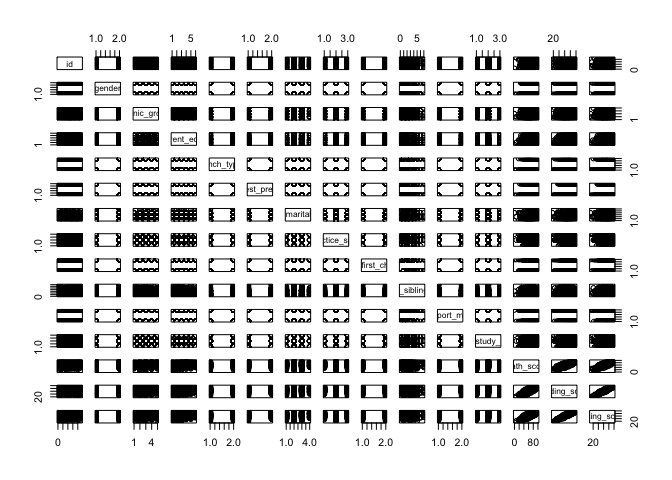
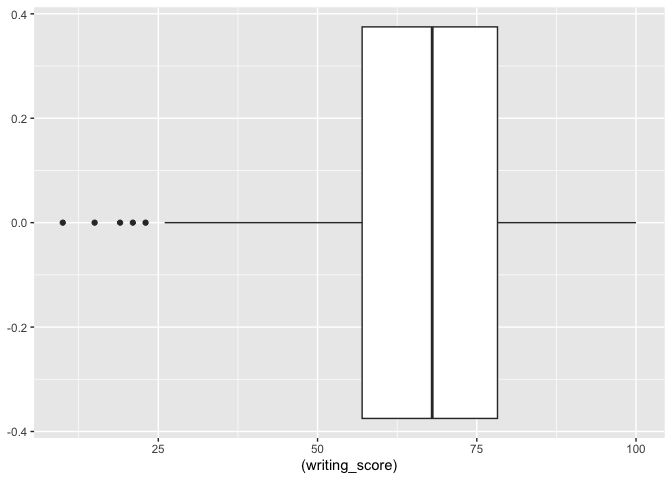
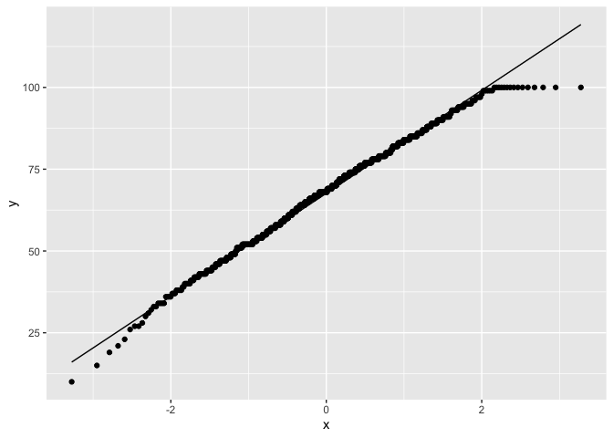
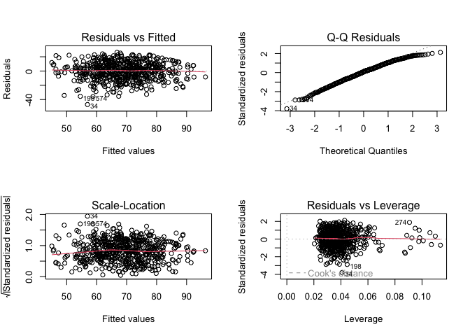
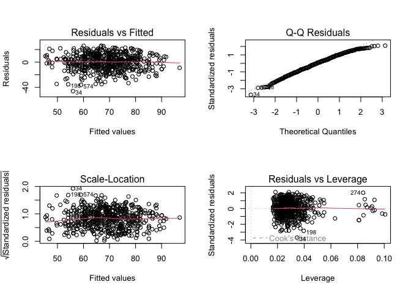
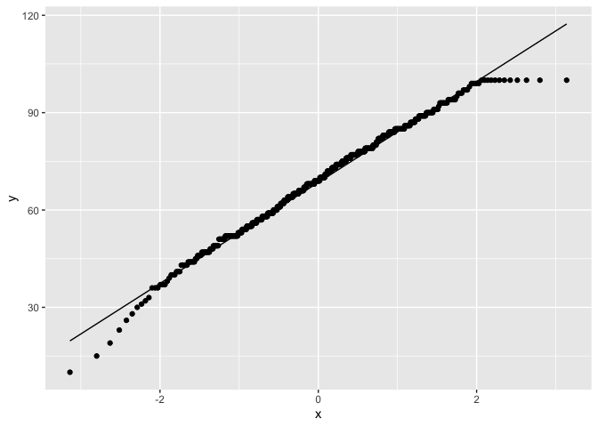
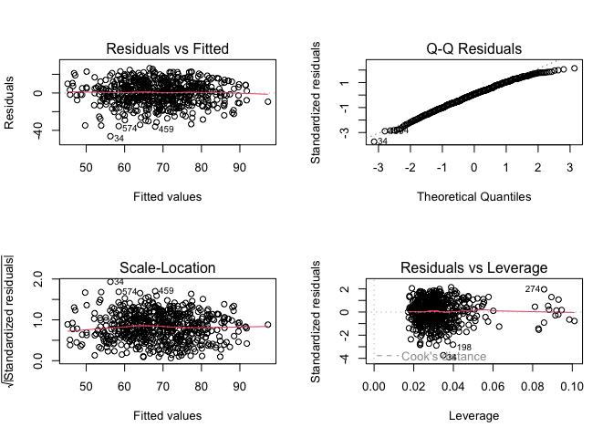

Writing Regression
================
Riya Kalra
2024-12-20

# Data Preparation

    ## Rows: 948 Columns: 14
    ## ── Column specification ────────────────────────────────────────────────────────
    ## Delimiter: ","
    ## chr (10): Gender, EthnicGroup, ParentEduc, LunchType, TestPrep, ParentMarita...
    ## dbl  (4): NrSiblings, MathScore, ReadingScore, WritingScore
    ## 
    ## ℹ Use `spec()` to retrieve the full column specification for this data.
    ## ℹ Specify the column types or set `show_col_types = FALSE` to quiet this message.

<div id="dlsvfdgmop" style="padding-left:0px;padding-right:0px;padding-top:10px;padding-bottom:10px;overflow-x:auto;overflow-y:auto;width:auto;height:auto;">
<style>#dlsvfdgmop table {
  font-family: system-ui, 'Segoe UI', Roboto, Helvetica, Arial, sans-serif, 'Apple Color Emoji', 'Segoe UI Emoji', 'Segoe UI Symbol', 'Noto Color Emoji';
  -webkit-font-smoothing: antialiased;
  -moz-osx-font-smoothing: grayscale;
}
&#10;#dlsvfdgmop thead, #dlsvfdgmop tbody, #dlsvfdgmop tfoot, #dlsvfdgmop tr, #dlsvfdgmop td, #dlsvfdgmop th {
  border-style: none;
}
&#10;#dlsvfdgmop p {
  margin: 0;
  padding: 0;
}
&#10;#dlsvfdgmop .gt_table {
  display: table;
  border-collapse: collapse;
  line-height: normal;
  margin-left: auto;
  margin-right: auto;
  color: #333333;
  font-size: 16px;
  font-weight: normal;
  font-style: normal;
  background-color: #FFFFFF;
  width: auto;
  border-top-style: solid;
  border-top-width: 2px;
  border-top-color: #A8A8A8;
  border-right-style: none;
  border-right-width: 2px;
  border-right-color: #D3D3D3;
  border-bottom-style: solid;
  border-bottom-width: 2px;
  border-bottom-color: #A8A8A8;
  border-left-style: none;
  border-left-width: 2px;
  border-left-color: #D3D3D3;
}
&#10;#dlsvfdgmop .gt_caption {
  padding-top: 4px;
  padding-bottom: 4px;
}
&#10;#dlsvfdgmop .gt_title {
  color: #333333;
  font-size: 125%;
  font-weight: initial;
  padding-top: 4px;
  padding-bottom: 4px;
  padding-left: 5px;
  padding-right: 5px;
  border-bottom-color: #FFFFFF;
  border-bottom-width: 0;
}
&#10;#dlsvfdgmop .gt_subtitle {
  color: #333333;
  font-size: 85%;
  font-weight: initial;
  padding-top: 3px;
  padding-bottom: 5px;
  padding-left: 5px;
  padding-right: 5px;
  border-top-color: #FFFFFF;
  border-top-width: 0;
}
&#10;#dlsvfdgmop .gt_heading {
  background-color: #FFFFFF;
  text-align: center;
  border-bottom-color: #FFFFFF;
  border-left-style: none;
  border-left-width: 1px;
  border-left-color: #D3D3D3;
  border-right-style: none;
  border-right-width: 1px;
  border-right-color: #D3D3D3;
}
&#10;#dlsvfdgmop .gt_bottom_border {
  border-bottom-style: solid;
  border-bottom-width: 2px;
  border-bottom-color: #D3D3D3;
}
&#10;#dlsvfdgmop .gt_col_headings {
  border-top-style: solid;
  border-top-width: 2px;
  border-top-color: #D3D3D3;
  border-bottom-style: solid;
  border-bottom-width: 2px;
  border-bottom-color: #D3D3D3;
  border-left-style: none;
  border-left-width: 1px;
  border-left-color: #D3D3D3;
  border-right-style: none;
  border-right-width: 1px;
  border-right-color: #D3D3D3;
}
&#10;#dlsvfdgmop .gt_col_heading {
  color: #333333;
  background-color: #FFFFFF;
  font-size: 100%;
  font-weight: normal;
  text-transform: inherit;
  border-left-style: none;
  border-left-width: 1px;
  border-left-color: #D3D3D3;
  border-right-style: none;
  border-right-width: 1px;
  border-right-color: #D3D3D3;
  vertical-align: bottom;
  padding-top: 5px;
  padding-bottom: 6px;
  padding-left: 5px;
  padding-right: 5px;
  overflow-x: hidden;
}
&#10;#dlsvfdgmop .gt_column_spanner_outer {
  color: #333333;
  background-color: #FFFFFF;
  font-size: 100%;
  font-weight: normal;
  text-transform: inherit;
  padding-top: 0;
  padding-bottom: 0;
  padding-left: 4px;
  padding-right: 4px;
}
&#10;#dlsvfdgmop .gt_column_spanner_outer:first-child {
  padding-left: 0;
}
&#10;#dlsvfdgmop .gt_column_spanner_outer:last-child {
  padding-right: 0;
}
&#10;#dlsvfdgmop .gt_column_spanner {
  border-bottom-style: solid;
  border-bottom-width: 2px;
  border-bottom-color: #D3D3D3;
  vertical-align: bottom;
  padding-top: 5px;
  padding-bottom: 5px;
  overflow-x: hidden;
  display: inline-block;
  width: 100%;
}
&#10;#dlsvfdgmop .gt_spanner_row {
  border-bottom-style: hidden;
}
&#10;#dlsvfdgmop .gt_group_heading {
  padding-top: 8px;
  padding-bottom: 8px;
  padding-left: 5px;
  padding-right: 5px;
  color: #333333;
  background-color: #FFFFFF;
  font-size: 100%;
  font-weight: initial;
  text-transform: inherit;
  border-top-style: solid;
  border-top-width: 2px;
  border-top-color: #D3D3D3;
  border-bottom-style: solid;
  border-bottom-width: 2px;
  border-bottom-color: #D3D3D3;
  border-left-style: none;
  border-left-width: 1px;
  border-left-color: #D3D3D3;
  border-right-style: none;
  border-right-width: 1px;
  border-right-color: #D3D3D3;
  vertical-align: middle;
  text-align: left;
}
&#10;#dlsvfdgmop .gt_empty_group_heading {
  padding: 0.5px;
  color: #333333;
  background-color: #FFFFFF;
  font-size: 100%;
  font-weight: initial;
  border-top-style: solid;
  border-top-width: 2px;
  border-top-color: #D3D3D3;
  border-bottom-style: solid;
  border-bottom-width: 2px;
  border-bottom-color: #D3D3D3;
  vertical-align: middle;
}
&#10;#dlsvfdgmop .gt_from_md > :first-child {
  margin-top: 0;
}
&#10;#dlsvfdgmop .gt_from_md > :last-child {
  margin-bottom: 0;
}
&#10;#dlsvfdgmop .gt_row {
  padding-top: 8px;
  padding-bottom: 8px;
  padding-left: 5px;
  padding-right: 5px;
  margin: 10px;
  border-top-style: solid;
  border-top-width: 1px;
  border-top-color: #D3D3D3;
  border-left-style: none;
  border-left-width: 1px;
  border-left-color: #D3D3D3;
  border-right-style: none;
  border-right-width: 1px;
  border-right-color: #D3D3D3;
  vertical-align: middle;
  overflow-x: hidden;
}
&#10;#dlsvfdgmop .gt_stub {
  color: #333333;
  background-color: #FFFFFF;
  font-size: 100%;
  font-weight: initial;
  text-transform: inherit;
  border-right-style: solid;
  border-right-width: 2px;
  border-right-color: #D3D3D3;
  padding-left: 5px;
  padding-right: 5px;
}
&#10;#dlsvfdgmop .gt_stub_row_group {
  color: #333333;
  background-color: #FFFFFF;
  font-size: 100%;
  font-weight: initial;
  text-transform: inherit;
  border-right-style: solid;
  border-right-width: 2px;
  border-right-color: #D3D3D3;
  padding-left: 5px;
  padding-right: 5px;
  vertical-align: top;
}
&#10;#dlsvfdgmop .gt_row_group_first td {
  border-top-width: 2px;
}
&#10;#dlsvfdgmop .gt_row_group_first th {
  border-top-width: 2px;
}
&#10;#dlsvfdgmop .gt_summary_row {
  color: #333333;
  background-color: #FFFFFF;
  text-transform: inherit;
  padding-top: 8px;
  padding-bottom: 8px;
  padding-left: 5px;
  padding-right: 5px;
}
&#10;#dlsvfdgmop .gt_first_summary_row {
  border-top-style: solid;
  border-top-color: #D3D3D3;
}
&#10;#dlsvfdgmop .gt_first_summary_row.thick {
  border-top-width: 2px;
}
&#10;#dlsvfdgmop .gt_last_summary_row {
  padding-top: 8px;
  padding-bottom: 8px;
  padding-left: 5px;
  padding-right: 5px;
  border-bottom-style: solid;
  border-bottom-width: 2px;
  border-bottom-color: #D3D3D3;
}
&#10;#dlsvfdgmop .gt_grand_summary_row {
  color: #333333;
  background-color: #FFFFFF;
  text-transform: inherit;
  padding-top: 8px;
  padding-bottom: 8px;
  padding-left: 5px;
  padding-right: 5px;
}
&#10;#dlsvfdgmop .gt_first_grand_summary_row {
  padding-top: 8px;
  padding-bottom: 8px;
  padding-left: 5px;
  padding-right: 5px;
  border-top-style: double;
  border-top-width: 6px;
  border-top-color: #D3D3D3;
}
&#10;#dlsvfdgmop .gt_last_grand_summary_row_top {
  padding-top: 8px;
  padding-bottom: 8px;
  padding-left: 5px;
  padding-right: 5px;
  border-bottom-style: double;
  border-bottom-width: 6px;
  border-bottom-color: #D3D3D3;
}
&#10;#dlsvfdgmop .gt_striped {
  background-color: rgba(128, 128, 128, 0.05);
}
&#10;#dlsvfdgmop .gt_table_body {
  border-top-style: solid;
  border-top-width: 2px;
  border-top-color: #D3D3D3;
  border-bottom-style: solid;
  border-bottom-width: 2px;
  border-bottom-color: #D3D3D3;
}
&#10;#dlsvfdgmop .gt_footnotes {
  color: #333333;
  background-color: #FFFFFF;
  border-bottom-style: none;
  border-bottom-width: 2px;
  border-bottom-color: #D3D3D3;
  border-left-style: none;
  border-left-width: 2px;
  border-left-color: #D3D3D3;
  border-right-style: none;
  border-right-width: 2px;
  border-right-color: #D3D3D3;
}
&#10;#dlsvfdgmop .gt_footnote {
  margin: 0px;
  font-size: 90%;
  padding-top: 4px;
  padding-bottom: 4px;
  padding-left: 5px;
  padding-right: 5px;
}
&#10;#dlsvfdgmop .gt_sourcenotes {
  color: #333333;
  background-color: #FFFFFF;
  border-bottom-style: none;
  border-bottom-width: 2px;
  border-bottom-color: #D3D3D3;
  border-left-style: none;
  border-left-width: 2px;
  border-left-color: #D3D3D3;
  border-right-style: none;
  border-right-width: 2px;
  border-right-color: #D3D3D3;
}
&#10;#dlsvfdgmop .gt_sourcenote {
  font-size: 90%;
  padding-top: 4px;
  padding-bottom: 4px;
  padding-left: 5px;
  padding-right: 5px;
}
&#10;#dlsvfdgmop .gt_left {
  text-align: left;
}
&#10;#dlsvfdgmop .gt_center {
  text-align: center;
}
&#10;#dlsvfdgmop .gt_right {
  text-align: right;
  font-variant-numeric: tabular-nums;
}
&#10;#dlsvfdgmop .gt_font_normal {
  font-weight: normal;
}
&#10;#dlsvfdgmop .gt_font_bold {
  font-weight: bold;
}
&#10;#dlsvfdgmop .gt_font_italic {
  font-style: italic;
}
&#10;#dlsvfdgmop .gt_super {
  font-size: 65%;
}
&#10;#dlsvfdgmop .gt_footnote_marks {
  font-size: 75%;
  vertical-align: 0.4em;
  position: initial;
}
&#10;#dlsvfdgmop .gt_asterisk {
  font-size: 100%;
  vertical-align: 0;
}
&#10;#dlsvfdgmop .gt_indent_1 {
  text-indent: 5px;
}
&#10;#dlsvfdgmop .gt_indent_2 {
  text-indent: 10px;
}
&#10;#dlsvfdgmop .gt_indent_3 {
  text-indent: 15px;
}
&#10;#dlsvfdgmop .gt_indent_4 {
  text-indent: 20px;
}
&#10;#dlsvfdgmop .gt_indent_5 {
  text-indent: 25px;
}
&#10;#dlsvfdgmop .katex-display {
  display: inline-flex !important;
  margin-bottom: 0.75em !important;
}
&#10;#dlsvfdgmop div.Reactable > div.rt-table > div.rt-thead > div.rt-tr.rt-tr-group-header > div.rt-th-group:after {
  height: 0px !important;
}
</style>
<table class="gt_table" data-quarto-disable-processing="false" data-quarto-bootstrap="false">
  <thead>
    <tr class="gt_col_headings">
      <th class="gt_col_heading gt_columns_bottom_border gt_left" rowspan="1" colspan="1" scope="col" id="label"><span class='gt_from_md'><strong>Characteristic</strong></span></th>
      <th class="gt_col_heading gt_columns_bottom_border gt_center" rowspan="1" colspan="1" scope="col" id="stat_0"><span class='gt_from_md'><strong>N = 948</strong></span><span class="gt_footnote_marks" style="white-space:nowrap;font-style:italic;font-weight:normal;line-height:0;"><sup>1</sup></span></th>
    </tr>
  </thead>
  <tbody class="gt_table_body">
    <tr><td headers="label" class="gt_row gt_left" style="font-weight: bold;">id</td>
<td headers="stat_0" class="gt_row gt_center">475 (238, 712)</td></tr>
    <tr><td headers="label" class="gt_row gt_left" style="font-weight: bold;">gender</td>
<td headers="stat_0" class="gt_row gt_center"><br /></td></tr>
    <tr><td headers="label" class="gt_row gt_left" style="font-style: italic;">    female</td>
<td headers="stat_0" class="gt_row gt_center">488 (51%)</td></tr>
    <tr><td headers="label" class="gt_row gt_left" style="font-style: italic;">    male</td>
<td headers="stat_0" class="gt_row gt_center">460 (49%)</td></tr>
    <tr><td headers="label" class="gt_row gt_left" style="font-weight: bold;">ethnic_group</td>
<td headers="stat_0" class="gt_row gt_center"><br /></td></tr>
    <tr><td headers="label" class="gt_row gt_left" style="font-style: italic;">    A</td>
<td headers="stat_0" class="gt_row gt_center">80 (9.0%)</td></tr>
    <tr><td headers="label" class="gt_row gt_left" style="font-style: italic;">    B</td>
<td headers="stat_0" class="gt_row gt_center">171 (19%)</td></tr>
    <tr><td headers="label" class="gt_row gt_left" style="font-style: italic;">    C</td>
<td headers="stat_0" class="gt_row gt_center">277 (31%)</td></tr>
    <tr><td headers="label" class="gt_row gt_left" style="font-style: italic;">    D</td>
<td headers="stat_0" class="gt_row gt_center">237 (27%)</td></tr>
    <tr><td headers="label" class="gt_row gt_left" style="font-style: italic;">    E</td>
<td headers="stat_0" class="gt_row gt_center">124 (14%)</td></tr>
    <tr><td headers="label" class="gt_row gt_left" style="font-style: italic;">    Unknown</td>
<td headers="stat_0" class="gt_row gt_center">59</td></tr>
    <tr><td headers="label" class="gt_row gt_left" style="font-weight: bold;">parent_educ</td>
<td headers="stat_0" class="gt_row gt_center"><br /></td></tr>
    <tr><td headers="label" class="gt_row gt_left" style="font-style: italic;">    some high school</td>
<td headers="stat_0" class="gt_row gt_center">163 (18%)</td></tr>
    <tr><td headers="label" class="gt_row gt_left" style="font-style: italic;">    high school</td>
<td headers="stat_0" class="gt_row gt_center">176 (20%)</td></tr>
    <tr><td headers="label" class="gt_row gt_left" style="font-style: italic;">    some college</td>
<td headers="stat_0" class="gt_row gt_center">199 (22%)</td></tr>
    <tr><td headers="label" class="gt_row gt_left" style="font-style: italic;">    associates degree</td>
<td headers="stat_0" class="gt_row gt_center">198 (22%)</td></tr>
    <tr><td headers="label" class="gt_row gt_left" style="font-style: italic;">    bachelors degree</td>
<td headers="stat_0" class="gt_row gt_center">104 (12%)</td></tr>
    <tr><td headers="label" class="gt_row gt_left" style="font-style: italic;">    masters degree</td>
<td headers="stat_0" class="gt_row gt_center">55 (6.1%)</td></tr>
    <tr><td headers="label" class="gt_row gt_left" style="font-style: italic;">    Unknown</td>
<td headers="stat_0" class="gt_row gt_center">53</td></tr>
    <tr><td headers="label" class="gt_row gt_left" style="font-weight: bold;">lunch_type</td>
<td headers="stat_0" class="gt_row gt_center"><br /></td></tr>
    <tr><td headers="label" class="gt_row gt_left" style="font-style: italic;">    free_reduced</td>
<td headers="stat_0" class="gt_row gt_center">331 (35%)</td></tr>
    <tr><td headers="label" class="gt_row gt_left" style="font-style: italic;">    standard</td>
<td headers="stat_0" class="gt_row gt_center">617 (65%)</td></tr>
    <tr><td headers="label" class="gt_row gt_left" style="font-weight: bold;">test_prep</td>
<td headers="stat_0" class="gt_row gt_center"><br /></td></tr>
    <tr><td headers="label" class="gt_row gt_left" style="font-style: italic;">    none</td>
<td headers="stat_0" class="gt_row gt_center">571 (64%)</td></tr>
    <tr><td headers="label" class="gt_row gt_left" style="font-style: italic;">    completed</td>
<td headers="stat_0" class="gt_row gt_center">322 (36%)</td></tr>
    <tr><td headers="label" class="gt_row gt_left" style="font-style: italic;">    Unknown</td>
<td headers="stat_0" class="gt_row gt_center">55</td></tr>
    <tr><td headers="label" class="gt_row gt_left" style="font-weight: bold;">parent_marital_status</td>
<td headers="stat_0" class="gt_row gt_center"><br /></td></tr>
    <tr><td headers="label" class="gt_row gt_left" style="font-style: italic;">    divorced</td>
<td headers="stat_0" class="gt_row gt_center">146 (16%)</td></tr>
    <tr><td headers="label" class="gt_row gt_left" style="font-style: italic;">    married</td>
<td headers="stat_0" class="gt_row gt_center">516 (57%)</td></tr>
    <tr><td headers="label" class="gt_row gt_left" style="font-style: italic;">    single</td>
<td headers="stat_0" class="gt_row gt_center">213 (24%)</td></tr>
    <tr><td headers="label" class="gt_row gt_left" style="font-style: italic;">    widowed</td>
<td headers="stat_0" class="gt_row gt_center">24 (2.7%)</td></tr>
    <tr><td headers="label" class="gt_row gt_left" style="font-style: italic;">    Unknown</td>
<td headers="stat_0" class="gt_row gt_center">49</td></tr>
    <tr><td headers="label" class="gt_row gt_left" style="font-weight: bold;">practice_sport</td>
<td headers="stat_0" class="gt_row gt_center"><br /></td></tr>
    <tr><td headers="label" class="gt_row gt_left" style="font-style: italic;">    never</td>
<td headers="stat_0" class="gt_row gt_center">112 (12%)</td></tr>
    <tr><td headers="label" class="gt_row gt_left" style="font-style: italic;">    sometimes</td>
<td headers="stat_0" class="gt_row gt_center">477 (51%)</td></tr>
    <tr><td headers="label" class="gt_row gt_left" style="font-style: italic;">    regularly</td>
<td headers="stat_0" class="gt_row gt_center">343 (37%)</td></tr>
    <tr><td headers="label" class="gt_row gt_left" style="font-style: italic;">    Unknown</td>
<td headers="stat_0" class="gt_row gt_center">16</td></tr>
    <tr><td headers="label" class="gt_row gt_left" style="font-weight: bold;">is_first_child</td>
<td headers="stat_0" class="gt_row gt_center">604 (66%)</td></tr>
    <tr><td headers="label" class="gt_row gt_left" style="font-style: italic;">    Unknown</td>
<td headers="stat_0" class="gt_row gt_center">30</td></tr>
    <tr><td headers="label" class="gt_row gt_left" style="font-weight: bold;">nr_siblings</td>
<td headers="stat_0" class="gt_row gt_center"><br /></td></tr>
    <tr><td headers="label" class="gt_row gt_left" style="font-style: italic;">    0</td>
<td headers="stat_0" class="gt_row gt_center">101 (11%)</td></tr>
    <tr><td headers="label" class="gt_row gt_left" style="font-style: italic;">    1</td>
<td headers="stat_0" class="gt_row gt_center">245 (27%)</td></tr>
    <tr><td headers="label" class="gt_row gt_left" style="font-style: italic;">    2</td>
<td headers="stat_0" class="gt_row gt_center">213 (24%)</td></tr>
    <tr><td headers="label" class="gt_row gt_left" style="font-style: italic;">    3</td>
<td headers="stat_0" class="gt_row gt_center">198 (22%)</td></tr>
    <tr><td headers="label" class="gt_row gt_left" style="font-style: italic;">    4</td>
<td headers="stat_0" class="gt_row gt_center">76 (8.4%)</td></tr>
    <tr><td headers="label" class="gt_row gt_left" style="font-style: italic;">    5</td>
<td headers="stat_0" class="gt_row gt_center">50 (5.5%)</td></tr>
    <tr><td headers="label" class="gt_row gt_left" style="font-style: italic;">    6</td>
<td headers="stat_0" class="gt_row gt_center">8 (0.9%)</td></tr>
    <tr><td headers="label" class="gt_row gt_left" style="font-style: italic;">    7</td>
<td headers="stat_0" class="gt_row gt_center">11 (1.2%)</td></tr>
    <tr><td headers="label" class="gt_row gt_left" style="font-style: italic;">    Unknown</td>
<td headers="stat_0" class="gt_row gt_center">46</td></tr>
    <tr><td headers="label" class="gt_row gt_left" style="font-weight: bold;">transport_means</td>
<td headers="stat_0" class="gt_row gt_center"><br /></td></tr>
    <tr><td headers="label" class="gt_row gt_left" style="font-style: italic;">    private</td>
<td headers="stat_0" class="gt_row gt_center">337 (40%)</td></tr>
    <tr><td headers="label" class="gt_row gt_left" style="font-style: italic;">    school_bus</td>
<td headers="stat_0" class="gt_row gt_center">509 (60%)</td></tr>
    <tr><td headers="label" class="gt_row gt_left" style="font-style: italic;">    Unknown</td>
<td headers="stat_0" class="gt_row gt_center">102</td></tr>
    <tr><td headers="label" class="gt_row gt_left" style="font-weight: bold;">wkly_study_hours</td>
<td headers="stat_0" class="gt_row gt_center"><br /></td></tr>
    <tr><td headers="label" class="gt_row gt_left" style="font-style: italic;">    &lt; 5</td>
<td headers="stat_0" class="gt_row gt_center">253 (28%)</td></tr>
    <tr><td headers="label" class="gt_row gt_left" style="font-style: italic;">    5-10</td>
<td headers="stat_0" class="gt_row gt_center">508 (56%)</td></tr>
    <tr><td headers="label" class="gt_row gt_left" style="font-style: italic;">    &gt; 10</td>
<td headers="stat_0" class="gt_row gt_center">150 (16%)</td></tr>
    <tr><td headers="label" class="gt_row gt_left" style="font-style: italic;">    Unknown</td>
<td headers="stat_0" class="gt_row gt_center">37</td></tr>
    <tr><td headers="label" class="gt_row gt_left" style="font-weight: bold;">math_score</td>
<td headers="stat_0" class="gt_row gt_center">66 (56, 76)</td></tr>
    <tr><td headers="label" class="gt_row gt_left" style="font-weight: bold;">reading_score</td>
<td headers="stat_0" class="gt_row gt_center">70 (59, 80)</td></tr>
    <tr><td headers="label" class="gt_row gt_left" style="font-weight: bold;">writing_score</td>
<td headers="stat_0" class="gt_row gt_center">68 (57, 79)</td></tr>
  </tbody>
  &#10;  <tfoot class="gt_footnotes">
    <tr>
      <td class="gt_footnote" colspan="2"><span class="gt_footnote_marks" style="white-space:nowrap;font-style:italic;font-weight:normal;line-height:0;"><sup>1</sup></span> <span class='gt_from_md'>Median (Q1, Q3); n (%)</span></td>
    </tr>
  </tfoot>
</table>
</div>

<!-- -->

## Visualize the distribution of writing_score

<!-- --><!-- -->

Based on this plot, we see a roughly straight diagonal, but deviations
at the tails. This could indicate a potential issue with normality.

We can attempt a Box-Cox transformation to solve this issue.

``` r
# Load required library
library(caret)
```

    ## Loading required package: lattice

    ## 
    ## Attaching package: 'caret'

    ## The following object is masked from 'package:purrr':
    ## 
    ##     lift

``` r
# Create a binary variable for gendermale
scores_df$gendermale <- ifelse(scores_df$gender == "male", 1, 0)

# Verify the variable
table(scores_df$gendermale)
```

    ## 
    ##   0   1 
    ## 488 460

``` r
# Box-Cox Transformation
boxcox_obj <- BoxCoxTrans(scores_df$writing_score)  

# View the optimal lambda for Box-Cox transformation
optimal_lambda <- boxcox_obj$lambda
cat("Optimal Lambda for Box-Cox Transformation:", optimal_lambda, "\n")
```

    ## Optimal Lambda for Box-Cox Transformation: 1.3

The optimal lambda is 1.3, which is close to 1, which means a
transformation is not necessary. If the transformation does not
significantly improve predictive accuracy, it may not be worthwhile.

We can proceed without a transformation.

# Basic Regression Model

    ## 
    ## Call:
    ## lm(formula = writing_score ~ ., data = writing_df)
    ## 
    ## Residuals:
    ##     Min      1Q  Median      3Q     Max 
    ## -46.922  -8.043   1.071   8.811  26.214 
    ## 
    ## Coefficients: (1 not defined because of singularities)
    ##                               Estimate Std. Error t value Pr(>|t|)    
    ## (Intercept)                  49.054407   3.338225  14.695  < 2e-16 ***
    ## gendermale                   -9.268845   1.064760  -8.705  < 2e-16 ***
    ## ethnic_groupB                -1.372239   2.163560  -0.634 0.526175    
    ## ethnic_groupC                 0.005008   2.071256   0.002 0.998072    
    ## ethnic_groupD                 5.010576   2.084123   2.404 0.016531 *  
    ## ethnic_groupE                 6.018419   2.284980   2.634 0.008673 ** 
    ## parent_educhigh school       -0.230994   1.684700  -0.137 0.890990    
    ## parent_educsome college       4.338798   1.698536   2.554 0.010898 *  
    ## parent_educassociates degree  6.130783   1.657904   3.698 0.000239 ***
    ## parent_educbachelors degree   9.217680   1.941668   4.747 2.62e-06 ***
    ## parent_educmasters degree    11.712279   2.376896   4.928 1.10e-06 ***
    ## lunch_typestandard            9.390698   1.100772   8.531  < 2e-16 ***
    ## test_prepcompleted            8.754351   1.122889   7.796 3.09e-14 ***
    ## parent_marital_statusmarried  5.246610   1.512157   3.470 0.000561 ***
    ## parent_marital_statussingle   2.144248   1.725778   1.242 0.214575    
    ## parent_marital_statuswidowed  6.877832   3.564779   1.929 0.054184 .  
    ## practice_sportsometimes       1.674659   1.724312   0.971 0.331863    
    ## practice_sportregularly       1.606102   1.781092   0.902 0.367574    
    ## is_first_childyes             1.045414   1.133850   0.922 0.356921    
    ## nr_siblings                   0.546033   0.359485   1.519 0.129340    
    ## transport_meansschool_bus     0.240107   1.087508   0.221 0.825338    
    ## wkly_study_hours5-10          2.802323   1.255870   2.231 0.026048 *  
    ## wkly_study_hours> 10          1.188892   1.640324   0.725 0.468881    
    ## gendermale                          NA         NA      NA       NA    
    ## ---
    ## Signif. codes:  0 '***' 0.001 '**' 0.01 '*' 0.05 '.' 0.1 ' ' 1
    ## 
    ## Residual standard error: 12.65 on 564 degrees of freedom
    ## Multiple R-squared:  0.3634, Adjusted R-squared:  0.3385 
    ## F-statistic: 14.63 on 22 and 564 DF,  p-value: < 2.2e-16

<!-- -->

Significant coefficients:

- (Intercept) (p\<2e−16)
- gendermale (p=5.56e−12)
- ethnic_groupE (p=0.008673)
- ethnic_groupD (p=0.016531)
- parent_educsome college (p=0.010898)
- parent_educassociates degree (p=0.000239)
- parent_educbachelors degree (p=2.62e-06)
- parent_educmasters degree (p=1.10e-06)
- lunch_typestandard (p=\<2e-16)
- test_prepcompleted (p=3.09e-14)
- parent_marital_statusmarried (p=0.000561)
- wkly_study_hours5-10 (p=0.026048)

# Residual Analysis

**RSE = 12.65**: the RSE represents the average difference betweeen
observed and fitted values.

**R^2 = 0.3634**: The R^2 value represents the fact that 36.34% of the
variability in writing score is explained by the covariates.

**Adj-R^2 = 0.3385**: Removing predictors in the model that don’t add
significance, 33.85% of the variability in writing score is explained by
the selected covariates.

### Create a model with the significant variables

    ##         writing_score                gender          ethnic_group 
    ##             "numeric"              "factor"              "factor" 
    ##            lunch_type             test_prep           parent_educ 
    ##              "factor"              "factor"              "factor" 
    ## parent_marital_status      wkly_study_hours 
    ##              "factor"              "factor"

    ## 
    ## Call:
    ## lm(formula = writing_score ~ gender + ethnic_group + lunch_type + 
    ##     test_prep + parent_educ + parent_marital_status + wkly_study_hours, 
    ##     data = writing_df_significant)
    ## 
    ## Residuals:
    ##     Min      1Q  Median      3Q     Max 
    ## -45.977  -7.958   0.963   9.188  26.159 
    ## 
    ## Coefficients:
    ##                              Estimate Std. Error t value Pr(>|t|)    
    ## (Intercept)                  52.36059    2.76840  18.914  < 2e-16 ***
    ## gendermale                   -9.33994    1.06218  -8.793  < 2e-16 ***
    ## ethnic_groupB                -1.46879    2.15698  -0.681 0.496180    
    ## ethnic_groupC                 0.06504    2.06421   0.032 0.974877    
    ## ethnic_groupD                 4.93524    2.07666   2.377 0.017806 *  
    ## ethnic_groupE                 5.88238    2.27782   2.582 0.010059 *  
    ## lunch_typestandard            9.38554    1.09899   8.540  < 2e-16 ***
    ## test_prepcompleted            8.92515    1.11256   8.022 5.96e-15 ***
    ## parent_educhigh school        0.06908    1.67411   0.041 0.967101    
    ## parent_educsome college       4.48923    1.69359   2.651 0.008256 ** 
    ## parent_educassociates degree  6.28800    1.65187   3.807 0.000156 ***
    ## parent_educbachelors degree   9.23430    1.93800   4.765 2.40e-06 ***
    ## parent_educmasters degree    11.63915    2.36383   4.924 1.11e-06 ***
    ## parent_marital_statusmarried  5.28139    1.50141   3.518 0.000470 ***
    ## parent_marital_statussingle   2.20131    1.71297   1.285 0.199286    
    ## parent_marital_statuswidowed  6.89594    3.54724   1.944 0.052384 .  
    ## wkly_study_hours5-10          2.80033    1.25235   2.236 0.025735 *  
    ## wkly_study_hours> 10          1.35009    1.63558   0.825 0.409463    
    ## ---
    ## Signif. codes:  0 '***' 0.001 '**' 0.01 '*' 0.05 '.' 0.1 ' ' 1
    ## 
    ## Residual standard error: 12.64 on 569 degrees of freedom
    ## Multiple R-squared:  0.3589, Adjusted R-squared:  0.3397 
    ## F-statistic: 18.74 on 17 and 569 DF,  p-value: < 2.2e-16

Model using only significant coefficients: **writing_score ~ gender +
ethnic_group + lunch_type + test_prep + parent_educ +
parent_marital_status + wkly_study_hours**

# Model Selection

### Diagnostics

<!-- -->

    ## 
    ##  Shapiro-Wilk normality test
    ## 
    ## data:  residuals(significant_model)
    ## W = 0.98749, p-value = 6.407e-05

    ## Loading required package: zoo

    ## 
    ## Attaching package: 'zoo'

    ## The following objects are masked from 'package:base':
    ## 
    ##     as.Date, as.Date.numeric

    ## 
    ##  studentized Breusch-Pagan test
    ## 
    ## data:  significant_model
    ## BP = 13.867, df = 17, p-value = 0.6765

<!-- -->

### Backward Model

    ## 
    ## Call:
    ## lm(formula = writing_score ~ ., data = writing_df)
    ## 
    ## Residuals:
    ##     Min      1Q  Median      3Q     Max 
    ## -46.922  -8.043   1.071   8.811  26.214 
    ## 
    ## Coefficients: (1 not defined because of singularities)
    ##                               Estimate Std. Error t value Pr(>|t|)    
    ## (Intercept)                  49.054407   3.338225  14.695  < 2e-16 ***
    ## gendermale                   -9.268845   1.064760  -8.705  < 2e-16 ***
    ## ethnic_groupB                -1.372239   2.163560  -0.634 0.526175    
    ## ethnic_groupC                 0.005008   2.071256   0.002 0.998072    
    ## ethnic_groupD                 5.010576   2.084123   2.404 0.016531 *  
    ## ethnic_groupE                 6.018419   2.284980   2.634 0.008673 ** 
    ## parent_educhigh school       -0.230994   1.684700  -0.137 0.890990    
    ## parent_educsome college       4.338798   1.698536   2.554 0.010898 *  
    ## parent_educassociates degree  6.130783   1.657904   3.698 0.000239 ***
    ## parent_educbachelors degree   9.217680   1.941668   4.747 2.62e-06 ***
    ## parent_educmasters degree    11.712279   2.376896   4.928 1.10e-06 ***
    ## lunch_typestandard            9.390698   1.100772   8.531  < 2e-16 ***
    ## test_prepcompleted            8.754351   1.122889   7.796 3.09e-14 ***
    ## parent_marital_statusmarried  5.246610   1.512157   3.470 0.000561 ***
    ## parent_marital_statussingle   2.144248   1.725778   1.242 0.214575    
    ## parent_marital_statuswidowed  6.877832   3.564779   1.929 0.054184 .  
    ## practice_sportsometimes       1.674659   1.724312   0.971 0.331863    
    ## practice_sportregularly       1.606102   1.781092   0.902 0.367574    
    ## is_first_childyes             1.045414   1.133850   0.922 0.356921    
    ## nr_siblings                   0.546033   0.359485   1.519 0.129340    
    ## transport_meansschool_bus     0.240107   1.087508   0.221 0.825338    
    ## wkly_study_hours5-10          2.802323   1.255870   2.231 0.026048 *  
    ## wkly_study_hours> 10          1.188892   1.640324   0.725 0.468881    
    ## gendermale                          NA         NA      NA       NA    
    ## ---
    ## Signif. codes:  0 '***' 0.001 '**' 0.01 '*' 0.05 '.' 0.1 ' ' 1
    ## 
    ## Residual standard error: 12.65 on 564 degrees of freedom
    ## Multiple R-squared:  0.3634, Adjusted R-squared:  0.3385 
    ## F-statistic: 14.63 on 22 and 564 DF,  p-value: < 2.2e-16

    ## Start:  AIC=3001.45
    ## writing_score ~ gender + ethnic_group + parent_educ + lunch_type + 
    ##     test_prep + parent_marital_status + practice_sport + is_first_child + 
    ##     nr_siblings + transport_means + wkly_study_hours + gendermale
    ## 
    ## 
    ## Step:  AIC=3001.45
    ## writing_score ~ gender + ethnic_group + parent_educ + lunch_type + 
    ##     test_prep + parent_marital_status + practice_sport + is_first_child + 
    ##     nr_siblings + transport_means + wkly_study_hours
    ## 
    ##                         Df Sum of Sq    RSS    AIC
    ## - practice_sport         2     158.6  90366 2998.5
    ## - transport_means        1       7.8  90216 2999.5
    ## - is_first_child         1     136.0  90344 3000.3
    ## <none>                                90208 3001.4
    ## - nr_siblings            1     369.0  90577 3001.8
    ## - wkly_study_hours       2     841.9  91050 3002.9
    ## - parent_marital_status  3    2476.3  92684 3011.3
    ## - ethnic_group           4    4915.1  95123 3024.6
    ## - parent_educ            5    8503.8  98712 3044.3
    ## - test_prep              1    9721.6  99929 3059.5
    ## - lunch_type             1   11640.4 101848 3070.7
    ## - gender                 1   12120.3 102328 3073.5
    ## 
    ## Step:  AIC=2998.49
    ## writing_score ~ gender + ethnic_group + parent_educ + lunch_type + 
    ##     test_prep + parent_marital_status + is_first_child + nr_siblings + 
    ##     transport_means + wkly_study_hours
    ## 
    ##                         Df Sum of Sq    RSS    AIC
    ## - transport_means        1      11.9  90378 2996.6
    ## - is_first_child         1     125.6  90492 2997.3
    ## <none>                                90366 2998.5
    ## - nr_siblings            1     368.2  90735 2998.9
    ## - wkly_study_hours       2     864.2  91231 3000.1
    ## - parent_marital_status  3    2496.8  92863 3008.5
    ## - ethnic_group           4    4908.0  95274 3021.5
    ## - parent_educ            5    8430.2  98797 3040.8
    ## - test_prep              1    9868.4 100235 3057.3
    ## - lunch_type             1   11574.0 101940 3067.2
    ## - gender                 1   12140.0 102506 3070.5
    ## 
    ## Step:  AIC=2996.56
    ## writing_score ~ gender + ethnic_group + parent_educ + lunch_type + 
    ##     test_prep + parent_marital_status + is_first_child + nr_siblings + 
    ##     wkly_study_hours
    ## 
    ##                         Df Sum of Sq    RSS    AIC
    ## - is_first_child         1     127.2  90505 2995.4
    ## <none>                                90378 2996.6
    ## - nr_siblings            1     368.9  90747 2996.9
    ## - wkly_study_hours       2     866.1  91244 2998.2
    ## - parent_marital_status  3    2511.0  92889 3006.7
    ## - ethnic_group           4    4901.4  95280 3019.6
    ## - parent_educ            5    8496.7  98875 3039.3
    ## - test_prep              1    9884.2 100262 3055.5
    ## - lunch_type             1   11582.5 101961 3065.3
    ## - gender                 1   12131.4 102510 3068.5
    ## 
    ## Step:  AIC=2995.39
    ## writing_score ~ gender + ethnic_group + parent_educ + lunch_type + 
    ##     test_prep + parent_marital_status + nr_siblings + wkly_study_hours
    ## 
    ##                         Df Sum of Sq    RSS    AIC
    ## <none>                                90505 2995.4
    ## - nr_siblings            1     336.4  90842 2995.6
    ## - wkly_study_hours       2     887.4  91393 2997.1
    ## - parent_marital_status  3    2442.3  92948 3005.0
    ## - ethnic_group           4    4860.1  95366 3018.1
    ## - parent_educ            5    8467.3  98973 3037.9
    ## - test_prep              1   10063.8 100569 3055.3
    ## - lunch_type             1   11607.5 102113 3064.2
    ## - gender                 1   12107.9 102613 3067.1

Backward Model: **writing_score ~ gender + ethnic_group + parent_educ +
lunch_type + test_prep + parent_marital_status + is_first_child**

### Forward Model

    ## [1] 587

    ## Start:  AIC=3222.53
    ## writing_score ~ 1
    ## 
    ##                         Df Sum of Sq    RSS    AIC
    ## + gender                 1   11104.5 130592 3176.6
    ## + gendermale             1   11104.5 130592 3176.6
    ## + lunch_type             1   10442.9 131253 3179.6
    ## + test_prep              1    9618.7 132078 3183.3
    ## + parent_educ            5   11133.9 130562 3184.5
    ## + ethnic_group           4    5484.2 136212 3207.4
    ## + wkly_study_hours       2    1531.9 140164 3220.1
    ## + parent_marital_status  3    1929.1 139767 3220.5
    ## + nr_siblings            1     560.4 141136 3222.2
    ## <none>                               141696 3222.5
    ## + is_first_child         1      95.4 141601 3224.1
    ## + transport_means        1       0.6 141696 3224.5
    ## + practice_sport         2     162.8 141533 3225.9
    ## 
    ## Step:  AIC=3176.62
    ## writing_score ~ gender
    ## 
    ##                         Df Sum of Sq    RSS    AIC
    ## + lunch_type             1   11657.0 118935 3123.7
    ## + test_prep              1   10482.9 120109 3129.5
    ## + parent_educ            5    9612.1 120980 3141.7
    ## + ethnic_group           4    5921.4 124670 3157.4
    ## + parent_marital_status  3    2060.8 128531 3173.3
    ## + wkly_study_hours       2    1464.7 129127 3174.0
    ## <none>                               130592 3176.6
    ## + nr_siblings            1     401.5 130190 3176.8
    ## + is_first_child         1     127.2 130465 3178.0
    ## + transport_means        1       5.5 130586 3178.6
    ## + practice_sport         2     125.5 130466 3180.1
    ## 
    ## Step:  AIC=3123.74
    ## writing_score ~ gender + lunch_type
    ## 
    ##                         Df Sum of Sq    RSS    AIC
    ## + test_prep              1   11216.2 107719 3067.6
    ## + parent_educ            5    9909.5 109025 3082.7
    ## + ethnic_group           4    5256.1 113679 3105.2
    ## + parent_marital_status  3    2028.6 116906 3119.6
    ## + wkly_study_hours       2    1162.9 117772 3122.0
    ## <none>                               118935 3123.7
    ## + nr_siblings            1     385.6 118549 3123.8
    ## + is_first_child         1     100.6 118834 3125.2
    ## + transport_means        1       1.3 118933 3125.7
    ## + practice_sport         2     179.9 118755 3126.8
    ## 
    ## Step:  AIC=3067.59
    ## writing_score ~ gender + lunch_type + test_prep
    ## 
    ##                         Df Sum of Sq    RSS    AIC
    ## + parent_educ            5    9190.5  98528 3025.2
    ## + ethnic_group           4    5091.3 102627 3047.2
    ## + parent_marital_status  3    2161.1 105557 3061.7
    ## + wkly_study_hours       2     743.3 106975 3067.5
    ## <none>                               107719 3067.6
    ## + nr_siblings            1     207.4 107511 3068.5
    ## + transport_means        1      77.9 107641 3069.2
    ## + is_first_child         1      19.3 107699 3069.5
    ## + practice_sport         2      92.7 107626 3071.1
    ## 
    ## Step:  AIC=3025.24
    ## writing_score ~ gender + lunch_type + test_prep + parent_educ
    ## 
    ##                         Df Sum of Sq   RSS    AIC
    ## + ethnic_group           4    4313.2 94215 3007.0
    ## + parent_marital_status  3    1944.7 96583 3019.5
    ## + wkly_study_hours       2     974.0 97554 3023.4
    ## <none>                               98528 3025.2
    ## + nr_siblings            1     292.8 98235 3025.5
    ## + is_first_child         1      34.2 98494 3027.0
    ## + transport_means        1      18.0 98510 3027.1
    ## + practice_sport         2     177.4 98351 3028.2
    ## 
    ## Step:  AIC=3006.97
    ## writing_score ~ gender + lunch_type + test_prep + parent_educ + 
    ##     ethnic_group
    ## 
    ##                         Df Sum of Sq   RSS    AIC
    ## + parent_marital_status  3   2545.71 91669 2996.9
    ## + wkly_study_hours       2    864.83 93350 3005.6
    ## + nr_siblings            1    339.56 93875 3006.8
    ## <none>                               94215 3007.0
    ## + is_first_child         1     48.28 94167 3008.7
    ## + transport_means        1     32.92 94182 3008.8
    ## + practice_sport         2    195.29 94020 3009.8
    ## 
    ## Step:  AIC=2996.89
    ## writing_score ~ gender + lunch_type + test_prep + parent_educ + 
    ##     ethnic_group + parent_marital_status
    ## 
    ##                    Df Sum of Sq   RSS    AIC
    ## + wkly_study_hours  2    827.32 90842 2995.6
    ## <none>                          91669 2996.9
    ## + nr_siblings       1    276.33 91393 2997.1
    ## + is_first_child    1    115.33 91554 2998.2
    ## + transport_means   1     16.41 91653 2998.8
    ## + practice_sport    2    173.57 91496 2999.8
    ## 
    ## Step:  AIC=2995.57
    ## writing_score ~ gender + lunch_type + test_prep + parent_educ + 
    ##     ethnic_group + parent_marital_status + wkly_study_hours
    ## 
    ##                   Df Sum of Sq   RSS    AIC
    ## + nr_siblings      1    336.37 90505 2995.4
    ## <none>                         90842 2995.6
    ## + is_first_child   1     94.72 90747 2996.9
    ## + transport_means  1     13.98 90828 2997.5
    ## + practice_sport   2    153.26 90689 2998.6
    ## 
    ## Step:  AIC=2995.39
    ## writing_score ~ gender + lunch_type + test_prep + parent_educ + 
    ##     ethnic_group + parent_marital_status + wkly_study_hours + 
    ##     nr_siblings
    ## 
    ##                   Df Sum of Sq   RSS    AIC
    ## <none>                         90505 2995.4
    ## + is_first_child   1   127.220 90378 2996.6
    ## + transport_means  1    13.523 90492 2997.3
    ## + practice_sport   2   152.530 90353 2998.4

    ## 
    ## Call:
    ## lm(formula = writing_score ~ gender + lunch_type + test_prep + 
    ##     parent_educ + ethnic_group + parent_marital_status + wkly_study_hours + 
    ##     nr_siblings, data = writing_df)
    ## 
    ## Residuals:
    ##     Min      1Q  Median      3Q     Max 
    ## -46.297  -8.020   1.032   9.340  26.505 
    ## 
    ## Coefficients:
    ##                              Estimate Std. Error t value Pr(>|t|)    
    ## (Intercept)                  51.28924    2.86231  17.919  < 2e-16 ***
    ## gendermale                   -9.26189    1.06250  -8.717  < 2e-16 ***
    ## lunch_typestandard            9.37121    1.09797   8.535  < 2e-16 ***
    ## test_prepcompleted            8.84425    1.11287   7.947 1.03e-14 ***
    ## parent_educhigh school       -0.12968    1.67806  -0.077 0.938426    
    ## parent_educsome college       4.38949    1.69333   2.592 0.009781 ** 
    ## parent_educassociates degree  6.15730    1.65271   3.726 0.000214 ***
    ## parent_educbachelors degree   9.20059    1.93625   4.752 2.56e-06 ***
    ## parent_educmasters degree    11.67091    2.36162   4.942 1.02e-06 ***
    ## ethnic_groupB                -1.30296    2.15790  -0.604 0.546211    
    ## ethnic_groupC                 0.09471    2.06230   0.046 0.963387    
    ## ethnic_groupD                 5.08525    2.07720   2.448 0.014662 *  
    ## ethnic_groupE                 5.98545    2.27671   2.629 0.008796 ** 
    ## parent_marital_statusmarried  5.21090    1.50073   3.472 0.000555 ***
    ## parent_marital_statussingle   2.12419    1.71212   1.241 0.215237    
    ## parent_marital_statuswidowed  6.61763    3.54896   1.865 0.062743 .  
    ## wkly_study_hours5-10          2.87616    1.25222   2.297 0.021990 *  
    ## wkly_study_hours> 10          1.22990    1.63608   0.752 0.452521    
    ## nr_siblings                   0.51954    0.35758   1.453 0.146797    
    ## ---
    ## Signif. codes:  0 '***' 0.001 '**' 0.01 '*' 0.05 '.' 0.1 ' ' 1
    ## 
    ## Residual standard error: 12.62 on 568 degrees of freedom
    ## Multiple R-squared:  0.3613, Adjusted R-squared:  0.341 
    ## F-statistic: 17.85 on 18 and 568 DF,  p-value: < 2.2e-16

Forward model: **writing_score ~ lunch_type + gender + test_prep +
ethnic_group + parent_educ + parent_marital_status + is_first_child**

# Select Final Model

``` r
# Extract Adjusted R²
adj_r2_forward <- summary(forward_model)$adj.r.squared
adj_r2_backward <- summary(backward_model)$adj.r.squared
adj_r2_sig <- summary(significant_model)$adj.r.squared

# Extract AIC
aic_forward <- AIC(forward_model)
aic_backward <- AIC(backward_model)
aic_significant <- AIC(significant_model)

# Cross-Validation for RMSE
library(caret)

# Cross-validate Forward Model
cv_forward <- train(
  formula(forward_model),
  data = writing_df,
  method = "lm",
  trControl = trainControl(method = "cv", number = 10)
)

# Cross-validate Backward Model
cv_backward <- train(
  formula(backward_model),
  data = writing_df,
  method = "lm",
  trControl = trainControl(method = "cv", number = 10)
)

# Cross-validate Sig Model
cv_significant <- train(
  formula(significant_model),
  data = writing_df,
  method = "lm",
  trControl = trainControl(method = "cv", number = 10)
)

rmse_forward <- cv_forward$results$RMSE
rmse_backward <- cv_backward$results$RMSE
rmse_significant <- cv_significant$results$RMSE

# Create a Comparison Table
comparison_table <- data.frame(
  Model = c("Forward", "Backward", "Significant"),
  Adjusted_R2 = c(adj_r2_forward, adj_r2_backward, adj_r2_sig),
  AIC = c(aic_forward, aic_backward, aic_significant),
  RMSE = c(rmse_forward, rmse_backward, rmse_significant)
)

print(comparison_table)
```

    ##         Model Adjusted_R2      AIC     RMSE
    ## 1     Forward   0.3410300 4663.222 12.78190
    ## 2    Backward   0.3410300 4663.222 12.88400
    ## 3 Significant   0.3397433 4663.400 12.83263

``` r
# Decide the Final Model
if (aic_forward < aic_backward & aic_forward < aic_significant & 
    rmse_forward < rmse_backward & rmse_forward < rmse_significant) {
  final_model <- forward_model
  cat("Final Model: Forward Selection\n")
} else if (aic_backward < aic_significant & rmse_backward < rmse_significant) {
  final_model <- backward_model
  cat("Final Model: Backward Selection\n")
} else {
  final_model <- significant_model
  cat("Final Model: Significant Model\n")
}
```

    ## Final Model: Significant Model

``` r
# Print Summary of Final Model
summary(final_model)
```

    ## 
    ## Call:
    ## lm(formula = writing_score ~ gender + ethnic_group + lunch_type + 
    ##     test_prep + parent_educ + parent_marital_status + wkly_study_hours, 
    ##     data = writing_df_significant)
    ## 
    ## Residuals:
    ##     Min      1Q  Median      3Q     Max 
    ## -45.977  -7.958   0.963   9.188  26.159 
    ## 
    ## Coefficients:
    ##                              Estimate Std. Error t value Pr(>|t|)    
    ## (Intercept)                  52.36059    2.76840  18.914  < 2e-16 ***
    ## gendermale                   -9.33994    1.06218  -8.793  < 2e-16 ***
    ## ethnic_groupB                -1.46879    2.15698  -0.681 0.496180    
    ## ethnic_groupC                 0.06504    2.06421   0.032 0.974877    
    ## ethnic_groupD                 4.93524    2.07666   2.377 0.017806 *  
    ## ethnic_groupE                 5.88238    2.27782   2.582 0.010059 *  
    ## lunch_typestandard            9.38554    1.09899   8.540  < 2e-16 ***
    ## test_prepcompleted            8.92515    1.11256   8.022 5.96e-15 ***
    ## parent_educhigh school        0.06908    1.67411   0.041 0.967101    
    ## parent_educsome college       4.48923    1.69359   2.651 0.008256 ** 
    ## parent_educassociates degree  6.28800    1.65187   3.807 0.000156 ***
    ## parent_educbachelors degree   9.23430    1.93800   4.765 2.40e-06 ***
    ## parent_educmasters degree    11.63915    2.36383   4.924 1.11e-06 ***
    ## parent_marital_statusmarried  5.28139    1.50141   3.518 0.000470 ***
    ## parent_marital_statussingle   2.20131    1.71297   1.285 0.199286    
    ## parent_marital_statuswidowed  6.89594    3.54724   1.944 0.052384 .  
    ## wkly_study_hours5-10          2.80033    1.25235   2.236 0.025735 *  
    ## wkly_study_hours> 10          1.35009    1.63558   0.825 0.409463    
    ## ---
    ## Signif. codes:  0 '***' 0.001 '**' 0.01 '*' 0.05 '.' 0.1 ' ' 1
    ## 
    ## Residual standard error: 12.64 on 569 degrees of freedom
    ## Multiple R-squared:  0.3589, Adjusted R-squared:  0.3397 
    ## F-statistic: 18.74 on 17 and 569 DF,  p-value: < 2.2e-16

Current best model is: **writing_score ~ gender + ethnic_group +
parent_educ + lunch_type + test_prep + parent_marital_status +
is_first_child**

## Diagnostics

``` r
# Residual diagnostics
par(mfrow = c(2, 2))
plot(backward_model)
```

<!-- -->

``` r
# Normality of residuals
shapiro.test(residuals(backward_model))
```

    ## 
    ##  Shapiro-Wilk normality test
    ## 
    ## data:  residuals(backward_model)
    ## W = 0.98759, p-value = 6.932e-05

``` r
# Homoscedasticity test
library(lmtest)
bptest(backward_model)
```

    ## 
    ##  studentized Breusch-Pagan test
    ## 
    ## data:  backward_model
    ## BP = 14.218, df = 18, p-value = 0.7148

``` r
# Define the cross-validation method (10-fold CV)
train_control <- trainControl(method = "cv", number = 10)

# Perform cross-validation on the final model
cv_final <- train(
  formula(backward_model),  # Extract formula from the final model
  data = writing_df,
  method = "lm",  # Linear regression
  trControl = train_control
)

# Display cross-validation results
print(cv_final)
```

    ## Linear Regression 
    ## 
    ## 587 samples
    ##   8 predictor
    ## 
    ## No pre-processing
    ## Resampling: Cross-Validated (10 fold) 
    ## Summary of sample sizes: 529, 530, 527, 527, 528, 528, ... 
    ## Resampling results:
    ## 
    ##   RMSE      Rsquared   MAE     
    ##   12.89168  0.3268753  10.38886
    ## 
    ## Tuning parameter 'intercept' was held constant at a value of TRUE

``` r
 # Extract performance metrics
cat("Cross-Validation Metrics for Final Model:\n")
```

    ## Cross-Validation Metrics for Final Model:

``` r
cat("RMSE:", cv_final$results$RMSE, "\n")
```

    ## RMSE: 12.89168

``` r
cat("R²:", cv_final$results$Rsquared, "\n")
```

    ## R²: 0.3268753

``` r
cat("MAE:", cv_final$results$MAE, "\n")
```

    ## MAE: 10.38886

# Interactions

#### reduced, output hidden, to allow for reasonable run time, was originally run with all variables as interaction terms (\*)

After using this model to test for all variables in combination, there
were no interactions that had a p-value less than 0.05. A few had a
p-value less than 0.1, but these did not improve the model. We can try
to test an interaction that had a small effect on the reading score,
which has potential to be related to writing score based on the nature
of standardized testing.

``` r
#Test an interaction that affected reading score
model_interaction <- lm(writing_score ~ gender + ethnic_group + parent_educ + lunch_type + test_prep + is_first_child + parent_marital_status * wkly_study_hours, data = writing_df)
summary(model_interaction)
```

    ## 
    ## Call:
    ## lm(formula = writing_score ~ gender + ethnic_group + parent_educ + 
    ##     lunch_type + test_prep + is_first_child + parent_marital_status * 
    ##     wkly_study_hours, data = writing_df)
    ## 
    ## Residuals:
    ##     Min      1Q  Median      3Q     Max 
    ## -49.960  -8.257   0.707   9.084  26.793 
    ## 
    ## Coefficients:
    ##                                                   Estimate Std. Error t value
    ## (Intercept)                                        55.5179     3.6106  15.376
    ## gendermale                                         -9.2466     1.0648  -8.684
    ## ethnic_groupB                                      -1.1564     2.1525  -0.537
    ## ethnic_groupC                                       0.3510     2.0597   0.170
    ## ethnic_groupD                                       5.2517     2.0694   2.538
    ## ethnic_groupE                                       6.1787     2.2692   2.723
    ## parent_educhigh school                             -0.3238     1.6795  -0.193
    ## parent_educsome college                             4.5020     1.6908   2.663
    ## parent_educassociates degree                        6.2909     1.6522   3.808
    ## parent_educbachelors degree                         9.3748     1.9414   4.829
    ## parent_educmasters degree                          11.5167     2.3622   4.875
    ## lunch_typestandard                                  9.3579     1.1011   8.499
    ## test_prepcompleted                                  8.9524     1.1107   8.060
    ## is_first_childyes                                   0.8414     1.1264   0.747
    ## parent_marital_statusmarried                        2.1421     3.0268   0.708
    ## parent_marital_statussingle                        -6.0804     3.3718  -1.803
    ## parent_marital_statuswidowed                        8.2794     9.3817   0.883
    ## wkly_study_hours5-10                               -1.6132     3.1981  -0.504
    ## wkly_study_hours> 10                               -7.2236     4.2456  -1.701
    ## parent_marital_statusmarried:wkly_study_hours5-10   3.3088     3.5880   0.922
    ## parent_marital_statussingle:wkly_study_hours5-10    9.8954     4.0551   2.440
    ## parent_marital_statuswidowed:wkly_study_hours5-10  -1.5308    10.3118  -0.148
    ## parent_marital_statusmarried:wkly_study_hours> 10   7.4553     4.7277   1.577
    ## parent_marital_statussingle:wkly_study_hours> 10   16.5538     5.3294   3.106
    ## parent_marital_statuswidowed:wkly_study_hours> 10   1.4476    13.3411   0.109
    ##                                                   Pr(>|t|)    
    ## (Intercept)                                        < 2e-16 ***
    ## gendermale                                         < 2e-16 ***
    ## ethnic_groupB                                     0.591314    
    ## ethnic_groupC                                     0.864726    
    ## ethnic_groupD                                     0.011424 *  
    ## ethnic_groupE                                     0.006672 ** 
    ## parent_educhigh school                            0.847193    
    ## parent_educsome college                           0.007976 ** 
    ## parent_educassociates degree                      0.000156 ***
    ## parent_educbachelors degree                       1.77e-06 ***
    ## parent_educmasters degree                         1.41e-06 ***
    ## lunch_typestandard                                 < 2e-16 ***
    ## test_prepcompleted                                4.61e-15 ***
    ## is_first_childyes                                 0.455393    
    ## parent_marital_statusmarried                      0.479427    
    ## parent_marital_statussingle                       0.071878 .  
    ## parent_marital_statuswidowed                      0.377878    
    ## wkly_study_hours5-10                              0.614168    
    ## wkly_study_hours> 10                              0.089418 .  
    ## parent_marital_statusmarried:wkly_study_hours5-10 0.356825    
    ## parent_marital_statussingle:wkly_study_hours5-10  0.014985 *  
    ## parent_marital_statuswidowed:wkly_study_hours5-10 0.882041    
    ## parent_marital_statusmarried:wkly_study_hours> 10 0.115372    
    ## parent_marital_statussingle:wkly_study_hours> 10  0.001991 ** 
    ## parent_marital_statuswidowed:wkly_study_hours> 10 0.913630    
    ## ---
    ## Signif. codes:  0 '***' 0.001 '**' 0.01 '*' 0.05 '.' 0.1 ' ' 1
    ## 
    ## Residual standard error: 12.57 on 562 degrees of freedom
    ## Multiple R-squared:  0.3735, Adjusted R-squared:  0.3468 
    ## F-statistic: 13.96 on 24 and 562 DF,  p-value: < 2.2e-16

``` r
# Tidy the model summary and filter by p-value
significant_terms <- tidy(model_interaction, conf.int = TRUE) %>%
  filter(p.value < 0.05)

# View significant terms
print(significant_terms)
```

    ## # A tibble: 12 × 7
    ##    term                 estimate std.error statistic  p.value conf.low conf.high
    ##    <chr>                   <dbl>     <dbl>     <dbl>    <dbl>    <dbl>     <dbl>
    ##  1 (Intercept)             55.5       3.61     15.4  8.64e-45    48.4      62.6 
    ##  2 gendermale              -9.25      1.06     -8.68 4.16e-17   -11.3      -7.16
    ##  3 ethnic_groupD            5.25      2.07      2.54 1.14e- 2     1.19      9.32
    ##  4 ethnic_groupE            6.18      2.27      2.72 6.67e- 3     1.72     10.6 
    ##  5 parent_educsome col…     4.50      1.69      2.66 7.98e- 3     1.18      7.82
    ##  6 parent_educassociat…     6.29      1.65      3.81 1.56e- 4     3.05      9.54
    ##  7 parent_educbachelor…     9.37      1.94      4.83 1.77e- 6     5.56     13.2 
    ##  8 parent_educmasters …    11.5       2.36      4.88 1.41e- 6     6.88     16.2 
    ##  9 lunch_typestandard       9.36      1.10      8.50 1.73e-16     7.20     11.5 
    ## 10 test_prepcompleted       8.95      1.11      8.06 4.61e-15     6.77     11.1 
    ## 11 parent_marital_stat…     9.90      4.06      2.44 1.50e- 2     1.93     17.9 
    ## 12 parent_marital_stat…    16.6       5.33      3.11 1.99e- 3     6.09     27.0

Here we see that the interaction of parent marital status and weekly
study hours is not significant based on p-value. Let’s compare R^2
values.

``` r
# Extract adjusted R^2 for both models
adj_r2_all <- summary(backward_model)$adj.r.squared
adj_r2_reduced <- summary(model_interaction)$adj.r.squared

# Print results
cat("Backward Model: Adjusted R^2 =", adj_r2_all, "\n")
```

    ## Backward Model: Adjusted R^2 = 0.34103

``` r
cat("Model Interaction Based on Reading: Adjusted R^2 =", adj_r2_reduced, "\n")
```

    ## Model Interaction Based on Reading: Adjusted R^2 = 0.3467879

``` r
if (adj_r2_all > adj_r2_reduced) {
  cat("Best Model by Adjusted R^2: backward_model\n")
} else {
  cat("Best Model by Adjusted R^2: model_interaction\n")
}
```

    ## Best Model by Adjusted R^2: model_interaction

The adjusted R^2 value of the original model we selected, without
interactions, is 0.3223164 . The value for the interaction model is
0.3202919. That means incorporating this interaction does not explain
more variability.

Therefore the final model for writing score is the backward model:

**writing_score ~ gender + ethnic_group + parent_educ + lunch_type +
test_prep + parent_marital_status + is_first_child**

# Compare With Other Scores

Now we will add the other scores, math and reading, to see if we can use
them to predict any patterns in writing.

``` r
all_scores = scores_df |> select(-id) |> na.omit()

all_scores_combined = lm(writing_score ~ math_score + reading_score + lunch_type + gender + test_prep + parent_educ + ethnic_group + parent_marital_status * wkly_study_hours, data = all_scores)

writing_final_model = lm(writing_score ~ gender + ethnic_group + parent_educ + lunch_type + test_prep + parent_marital_status + is_first_child, data = writing_df)

mse_writing_scores = mean((all_scores$writing_score - predict(all_scores_combined, newdata = all_scores))^2)

mse_writing = mean((all_scores$writing_score - predict(writing_final_model, newdata = all_scores))^2)

tibble(
  model = c("Writing with scores", "Writing without scores"),
  MSE = c(mse_writing_scores, mse_writing)
) |> knitr::kable()
```

| model                  |       MSE |
|:-----------------------|----------:|
| Writing with scores    |  11.13261 |
| Writing without scores | 155.96903 |

The model that combines scores has far superior predictive performance
compared to the “Writing without Scores” model. The large gap in MSE
indicates that the variables or interactions included in the combined
scores model are critical for explaining the variability in the writing
scores. The MSE of the “Writing without Scores” model is many times
larger than that of the “Writing with Scores” model, highlighting the
significant difference in predictive accuracy between the two models.
