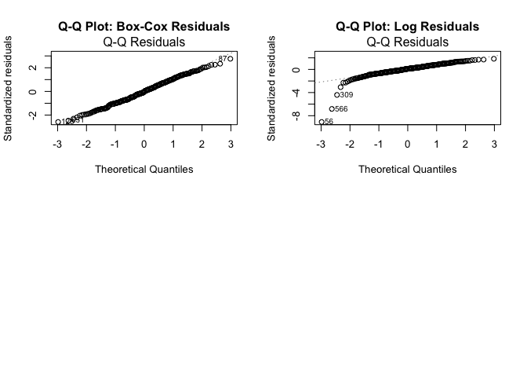
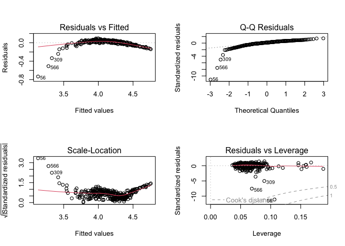
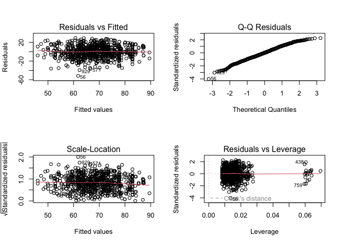
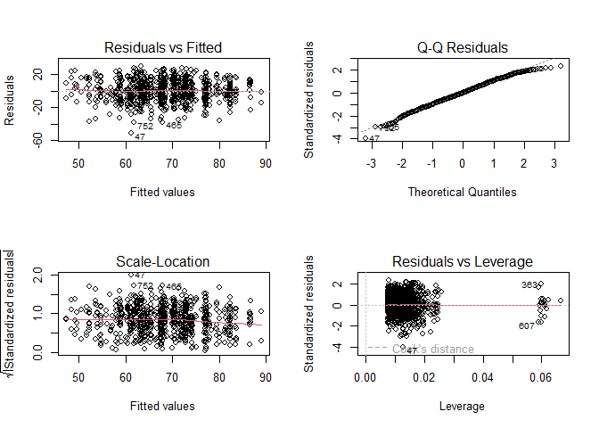

Writing Regression
================
Riya Kalra
2024-12-15

## Data Preparation

    ## Warning: package 'fastDummies' was built under R version 4.4.2

    ## Rows: 948 Columns: 14
    ## ── Column specification ────────────────────────────────────────────────────────
    ## Delimiter: ","
    ## chr (10): Gender, EthnicGroup, ParentEduc, LunchType, TestPrep, ParentMarita...
    ## dbl  (4): NrSiblings, MathScore, ReadingScore, WritingScore
    ## 
    ## ℹ Use `spec()` to retrieve the full column specification for this data.
    ## ℹ Specify the column types or set `show_col_types = FALSE` to quiet this message.

<div id="afsaglrqlj" style="padding-left:0px;padding-right:0px;padding-top:10px;padding-bottom:10px;overflow-x:auto;overflow-y:auto;width:auto;height:auto;">
<style>#afsaglrqlj table {
  font-family: system-ui, 'Segoe UI', Roboto, Helvetica, Arial, sans-serif, 'Apple Color Emoji', 'Segoe UI Emoji', 'Segoe UI Symbol', 'Noto Color Emoji';
  -webkit-font-smoothing: antialiased;
  -moz-osx-font-smoothing: grayscale;
}
&#10;#afsaglrqlj thead, #afsaglrqlj tbody, #afsaglrqlj tfoot, #afsaglrqlj tr, #afsaglrqlj td, #afsaglrqlj th {
  border-style: none;
}
&#10;#afsaglrqlj p {
  margin: 0;
  padding: 0;
}
&#10;#afsaglrqlj .gt_table {
  display: table;
  border-collapse: collapse;
  line-height: normal;
  margin-left: auto;
  margin-right: auto;
  color: #333333;
  font-size: 16px;
  font-weight: normal;
  font-style: normal;
  background-color: #FFFFFF;
  width: auto;
  border-top-style: solid;
  border-top-width: 2px;
  border-top-color: #A8A8A8;
  border-right-style: none;
  border-right-width: 2px;
  border-right-color: #D3D3D3;
  border-bottom-style: solid;
  border-bottom-width: 2px;
  border-bottom-color: #A8A8A8;
  border-left-style: none;
  border-left-width: 2px;
  border-left-color: #D3D3D3;
}
&#10;#afsaglrqlj .gt_caption {
  padding-top: 4px;
  padding-bottom: 4px;
}
&#10;#afsaglrqlj .gt_title {
  color: #333333;
  font-size: 125%;
  font-weight: initial;
  padding-top: 4px;
  padding-bottom: 4px;
  padding-left: 5px;
  padding-right: 5px;
  border-bottom-color: #FFFFFF;
  border-bottom-width: 0;
}
&#10;#afsaglrqlj .gt_subtitle {
  color: #333333;
  font-size: 85%;
  font-weight: initial;
  padding-top: 3px;
  padding-bottom: 5px;
  padding-left: 5px;
  padding-right: 5px;
  border-top-color: #FFFFFF;
  border-top-width: 0;
}
&#10;#afsaglrqlj .gt_heading {
  background-color: #FFFFFF;
  text-align: center;
  border-bottom-color: #FFFFFF;
  border-left-style: none;
  border-left-width: 1px;
  border-left-color: #D3D3D3;
  border-right-style: none;
  border-right-width: 1px;
  border-right-color: #D3D3D3;
}
&#10;#afsaglrqlj .gt_bottom_border {
  border-bottom-style: solid;
  border-bottom-width: 2px;
  border-bottom-color: #D3D3D3;
}
&#10;#afsaglrqlj .gt_col_headings {
  border-top-style: solid;
  border-top-width: 2px;
  border-top-color: #D3D3D3;
  border-bottom-style: solid;
  border-bottom-width: 2px;
  border-bottom-color: #D3D3D3;
  border-left-style: none;
  border-left-width: 1px;
  border-left-color: #D3D3D3;
  border-right-style: none;
  border-right-width: 1px;
  border-right-color: #D3D3D3;
}
&#10;#afsaglrqlj .gt_col_heading {
  color: #333333;
  background-color: #FFFFFF;
  font-size: 100%;
  font-weight: normal;
  text-transform: inherit;
  border-left-style: none;
  border-left-width: 1px;
  border-left-color: #D3D3D3;
  border-right-style: none;
  border-right-width: 1px;
  border-right-color: #D3D3D3;
  vertical-align: bottom;
  padding-top: 5px;
  padding-bottom: 6px;
  padding-left: 5px;
  padding-right: 5px;
  overflow-x: hidden;
}
&#10;#afsaglrqlj .gt_column_spanner_outer {
  color: #333333;
  background-color: #FFFFFF;
  font-size: 100%;
  font-weight: normal;
  text-transform: inherit;
  padding-top: 0;
  padding-bottom: 0;
  padding-left: 4px;
  padding-right: 4px;
}
&#10;#afsaglrqlj .gt_column_spanner_outer:first-child {
  padding-left: 0;
}
&#10;#afsaglrqlj .gt_column_spanner_outer:last-child {
  padding-right: 0;
}
&#10;#afsaglrqlj .gt_column_spanner {
  border-bottom-style: solid;
  border-bottom-width: 2px;
  border-bottom-color: #D3D3D3;
  vertical-align: bottom;
  padding-top: 5px;
  padding-bottom: 5px;
  overflow-x: hidden;
  display: inline-block;
  width: 100%;
}
&#10;#afsaglrqlj .gt_spanner_row {
  border-bottom-style: hidden;
}
&#10;#afsaglrqlj .gt_group_heading {
  padding-top: 8px;
  padding-bottom: 8px;
  padding-left: 5px;
  padding-right: 5px;
  color: #333333;
  background-color: #FFFFFF;
  font-size: 100%;
  font-weight: initial;
  text-transform: inherit;
  border-top-style: solid;
  border-top-width: 2px;
  border-top-color: #D3D3D3;
  border-bottom-style: solid;
  border-bottom-width: 2px;
  border-bottom-color: #D3D3D3;
  border-left-style: none;
  border-left-width: 1px;
  border-left-color: #D3D3D3;
  border-right-style: none;
  border-right-width: 1px;
  border-right-color: #D3D3D3;
  vertical-align: middle;
  text-align: left;
}
&#10;#afsaglrqlj .gt_empty_group_heading {
  padding: 0.5px;
  color: #333333;
  background-color: #FFFFFF;
  font-size: 100%;
  font-weight: initial;
  border-top-style: solid;
  border-top-width: 2px;
  border-top-color: #D3D3D3;
  border-bottom-style: solid;
  border-bottom-width: 2px;
  border-bottom-color: #D3D3D3;
  vertical-align: middle;
}
&#10;#afsaglrqlj .gt_from_md > :first-child {
  margin-top: 0;
}
&#10;#afsaglrqlj .gt_from_md > :last-child {
  margin-bottom: 0;
}
&#10;#afsaglrqlj .gt_row {
  padding-top: 8px;
  padding-bottom: 8px;
  padding-left: 5px;
  padding-right: 5px;
  margin: 10px;
  border-top-style: solid;
  border-top-width: 1px;
  border-top-color: #D3D3D3;
  border-left-style: none;
  border-left-width: 1px;
  border-left-color: #D3D3D3;
  border-right-style: none;
  border-right-width: 1px;
  border-right-color: #D3D3D3;
  vertical-align: middle;
  overflow-x: hidden;
}
&#10;#afsaglrqlj .gt_stub {
  color: #333333;
  background-color: #FFFFFF;
  font-size: 100%;
  font-weight: initial;
  text-transform: inherit;
  border-right-style: solid;
  border-right-width: 2px;
  border-right-color: #D3D3D3;
  padding-left: 5px;
  padding-right: 5px;
}
&#10;#afsaglrqlj .gt_stub_row_group {
  color: #333333;
  background-color: #FFFFFF;
  font-size: 100%;
  font-weight: initial;
  text-transform: inherit;
  border-right-style: solid;
  border-right-width: 2px;
  border-right-color: #D3D3D3;
  padding-left: 5px;
  padding-right: 5px;
  vertical-align: top;
}
&#10;#afsaglrqlj .gt_row_group_first td {
  border-top-width: 2px;
}
&#10;#afsaglrqlj .gt_row_group_first th {
  border-top-width: 2px;
}
&#10;#afsaglrqlj .gt_summary_row {
  color: #333333;
  background-color: #FFFFFF;
  text-transform: inherit;
  padding-top: 8px;
  padding-bottom: 8px;
  padding-left: 5px;
  padding-right: 5px;
}
&#10;#afsaglrqlj .gt_first_summary_row {
  border-top-style: solid;
  border-top-color: #D3D3D3;
}
&#10;#afsaglrqlj .gt_first_summary_row.thick {
  border-top-width: 2px;
}
&#10;#afsaglrqlj .gt_last_summary_row {
  padding-top: 8px;
  padding-bottom: 8px;
  padding-left: 5px;
  padding-right: 5px;
  border-bottom-style: solid;
  border-bottom-width: 2px;
  border-bottom-color: #D3D3D3;
}
&#10;#afsaglrqlj .gt_grand_summary_row {
  color: #333333;
  background-color: #FFFFFF;
  text-transform: inherit;
  padding-top: 8px;
  padding-bottom: 8px;
  padding-left: 5px;
  padding-right: 5px;
}
&#10;#afsaglrqlj .gt_first_grand_summary_row {
  padding-top: 8px;
  padding-bottom: 8px;
  padding-left: 5px;
  padding-right: 5px;
  border-top-style: double;
  border-top-width: 6px;
  border-top-color: #D3D3D3;
}
&#10;#afsaglrqlj .gt_last_grand_summary_row_top {
  padding-top: 8px;
  padding-bottom: 8px;
  padding-left: 5px;
  padding-right: 5px;
  border-bottom-style: double;
  border-bottom-width: 6px;
  border-bottom-color: #D3D3D3;
}
&#10;#afsaglrqlj .gt_striped {
  background-color: rgba(128, 128, 128, 0.05);
}
&#10;#afsaglrqlj .gt_table_body {
  border-top-style: solid;
  border-top-width: 2px;
  border-top-color: #D3D3D3;
  border-bottom-style: solid;
  border-bottom-width: 2px;
  border-bottom-color: #D3D3D3;
}
&#10;#afsaglrqlj .gt_footnotes {
  color: #333333;
  background-color: #FFFFFF;
  border-bottom-style: none;
  border-bottom-width: 2px;
  border-bottom-color: #D3D3D3;
  border-left-style: none;
  border-left-width: 2px;
  border-left-color: #D3D3D3;
  border-right-style: none;
  border-right-width: 2px;
  border-right-color: #D3D3D3;
}
&#10;#afsaglrqlj .gt_footnote {
  margin: 0px;
  font-size: 90%;
  padding-top: 4px;
  padding-bottom: 4px;
  padding-left: 5px;
  padding-right: 5px;
}
&#10;#afsaglrqlj .gt_sourcenotes {
  color: #333333;
  background-color: #FFFFFF;
  border-bottom-style: none;
  border-bottom-width: 2px;
  border-bottom-color: #D3D3D3;
  border-left-style: none;
  border-left-width: 2px;
  border-left-color: #D3D3D3;
  border-right-style: none;
  border-right-width: 2px;
  border-right-color: #D3D3D3;
}
&#10;#afsaglrqlj .gt_sourcenote {
  font-size: 90%;
  padding-top: 4px;
  padding-bottom: 4px;
  padding-left: 5px;
  padding-right: 5px;
}
&#10;#afsaglrqlj .gt_left {
  text-align: left;
}
&#10;#afsaglrqlj .gt_center {
  text-align: center;
}
&#10;#afsaglrqlj .gt_right {
  text-align: right;
  font-variant-numeric: tabular-nums;
}
&#10;#afsaglrqlj .gt_font_normal {
  font-weight: normal;
}
&#10;#afsaglrqlj .gt_font_bold {
  font-weight: bold;
}
&#10;#afsaglrqlj .gt_font_italic {
  font-style: italic;
}
&#10;#afsaglrqlj .gt_super {
  font-size: 65%;
}
&#10;#afsaglrqlj .gt_footnote_marks {
  font-size: 75%;
  vertical-align: 0.4em;
  position: initial;
}
&#10;#afsaglrqlj .gt_asterisk {
  font-size: 100%;
  vertical-align: 0;
}
&#10;#afsaglrqlj .gt_indent_1 {
  text-indent: 5px;
}
&#10;#afsaglrqlj .gt_indent_2 {
  text-indent: 10px;
}
&#10;#afsaglrqlj .gt_indent_3 {
  text-indent: 15px;
}
&#10;#afsaglrqlj .gt_indent_4 {
  text-indent: 20px;
}
&#10;#afsaglrqlj .gt_indent_5 {
  text-indent: 25px;
}
&#10;#afsaglrqlj .katex-display {
  display: inline-flex !important;
  margin-bottom: 0.75em !important;
}
&#10;#afsaglrqlj div.Reactable > div.rt-table > div.rt-thead > div.rt-tr.rt-tr-group-header > div.rt-th-group:after {
  height: 0px !important;
}
</style>
<table class="gt_table" data-quarto-disable-processing="false" data-quarto-bootstrap="false">
  <thead>
    <tr class="gt_col_headings">
      <th class="gt_col_heading gt_columns_bottom_border gt_left" rowspan="1" colspan="1" scope="col" id="label"><span class='gt_from_md'><strong>Characteristic</strong></span></th>
      <th class="gt_col_heading gt_columns_bottom_border gt_center" rowspan="1" colspan="1" scope="col" id="stat_0"><span class='gt_from_md'><strong>N = 948</strong></span><span class="gt_footnote_marks" style="white-space:nowrap;font-style:italic;font-weight:normal;line-height:0;"><sup>1</sup></span></th>
    </tr>
  </thead>
  <tbody class="gt_table_body">
    <tr><td headers="label" class="gt_row gt_left" style="font-weight: bold;">id</td>
<td headers="stat_0" class="gt_row gt_center">475 (238, 712)</td></tr>
    <tr><td headers="label" class="gt_row gt_left" style="font-weight: bold;">gender</td>
<td headers="stat_0" class="gt_row gt_center"><br /></td></tr>
    <tr><td headers="label" class="gt_row gt_left" style="font-style: italic;">    female</td>
<td headers="stat_0" class="gt_row gt_center">488 (51%)</td></tr>
    <tr><td headers="label" class="gt_row gt_left" style="font-style: italic;">    male</td>
<td headers="stat_0" class="gt_row gt_center">460 (49%)</td></tr>
    <tr><td headers="label" class="gt_row gt_left" style="font-weight: bold;">ethnic_group</td>
<td headers="stat_0" class="gt_row gt_center"><br /></td></tr>
    <tr><td headers="label" class="gt_row gt_left" style="font-style: italic;">    A</td>
<td headers="stat_0" class="gt_row gt_center">80 (9.0%)</td></tr>
    <tr><td headers="label" class="gt_row gt_left" style="font-style: italic;">    B</td>
<td headers="stat_0" class="gt_row gt_center">171 (19%)</td></tr>
    <tr><td headers="label" class="gt_row gt_left" style="font-style: italic;">    C</td>
<td headers="stat_0" class="gt_row gt_center">277 (31%)</td></tr>
    <tr><td headers="label" class="gt_row gt_left" style="font-style: italic;">    D</td>
<td headers="stat_0" class="gt_row gt_center">237 (27%)</td></tr>
    <tr><td headers="label" class="gt_row gt_left" style="font-style: italic;">    E</td>
<td headers="stat_0" class="gt_row gt_center">124 (14%)</td></tr>
    <tr><td headers="label" class="gt_row gt_left" style="font-style: italic;">    Unknown</td>
<td headers="stat_0" class="gt_row gt_center">59</td></tr>
    <tr><td headers="label" class="gt_row gt_left" style="font-weight: bold;">parent_educ</td>
<td headers="stat_0" class="gt_row gt_center"><br /></td></tr>
    <tr><td headers="label" class="gt_row gt_left" style="font-style: italic;">    some high school</td>
<td headers="stat_0" class="gt_row gt_center">163 (30%)</td></tr>
    <tr><td headers="label" class="gt_row gt_left" style="font-style: italic;">    high school</td>
<td headers="stat_0" class="gt_row gt_center">176 (33%)</td></tr>
    <tr><td headers="label" class="gt_row gt_left" style="font-style: italic;">    some college</td>
<td headers="stat_0" class="gt_row gt_center">199 (37%)</td></tr>
    <tr><td headers="label" class="gt_row gt_left" style="font-style: italic;">    associate's degree</td>
<td headers="stat_0" class="gt_row gt_center">0 (0%)</td></tr>
    <tr><td headers="label" class="gt_row gt_left" style="font-style: italic;">    backelor's degree</td>
<td headers="stat_0" class="gt_row gt_center">0 (0%)</td></tr>
    <tr><td headers="label" class="gt_row gt_left" style="font-style: italic;">    master's degree</td>
<td headers="stat_0" class="gt_row gt_center">0 (0%)</td></tr>
    <tr><td headers="label" class="gt_row gt_left" style="font-style: italic;">    Unknown</td>
<td headers="stat_0" class="gt_row gt_center">410</td></tr>
    <tr><td headers="label" class="gt_row gt_left" style="font-weight: bold;">lunch_type</td>
<td headers="stat_0" class="gt_row gt_center"><br /></td></tr>
    <tr><td headers="label" class="gt_row gt_left" style="font-style: italic;">    free_reduced</td>
<td headers="stat_0" class="gt_row gt_center">331 (35%)</td></tr>
    <tr><td headers="label" class="gt_row gt_left" style="font-style: italic;">    standard</td>
<td headers="stat_0" class="gt_row gt_center">617 (65%)</td></tr>
    <tr><td headers="label" class="gt_row gt_left" style="font-weight: bold;">test_prep</td>
<td headers="stat_0" class="gt_row gt_center"><br /></td></tr>
    <tr><td headers="label" class="gt_row gt_left" style="font-style: italic;">    none</td>
<td headers="stat_0" class="gt_row gt_center">571 (64%)</td></tr>
    <tr><td headers="label" class="gt_row gt_left" style="font-style: italic;">    completed</td>
<td headers="stat_0" class="gt_row gt_center">322 (36%)</td></tr>
    <tr><td headers="label" class="gt_row gt_left" style="font-style: italic;">    Unknown</td>
<td headers="stat_0" class="gt_row gt_center">55</td></tr>
    <tr><td headers="label" class="gt_row gt_left" style="font-weight: bold;">parent_marital_status</td>
<td headers="stat_0" class="gt_row gt_center"><br /></td></tr>
    <tr><td headers="label" class="gt_row gt_left" style="font-style: italic;">    divorced</td>
<td headers="stat_0" class="gt_row gt_center">146 (16%)</td></tr>
    <tr><td headers="label" class="gt_row gt_left" style="font-style: italic;">    married</td>
<td headers="stat_0" class="gt_row gt_center">516 (57%)</td></tr>
    <tr><td headers="label" class="gt_row gt_left" style="font-style: italic;">    single</td>
<td headers="stat_0" class="gt_row gt_center">213 (24%)</td></tr>
    <tr><td headers="label" class="gt_row gt_left" style="font-style: italic;">    widowed</td>
<td headers="stat_0" class="gt_row gt_center">24 (2.7%)</td></tr>
    <tr><td headers="label" class="gt_row gt_left" style="font-style: italic;">    Unknown</td>
<td headers="stat_0" class="gt_row gt_center">49</td></tr>
    <tr><td headers="label" class="gt_row gt_left" style="font-weight: bold;">practice_sport</td>
<td headers="stat_0" class="gt_row gt_center"><br /></td></tr>
    <tr><td headers="label" class="gt_row gt_left" style="font-style: italic;">    never</td>
<td headers="stat_0" class="gt_row gt_center">112 (12%)</td></tr>
    <tr><td headers="label" class="gt_row gt_left" style="font-style: italic;">    sometimes</td>
<td headers="stat_0" class="gt_row gt_center">477 (51%)</td></tr>
    <tr><td headers="label" class="gt_row gt_left" style="font-style: italic;">    regularly</td>
<td headers="stat_0" class="gt_row gt_center">343 (37%)</td></tr>
    <tr><td headers="label" class="gt_row gt_left" style="font-style: italic;">    Unknown</td>
<td headers="stat_0" class="gt_row gt_center">16</td></tr>
    <tr><td headers="label" class="gt_row gt_left" style="font-weight: bold;">is_first_child</td>
<td headers="stat_0" class="gt_row gt_center">604 (66%)</td></tr>
    <tr><td headers="label" class="gt_row gt_left" style="font-style: italic;">    Unknown</td>
<td headers="stat_0" class="gt_row gt_center">30</td></tr>
    <tr><td headers="label" class="gt_row gt_left" style="font-weight: bold;">nr_siblings</td>
<td headers="stat_0" class="gt_row gt_center"><br /></td></tr>
    <tr><td headers="label" class="gt_row gt_left" style="font-style: italic;">    0</td>
<td headers="stat_0" class="gt_row gt_center">101 (11%)</td></tr>
    <tr><td headers="label" class="gt_row gt_left" style="font-style: italic;">    1</td>
<td headers="stat_0" class="gt_row gt_center">245 (27%)</td></tr>
    <tr><td headers="label" class="gt_row gt_left" style="font-style: italic;">    2</td>
<td headers="stat_0" class="gt_row gt_center">213 (24%)</td></tr>
    <tr><td headers="label" class="gt_row gt_left" style="font-style: italic;">    3</td>
<td headers="stat_0" class="gt_row gt_center">198 (22%)</td></tr>
    <tr><td headers="label" class="gt_row gt_left" style="font-style: italic;">    4</td>
<td headers="stat_0" class="gt_row gt_center">76 (8.4%)</td></tr>
    <tr><td headers="label" class="gt_row gt_left" style="font-style: italic;">    5</td>
<td headers="stat_0" class="gt_row gt_center">50 (5.5%)</td></tr>
    <tr><td headers="label" class="gt_row gt_left" style="font-style: italic;">    6</td>
<td headers="stat_0" class="gt_row gt_center">8 (0.9%)</td></tr>
    <tr><td headers="label" class="gt_row gt_left" style="font-style: italic;">    7</td>
<td headers="stat_0" class="gt_row gt_center">11 (1.2%)</td></tr>
    <tr><td headers="label" class="gt_row gt_left" style="font-style: italic;">    Unknown</td>
<td headers="stat_0" class="gt_row gt_center">46</td></tr>
    <tr><td headers="label" class="gt_row gt_left" style="font-weight: bold;">transport_means</td>
<td headers="stat_0" class="gt_row gt_center"><br /></td></tr>
    <tr><td headers="label" class="gt_row gt_left" style="font-style: italic;">    private</td>
<td headers="stat_0" class="gt_row gt_center">337 (40%)</td></tr>
    <tr><td headers="label" class="gt_row gt_left" style="font-style: italic;">    school_bus</td>
<td headers="stat_0" class="gt_row gt_center">509 (60%)</td></tr>
    <tr><td headers="label" class="gt_row gt_left" style="font-style: italic;">    Unknown</td>
<td headers="stat_0" class="gt_row gt_center">102</td></tr>
    <tr><td headers="label" class="gt_row gt_left" style="font-weight: bold;">wkly_study_hours</td>
<td headers="stat_0" class="gt_row gt_center"><br /></td></tr>
    <tr><td headers="label" class="gt_row gt_left" style="font-style: italic;">    &lt; 5</td>
<td headers="stat_0" class="gt_row gt_center">253 (28%)</td></tr>
    <tr><td headers="label" class="gt_row gt_left" style="font-style: italic;">    5-10</td>
<td headers="stat_0" class="gt_row gt_center">508 (56%)</td></tr>
    <tr><td headers="label" class="gt_row gt_left" style="font-style: italic;">    &gt; 10</td>
<td headers="stat_0" class="gt_row gt_center">150 (16%)</td></tr>
    <tr><td headers="label" class="gt_row gt_left" style="font-style: italic;">    Unknown</td>
<td headers="stat_0" class="gt_row gt_center">37</td></tr>
    <tr><td headers="label" class="gt_row gt_left" style="font-weight: bold;">math_score</td>
<td headers="stat_0" class="gt_row gt_center">66 (56, 76)</td></tr>
    <tr><td headers="label" class="gt_row gt_left" style="font-weight: bold;">reading_score</td>
<td headers="stat_0" class="gt_row gt_center">70 (59, 80)</td></tr>
    <tr><td headers="label" class="gt_row gt_left" style="font-weight: bold;">writing_score</td>
<td headers="stat_0" class="gt_row gt_center">68 (57, 79)</td></tr>
  </tbody>
  &#10;  <tfoot class="gt_footnotes">
    <tr>
      <td class="gt_footnote" colspan="2"><span class="gt_footnote_marks" style="white-space:nowrap;font-style:italic;font-weight:normal;line-height:0;"><sup>1</sup></span> <span class='gt_from_md'>Median (Q1, Q3); n (%)</span></td>
    </tr>
  </tfoot>
</table>
</div>

## Visualize the distribution of writing_score

<!-- --><!-- -->
Based on this plot, we see a roughly straight diagonal, but deviations
at the tails. This could indicate a potential issue with normality.

We can apply a logarithmic or a Box-Cox transformation to solve this
issue. Let’s try both and pick the one with a lower adjusted R^2 value
and a lower AIC.

    ## Warning: package 'caret' was built under R version 4.4.2

    ## Loading required package: lattice

    ## 
    ## Attaching package: 'caret'

    ## The following object is masked from 'package:purrr':
    ## 
    ##     lift

    ## 
    ##   0   1 
    ## 488 460

    ## Box-Cox Model AIC: 2739.218

    ## Log Model AIC: -614.1538

    ## Box-Cox Model Adjusted R-squared: 0.9491582

    ## Log Model Adjusted R-squared: 0.8741145

<!-- -->
Based on the results:

Log Model AIC (-614.1538) is significantly lower than the Box-Cox Model
AIC (2739.218), indicating the log model has a better fit.

However, Box-Cox Model Adjusted R-squared (0.9492) is higher than the
Log Model Adjusted R-squared (0.8741), suggesting the Box-Cox model
explains more variability in the data.

Given the substantial difference in AIC (a strong measure of model fit)
and the adjusted R-squared being reasonably high for the log model, the
log model appears to be the better choice overall for both predictive
power and fit.

## Regression Model

    ## 
    ## Call:
    ## lm(formula = writing_score_log ~ ., data = final_data)
    ## 
    ## Residuals:
    ##      Min       1Q   Median       3Q      Max 
    ## -0.73331 -0.01420  0.00958  0.03614  0.09619 
    ## 
    ## Coefficients: (1 not defined because of singularities)
    ##                                Estimate Std. Error t value Pr(>|t|)    
    ## (Intercept)                   3.042e+00  2.919e-02 104.201  < 2e-16 ***
    ## gendermale                    3.605e-02  1.308e-02   2.757  0.00616 ** 
    ## ethnic_groupB                -4.574e-03  1.460e-02  -0.313  0.75422    
    ## ethnic_groupC                -1.728e-03  1.397e-02  -0.124  0.90165    
    ## ethnic_groupD                -6.422e-03  1.414e-02  -0.454  0.65009    
    ## ethnic_groupE                -7.257e-05  1.661e-02  -0.004  0.99652    
    ## parent_educhigh school        1.097e-02  9.403e-03   1.167  0.24410    
    ## parent_educsome college      -7.183e-03  9.721e-03  -0.739  0.46048    
    ## lunch_typestandard           -3.118e-03  8.843e-03  -0.353  0.72458    
    ## test_prepcompleted           -1.110e-02  9.279e-03  -1.197  0.23230    
    ## parent_marital_statusmarried -5.460e-03  1.072e-02  -0.509  0.61096    
    ## parent_marital_statussingle  -1.136e-02  1.235e-02  -0.920  0.35815    
    ## parent_marital_statuswidowed -5.948e-03  2.550e-02  -0.233  0.81569    
    ## practice_sportsometimes      -1.261e-02  1.299e-02  -0.971  0.33237    
    ## practice_sportregularly      -2.052e-02  1.334e-02  -1.538  0.12493    
    ## is_first_childyes            -5.007e-03  8.348e-03  -0.600  0.54902    
    ## nr_siblings                  -2.489e-03  2.591e-03  -0.961  0.33736    
    ## transport_meansschool_bus    -9.432e-03  7.694e-03  -1.226  0.22114    
    ## wkly_study_hours5-10         -9.618e-03  9.209e-03  -1.044  0.29707    
    ## wkly_study_hours> 10         -2.160e-02  1.205e-02  -1.793  0.07392 .  
    ## math_score                   -1.923e-04  7.090e-04  -0.271  0.78636    
    ## reading_score                -1.726e-03  9.428e-04  -1.830  0.06812 .  
    ## writing_score                 1.960e-02  1.121e-03  17.482  < 2e-16 ***
    ## gendermale                           NA         NA      NA       NA    
    ## ---
    ## Signif. codes:  0 '***' 0.001 '**' 0.01 '*' 0.05 '.' 0.1 ' ' 1
    ## 
    ## Residual standard error: 0.06986 on 326 degrees of freedom
    ##   (599 observations deleted due to missingness)
    ## Multiple R-squared:  0.9389, Adjusted R-squared:  0.9348 
    ## F-statistic: 227.9 on 22 and 326 DF,  p-value: < 2.2e-16

<!-- -->

    ## Warning: package 'lmtest' was built under R version 4.4.2

    ## Loading required package: zoo

    ## Warning: package 'zoo' was built under R version 4.4.2

    ## 
    ## Attaching package: 'zoo'

    ## The following objects are masked from 'package:base':
    ## 
    ##     as.Date, as.Date.numeric

    ## 
    ##  studentized Breusch-Pagan test
    ## 
    ## data:  final_log_model
    ## BP = 49.529, df = 22, p-value = 0.0006788

    ## 
    ##  Shapiro-Wilk normality test
    ## 
    ## data:  residuals(final_log_model)
    ## W = 0.62146, p-value < 2.2e-16

## Basic Regression Model

    ## 
    ## Call:
    ## lm(formula = writing_score ~ ., data = writing_df_no_transform)
    ## 
    ## Residuals:
    ##     Min      1Q  Median      3Q     Max 
    ## -47.302  -7.176   0.687   8.643  24.334 
    ## 
    ## Coefficients: (1 not defined because of singularities)
    ##                              Estimate Std. Error t value Pr(>|t|)    
    ## (Intercept)                   49.0566     4.3164  11.365  < 2e-16 ***
    ## gendermale                    -9.9168     1.3865  -7.152 5.56e-12 ***
    ## ethnic_groupB                 -3.9560     2.6301  -1.504  0.13350    
    ## ethnic_groupC                 -0.2113     2.5244  -0.084  0.93333    
    ## ethnic_groupD                  5.0372     2.5060   2.010  0.04524 *  
    ## ethnic_groupE                  6.7177     2.9041   2.313  0.02133 *  
    ## parent_educhigh school        -0.0470     1.7014  -0.028  0.97798    
    ## parent_educsome college        4.2499     1.7113   2.483  0.01351 *  
    ## lunch_typestandard            10.1304     1.4391   7.039 1.13e-11 ***
    ## test_prepcompleted             9.2085     1.4845   6.203 1.66e-09 ***
    ## parent_marital_statusmarried   5.7253     1.9143   2.991  0.00299 ** 
    ## parent_marital_statussingle    2.7644     2.2280   1.241  0.21559    
    ## parent_marital_statuswidowed   7.0220     4.5945   1.528  0.12739    
    ## practice_sportsometimes        0.7938     2.3447   0.339  0.73515    
    ## practice_sportregularly       -0.2612     2.3809  -0.110  0.91271    
    ## is_first_childyes              3.4637     1.4976   2.313  0.02135 *  
    ## nr_siblings                    0.5793     0.4674   1.239  0.21608    
    ## transport_meansschool_bus      0.9780     1.3826   0.707  0.47984    
    ## wkly_study_hours5-10           1.0741     1.6624   0.646  0.51866    
    ## wkly_study_hours> 10          -0.2265     2.1652  -0.105  0.91676    
    ## gendermale                         NA         NA      NA       NA    
    ## ---
    ## Signif. codes:  0 '***' 0.001 '**' 0.01 '*' 0.05 '.' 0.1 ' ' 1
    ## 
    ## Residual standard error: 12.65 on 329 degrees of freedom
    ##   (599 observations deleted due to missingness)
    ## Multiple R-squared:  0.3537, Adjusted R-squared:  0.3164 
    ## F-statistic: 9.476 on 19 and 329 DF,  p-value: < 2.2e-16

Significant coefficients:

- (Intercept) (p\<2e−16)
- gendermale (p=5.56e−12)
- ethnic_groupE (p=0.02133)
- ethnic_groupD (p=0.04524)
- lunch_typestandard (p=1.13e−11)
- test_prepcompleted (p=1.66e−09)
- parent_marital_statusmarried (p=0.00299)
- is_first_childyes (p=0.02135)

# Residual Analysis

**RSE = 12.65**: the RSE represents the average difference betweeen
observed and fitted values.

**R^2 = 0.3537**: The R^2 value represents the fact that 35.37% of the
variability in writing score is explained by the covariates.

**Adj-R^2 = 0.3164**: Removing predictors in the model that don’t add
significance, 31.64% of the variability in writing score is explained by
the selected covariates.

## Create a model with the significant variables

    ##         writing_score                gender          ethnic_group 
    ##             "numeric"              "factor"              "factor" 
    ##            lunch_type             test_prep parent_marital_status 
    ##              "factor"              "factor"              "factor" 
    ##        is_first_child 
    ##              "factor"

    ## 
    ## Call:
    ## lm(formula = writing_score ~ gender + ethnic_group + lunch_type + 
    ##     test_prep + parent_marital_status + is_first_child, data = writing_df_significant)
    ## 
    ## Residuals:
    ##     Min      1Q  Median      3Q     Max 
    ## -51.748  -8.565   0.052   9.236  29.320 
    ## 
    ## Coefficients:
    ##                              Estimate Std. Error t value Pr(>|t|)    
    ## (Intercept)                   56.7638     2.1603  26.275  < 2e-16 ***
    ## gendermale                    -9.4474     0.9476  -9.970  < 2e-16 ***
    ## ethnic_groupB                 -1.2895     1.9159  -0.673  0.50112    
    ## ethnic_groupC                  1.1214     1.8080   0.620  0.53527    
    ## ethnic_groupD                  5.4778     1.8234   3.004  0.00275 ** 
    ## ethnic_groupE                  5.1953     2.0113   2.583  0.00998 ** 
    ## lunch_typestandard             8.7054     0.9959   8.741  < 2e-16 ***
    ## test_prepcompleted             9.4733     0.9876   9.593  < 2e-16 ***
    ## parent_marital_statusmarried   5.1795     1.3144   3.940 8.89e-05 ***
    ## parent_marital_statussingle    2.2089     1.5076   1.465  0.14330    
    ## parent_marital_statuswidowed   7.4662     3.2169   2.321  0.02056 *  
    ## is_first_childyes              1.6535     0.9937   1.664  0.09652 .  
    ## ---
    ## Signif. codes:  0 '***' 0.001 '**' 0.01 '*' 0.05 '.' 0.1 ' ' 1
    ## 
    ## Residual standard error: 13.02 on 756 degrees of freedom
    ##   (180 observations deleted due to missingness)
    ## Multiple R-squared:  0.2898, Adjusted R-squared:  0.2795 
    ## F-statistic: 28.05 on 11 and 756 DF,  p-value: < 2.2e-16

## Model Selection

### Diagnostics

<!-- -->

    ## 
    ##  Shapiro-Wilk normality test
    ## 
    ## data:  residuals(significant_model)
    ## W = 0.99297, p-value = 0.001108

    ## 
    ##  studentized Breusch-Pagan test
    ## 
    ## data:  significant_model
    ## BP = 13.667, df = 11, p-value = 0.252

### Backward Model

    ## Start:  AIC=3953.81
    ## writing_score ~ gender + ethnic_group + lunch_type + test_prep + 
    ##     parent_marital_status + is_first_child
    ## 
    ##                         Df Sum of Sq    RSS    AIC
    ## <none>                               128120 3953.8
    ## - is_first_child         1     469.3 128590 3954.6
    ## - parent_marital_status  3    3347.4 131468 3967.6
    ## - ethnic_group           4    5599.6 133720 3978.7
    ## - lunch_type             1   12949.8 141070 4025.8
    ## - test_prep              1   15594.5 143715 4040.0
    ## - gender                 1   16844.6 144965 4046.7

    ## 
    ## Call:
    ## lm(formula = writing_score ~ gender + ethnic_group + lunch_type + 
    ##     test_prep + parent_marital_status + is_first_child, data = writing_df_significant)
    ## 
    ## Residuals:
    ##     Min      1Q  Median      3Q     Max 
    ## -51.748  -8.565   0.052   9.236  29.320 
    ## 
    ## Coefficients:
    ##                              Estimate Std. Error t value Pr(>|t|)    
    ## (Intercept)                   56.7638     2.1603  26.275  < 2e-16 ***
    ## gendermale                    -9.4474     0.9476  -9.970  < 2e-16 ***
    ## ethnic_groupB                 -1.2895     1.9159  -0.673  0.50112    
    ## ethnic_groupC                  1.1214     1.8080   0.620  0.53527    
    ## ethnic_groupD                  5.4778     1.8234   3.004  0.00275 ** 
    ## ethnic_groupE                  5.1953     2.0113   2.583  0.00998 ** 
    ## lunch_typestandard             8.7054     0.9959   8.741  < 2e-16 ***
    ## test_prepcompleted             9.4733     0.9876   9.593  < 2e-16 ***
    ## parent_marital_statusmarried   5.1795     1.3144   3.940 8.89e-05 ***
    ## parent_marital_statussingle    2.2089     1.5076   1.465  0.14330    
    ## parent_marital_statuswidowed   7.4662     3.2169   2.321  0.02056 *  
    ## is_first_childyes              1.6535     0.9937   1.664  0.09652 .  
    ## ---
    ## Signif. codes:  0 '***' 0.001 '**' 0.01 '*' 0.05 '.' 0.1 ' ' 1
    ## 
    ## Residual standard error: 13.02 on 756 degrees of freedom
    ##   (180 observations deleted due to missingness)
    ## Multiple R-squared:  0.2898, Adjusted R-squared:  0.2795 
    ## F-statistic: 28.05 on 11 and 756 DF,  p-value: < 2.2e-16

### Forward Model

    ## [1] 768

    ## Start:  AIC=4194.66
    ## writing_score ~ 1
    ## 
    ##                         Df Sum of Sq    RSS    AIC
    ## + test_prep              1   14629.6 165779 4131.7
    ## + gender                 1   14221.3 166187 4133.6
    ## + lunch_type             1   12506.2 167902 4141.5
    ## + ethnic_group           4    5409.0 174999 4179.3
    ## + parent_marital_status  3    2407.0 178001 4190.3
    ## + is_first_child         1     896.8 179511 4192.8
    ## <none>                               180408 4194.7
    ## 
    ## Step:  AIC=4131.71
    ## writing_score ~ test_prep
    ## 
    ##                         Df Sum of Sq    RSS    AIC
    ## + gender                 1   14883.3 150895 4061.5
    ## + lunch_type             1   12697.5 153081 4072.5
    ## + ethnic_group           4    5371.3 160407 4114.4
    ## + parent_marital_status  3    2746.2 163032 4124.9
    ## + is_first_child         1     454.5 165324 4131.6
    ## <none>                               165779 4131.7
    ## 
    ## Step:  AIC=4061.46
    ## writing_score ~ test_prep + gender
    ## 
    ##                         Df Sum of Sq    RSS    AIC
    ## + lunch_type             1   14148.8 136746 3987.8
    ## + ethnic_group           4    5648.1 145247 4040.2
    ## + parent_marital_status  3    3052.0 147843 4051.8
    ## <none>                               150895 4061.5
    ## + is_first_child         1     304.3 150591 4061.9
    ## 
    ## Step:  AIC=3987.85
    ## writing_score ~ test_prep + gender + lunch_type
    ## 
    ##                         Df Sum of Sq    RSS    AIC
    ## + ethnic_group           4    4934.7 131812 3967.6
    ## + parent_marital_status  3    2649.7 134097 3978.8
    ## <none>                               136746 3987.8
    ## + is_first_child         1     281.5 136465 3988.3
    ## 
    ## Step:  AIC=3967.62
    ## writing_score ~ test_prep + gender + lunch_type + ethnic_group
    ## 
    ##                         Df Sum of Sq    RSS    AIC
    ## + parent_marital_status  3    3222.0 128590 3954.6
    ## + is_first_child         1     343.9 131468 3967.6
    ## <none>                               131812 3967.6
    ## 
    ## Step:  AIC=3954.61
    ## writing_score ~ test_prep + gender + lunch_type + ethnic_group + 
    ##     parent_marital_status
    ## 
    ##                  Df Sum of Sq    RSS    AIC
    ## + is_first_child  1    469.28 128120 3953.8
    ## <none>                        128590 3954.6
    ## 
    ## Step:  AIC=3953.81
    ## writing_score ~ test_prep + gender + lunch_type + ethnic_group + 
    ##     parent_marital_status + is_first_child

    ## 
    ## Call:
    ## lm(formula = writing_score ~ test_prep + gender + lunch_type + 
    ##     ethnic_group + parent_marital_status + is_first_child, data = writing_df_significant)
    ## 
    ## Residuals:
    ##     Min      1Q  Median      3Q     Max 
    ## -51.748  -8.565   0.052   9.236  29.320 
    ## 
    ## Coefficients:
    ##                              Estimate Std. Error t value Pr(>|t|)    
    ## (Intercept)                   56.7638     2.1603  26.275  < 2e-16 ***
    ## test_prepcompleted             9.4733     0.9876   9.593  < 2e-16 ***
    ## gendermale                    -9.4474     0.9476  -9.970  < 2e-16 ***
    ## lunch_typestandard             8.7054     0.9959   8.741  < 2e-16 ***
    ## ethnic_groupB                 -1.2895     1.9159  -0.673  0.50112    
    ## ethnic_groupC                  1.1214     1.8080   0.620  0.53527    
    ## ethnic_groupD                  5.4778     1.8234   3.004  0.00275 ** 
    ## ethnic_groupE                  5.1953     2.0113   2.583  0.00998 ** 
    ## parent_marital_statusmarried   5.1795     1.3144   3.940 8.89e-05 ***
    ## parent_marital_statussingle    2.2089     1.5076   1.465  0.14330    
    ## parent_marital_statuswidowed   7.4662     3.2169   2.321  0.02056 *  
    ## is_first_childyes              1.6535     0.9937   1.664  0.09652 .  
    ## ---
    ## Signif. codes:  0 '***' 0.001 '**' 0.01 '*' 0.05 '.' 0.1 ' ' 1
    ## 
    ## Residual standard error: 13.02 on 756 degrees of freedom
    ## Multiple R-squared:  0.2898, Adjusted R-squared:  0.2795 
    ## F-statistic: 28.05 on 11 and 756 DF,  p-value: < 2.2e-16

The resulting model is: $$
\text{writing_score} = \beta_0 + \beta_1 \cdot \text{test_prepcompleted} + \beta_2 \cdot \text{gendermale} + \beta_3 \cdot \text{lunch_typestandard} + \beta_4 \cdot \text{ethnic_groupD} + \beta_5 \cdot \text{ethnic_groupE} + \beta_6 \cdot \text{parent_marital_statusmarried} + \beta_7 \cdot \text{parent_marital_statuswidowed}
$$ \## Fit the final regression model

``` r
final_model <- lm(
  writing_score ~ test_prep + gender + lunch_type + 
                  ethnic_group + parent_marital_status, 
  data = writing_df_significant
)

# Summarize the final model
summary(final_model)
```

    ## 
    ## Call:
    ## lm(formula = writing_score ~ test_prep + gender + lunch_type + 
    ##     ethnic_group + parent_marital_status, data = writing_df_significant)
    ## 
    ## Residuals:
    ##     Min      1Q  Median      3Q     Max 
    ## -51.147  -8.634   0.039   9.189  29.658 
    ## 
    ## Coefficients:
    ##                              Estimate Std. Error t value Pr(>|t|)    
    ## (Intercept)                   57.9339     2.0451  28.328  < 2e-16 ***
    ## test_prepcompleted             9.5890     0.9863   9.723  < 2e-16 ***
    ## gendermale                    -9.4940     0.9483 -10.012  < 2e-16 ***
    ## lunch_typestandard             8.7206     0.9970   8.747  < 2e-16 ***
    ## ethnic_groupB                 -1.2523     1.9181  -0.653 0.514009    
    ## ethnic_groupC                  1.1604     1.8099   0.641 0.521628    
    ## ethnic_groupD                  5.4452     1.8254   2.983 0.002947 ** 
    ## ethnic_groupE                  5.2037     2.0137   2.584 0.009948 ** 
    ## parent_marital_statusmarried   5.0214     1.3125   3.826 0.000141 ***
    ## parent_marital_statussingle    2.0528     1.5065   1.363 0.173404    
    ## parent_marital_statuswidowed   7.3814     3.2203   2.292 0.022168 *  
    ## ---
    ## Signif. codes:  0 '***' 0.001 '**' 0.01 '*' 0.05 '.' 0.1 ' ' 1
    ## 
    ## Residual standard error: 13.03 on 757 degrees of freedom
    ## Multiple R-squared:  0.2872, Adjusted R-squared:  0.2778 
    ## F-statistic: 30.51 on 10 and 757 DF,  p-value: < 2.2e-16

## Diagnostics

``` r
# Residual diagnostics
par(mfrow = c(2, 2))
plot(final_model)
```

<!-- -->

``` r
# Normality of residuals
shapiro.test(residuals(final_model))
```

    ## 
    ##  Shapiro-Wilk normality test
    ## 
    ## data:  residuals(final_model)
    ## W = 0.9929, p-value = 0.001025

``` r
# Homoscedasticity test
library(lmtest)
bptest(final_model)
```

    ## 
    ##  studentized Breusch-Pagan test
    ## 
    ## data:  final_model
    ## BP = 13.535, df = 10, p-value = 0.1953

<!-- $$ -->
<!-- \text{writing_score} = \beta_0 + \beta_1 \cdot \text{gender} + \beta_2 \cdot \text{ethnic_group} + \beta_3 \cdot \text{lunch_type} + \beta_4 \cdot \text{test_prep} + \beta_5 \cdot \text{parent_marital_status} + \beta_6 \cdot \text{is_first_child} -->
<!-- $$ -->
